# Qwen-RobotWorld 论文解读

> **论文标题**: Qwen-RobotWorld Technical Report: Unifying Embodied World Modeling through Language-Conditioned Video Generation
>
> **作者团队**: Qwen Team（阿里巴巴通义千问团队，30+ 位作者）
>
> **核心定位**: 面向具身智能的语言条件视频世界模型，以自然语言作为统一动作接口
>
> **发布日期**: 2026 年

---

## 一、背景与动机

### 1.1 具身智能的核心挑战

具身智能要求智能体在物理环境中**感知、推理和行动**——涵盖桌面级机器人操作、城市自动驾驶、室内导航等多样场景。直接在真实世界训练这类系统代价高昂、效率低下且面临严峻的安全风险。**世界模型（World Model）** 提供了一种可扩展的替代方案：通过从观测数据中学习环境动力学，作为交互式训练平台，让具身智能体无需物理部署即可获得并优化行为。

### 1.2 世界模型的形式化定义

世界模型可形式化为**状态转移函数**：

$$s_{t+1} = f(s_t, a_t)$$

即给定当前状态 $s_t$ 和动作 $a_t$，预测下一状态 $s_{t+1}$。在基于视频的世界模型中，状态就是视觉观测（视频帧或其潜表示），模型根据当前观测和动作信号生成未来视觉轨迹。动作 $a$ 可以有多种形式——低级运动指令、高级航点轨迹或自然语言指令。其中，**自然语言是最通用、最易获取的动作表示**：单一指令如"拿起红色杯子放到架子上"隐式编码了完整的动作序列、目标状态和物理约束，无需特定机器人的控制接口。

### 1.3 现有方法的根本矛盾

当前世界模型面临一个根本性的张力：

| 方法类型 | 代表工作 | 优势 | 关键局限 |
|---------|---------|------|---------|
| **通用视频生成模型** | Sora、Veo3、Wan2.6、Kling | 从互联网规模数据学到丰富视觉先验 | 无法准确建模具身物理——接触动力学、刚体结构约束、动作-因果关系 |
| **领域特定具身模型** | Cosmos、LVP、Vidar、GigaWorld、Wow | 针对特定场景（桌面操作/驾驶）精确建模 | 依赖机器人特定的动作表示（关节角、航点），无法跨形态、跨任务泛化 |

**核心矛盾**：通用模型缺乏具身物理理解能力，专用模型缺乏跨场景泛化能力。

### 1.4 解决思路：自然语言作为统一动作接口

弥合这一鸿沟需要将多样化具身体验锚定在通用视觉先验之上，并以**自然语言作为统一动作接口**，从而实现跨场景、跨任务的整合。不同具身领域提供互补的物理知识：

- **操作（Manipulation）** — 教会细粒度接触物理和物体状态转换
- **自动驾驶（Driving）** — 教会大规模多智能体动态和 3D 场景几何
- **室内导航（Navigation）** — 教会房间尺度空间推理
- **人-机器人迁移（Human-to-Robot）** — 通过视频编辑扩展跨形态训练数据

由于这些领域共享语言接口，可以联合训练，各领域的物理知识相互增强而非冲突。

### 1.5 论文图示

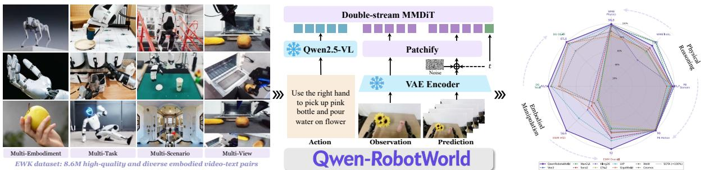
*图 1: Qwen-RobotWorld 整体思路示意 —— 通过语言条件视频生成统一跨具身场景的世界建模*

---

## 二、核心创新点

### 2.1 五大核心贡献

| 维度 | 创新点 | 意义 |
|------|--------|------|
| **框架** | 提出 **QWEN-ROBOTWORLD** 语言条件视频世界模型框架 | 以自然语言作为通用动作接口，统一跨场景、跨任务具身能力 |
| **数据** | 提出**动作-语言映射框架**，构建 EWK 数据集 | 标准化 20+ 机器人形态、500+ 动作类别为统一自然语言接口，形成 ~860 万高质量视频-文本对 |
| **架构** | 提出 **Double-Stream MMDiT + MLLM 动作编码** | 60 层双流扩散 Transformer 通过逐层联合注意力实现跨模态融合；MLLM 内化的世界知识隐式约束物理合理转移 |
| **训练** | 提出 **General + Expert 渐进课程** | 通用视觉先验与具身专业知识在统一语言接口下联合训练，稳定可扩展 |
| **性能** | 在 4 大基准测试取得领先 | EWMBench 和 DreamGen Bench 总榜第 1，开源全面领先 |

### 2.2 关键洞察提炼

1. **MLLM 作为动作编码器的双重价值**：既提供精确语言理解能力，其内化世界知识（如机械臂是刚体、有固定关节约束）又能隐式约束物理合理转移空间
2. **多领域互补而非冲突**：操作、驾驶、导航各教会不同的物理知识，通过共享语言接口实现联合强化
3. **人-机器人迁移作为数据扩展器**：通过自动化 MANO-to-robot 管线，绕开物理机器人采集的瓶颈

---

## 三、技术路线详细介绍

### 3.1 整体架构总览

模型由三大组件构成：

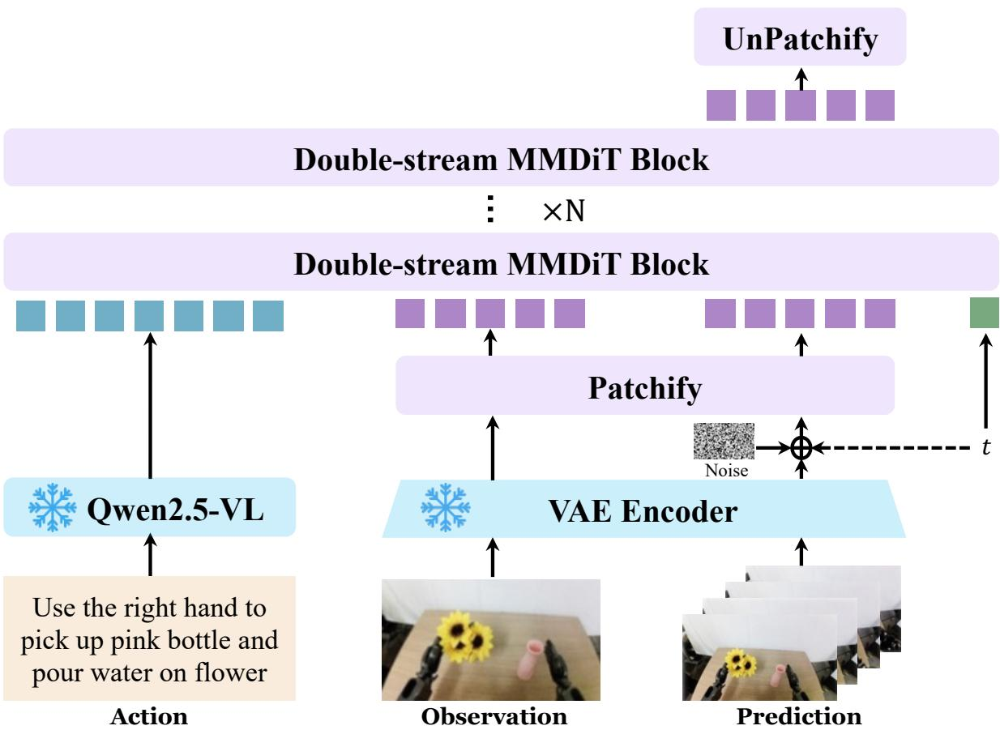
*图 2: 60 层双流 MMDiT 视频生成架构总览。模型由 MLLM 动作编码器、VAE 状态编/解码器、MMDiT 转移函数三大组件构成，双流间通过逐层联合注意力融合*

#### 3.1.1 各组件详解

| 组件 | 实现 | 参数量 | 功能 |
|------|------|--------|------|
| **MLLM 动作编码器** | 冻结的 Qwen2.5-VL | 7B | 将用户输入文本编码为条件信号 $h = \phi(S)$ |
| **VAE 状态编/解码器** | Wan-VAE | 127M（编码器 54M + 解码器 73M） | 视频帧 ↔ 潜空间表示 |
| **MMDiT 转移函数** | 60 层双流 Diffusion Transformer | 20B | 通过联合注意力实现跨模态融合 |

关键设计参数：
- 60 个双流块，每个 24 个注意力头（head dim 128）
- 隐藏维度 3072，patch size 2×2
- 上下文长度支持 **48,360 个视频 token**
- 总参数 ~27B（MLLM 7B + VAE 127M + MMDiT 20B）

#### 3.1.2 为什么用 MLLM 而非 T5/CLIP？

选用 MLLM（Qwen2.5-VL）作为动作编码器而非轻量级 T5/CLIP，带来两个关键优势：

1. **深度语言理解**：精确解析复杂组合指令为细粒度状态转移的条件信号
2. **内化世界知识**：例如"机械臂是刚体、有固定连杆长度和关节约束"的知识隐式约束了物理合理转移空间；结合 T2I 联合训练，能防止视频帧间物体变形

### 3.2 数据：Embodied World Knowledge（EWK）数据集

#### 3.2.1 核心数据规模

| 指标 | 数值 |
|------|------|
| 视频-文本对总量 | ~860 万 |
| 观测帧总数 | 200M+ |
| 机器人形态数 | 20+ |
| 动作类别数 | 500+ |
| 通用数据占比 | 30% |
| 具身数据占比 | 70% |

#### 3.2.2 数据组成

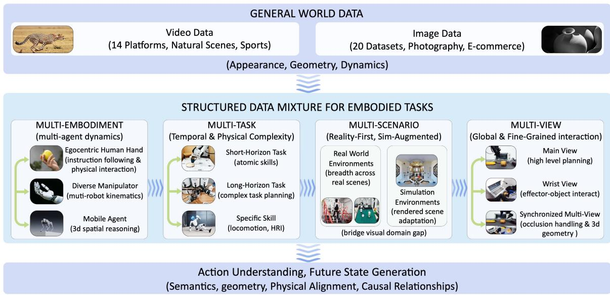
*图 3: EWK 训练语料库概览。包含通用世界数据（上）+ 四大结构化具身域数据（中），共同提供语义、几何、物理对齐、因果关系四类信号（下）*

| 域 | 规模 | 数据源 | 贡献 |
|----|------|--------|------|
| **A. 操作数据** | ~590 万样本 | EgoHOD, EPIC-Kitchens, Bridge V2, RH20T, Droid, Robomind, RoboCoin, Agibot-World, Galaxea, Qwen-Aloha 等 | 20+ 形态、1300+ 技能，覆盖单/双臂、灵巧手、人形等 |
| **B. 自动驾驶** | 1,744,405 段，2405 小时 | Waymo E2E, NVIDIA PhysicalAI-AD, Bench2Drive, Sekai | 大规模自运动、多智能体动态、3D 场景几何 |
| **C. 室内导航** | 6064 成功导航片段 | VLNVerse（134 室内场景） | 房间尺度空间推理 |
| **D. 人-机器人迁移** | 14 种机器人形态配对数据 | MANO-to-robot 自动化管线 | 跨形态视频编辑能力 |
| **通用数据** | ~30% | 14 个高质量视频平台 | 提供基础视觉先验 |

#### 3.2.3 动作-语言映射框架

**问题**：具身数据的视觉状态已经处于统一的像素空间，但动作表示在跨域间碎片化（机器人关节角、驾驶转向指令、导航航向向量），每种需要独立控制接口。

**解法**：将所有动作信号投射到共享的自然语言空间，让 Franka 夹爪、自动驾驶车辆、导航智能体都成为同一语言条件视频生成任务的实例。

#### 3.2.4 层次化五层标注

为持续生成高质量的动作丰富描述，设计了五层渐进式标注：

| 层 | 名称 | 说明 |
|----|------|------|
| **Layer 1** | 任务目标层 | 推断高层意图（$s_t$ 到 $s_{t+1}$ 应变为什么） |
| **Layer 2** | 动作细节层 | 将动作分解为时空轨迹、微动作、速度、力度，并强制声明视角信息 |
| **Layer 3** | 物理反馈层 | 描述可观测后果（位移、变形、接触状态变化） |
| **Layer 4** | 综合描述（50-100 词） | 完整指定视角-主体-动作-反馈四元组 |
| **Layer 5** | 简洁描述（15-30 词） | 仅保留核心要素，适配推理时高层指令 |

**四原则**：操作聚焦、视角定义、客观性、物理可验证性。

### 3.3 数据处理流水线

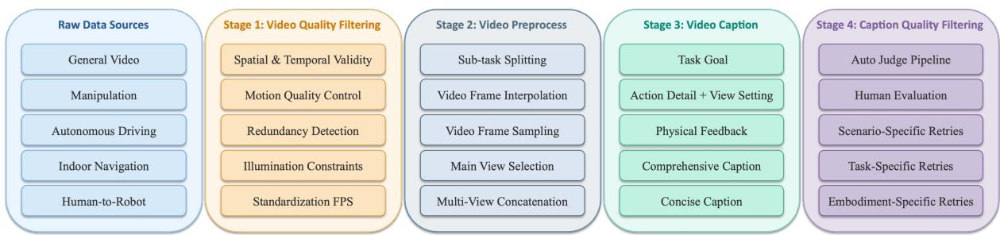
*图 4: 统一数据处理四阶段流水线。原始收集 → 视频预处理 → 层次化标注 → 质量过滤（带闭环反馈）*

**四阶段处理：**
1. **原始数据收集**（5 个来源）
2. **视频预处理**（5 个操作：帧提取、帧插值、子任务切分、主视角选择、多视角拼接）
3. **层次化标注**（五层框架，双粒度 caption，50%/50% 等概率采样）
4. **质量过滤**（LLM 自动评判 + 人工审核 + 场景/任务/形态特定的迭代提示精化）

### 3.4 3D RoPE 非对称位置编码

模型采用 3D RoPE 独立编码时间、高度、宽度三个维度，**非对称分配**：

| 维度 | 分配维数 | 理由 |
|------|----------|------|
| 时间轴 | 16 | 相邻帧强相关，无需太多维度 |
| 高度轴 | 56 | 物体位置和场景布局多样性大 |
| 宽度轴 | 56 | 同上 |
| **总计** | **128** | — |

结合 **Scalable RoPE** 支持推理时泛化到不同分辨率和时长。

### 3.5 Scene2Robot：多段条件机制（人-机器人迁移）

为支持**跨形态视频合成**，将同一骨干网络扩展为三段输入：

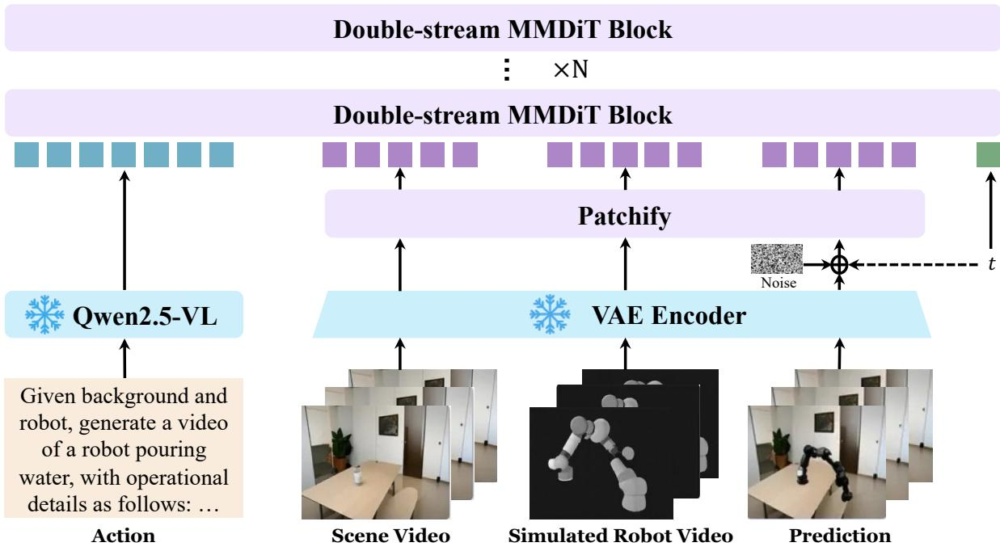
*图 5: Scene2Robot 三段式条件机制。输入序列组织为：场景条件 + 机器人参考 + 生成段。仅生成段参与损失计算*

| 段 | 内容 | 作用 | 是否参与损失 |
|----|------|------|-------------|
| **场景条件**（F 帧） | 去除人手后的原始演示视频 | 提供外观、空间布局、物体状态 | ❌（固定 t=0） |
| **机器人参考**（F 帧） | MuJoCo 渲染的机器人执行 | 提供目标形态的运动轨迹 | ❌（固定 t=0） |
| **生成段**（F 帧） | 待去噪的噪声潜变量 | 输出逼真的机器人执行视频 | ✅ |

3D RoPE 为每段分配独立的时间索引范围，区分跨段时间位置；联合注意力使生成 token 同时关注场景外观、机器人运动轨迹和 MLLM 动作语义。

### 3.6 训练策略：通用 + 专家渐进课程

#### 3.6.1 预训练阶段（建立通用世界基础）

| 要素 | 内容 |
|------|------|
| **通用世界先验** | 2 亿+ 真实世界观测样本（14 个高质量视频平台），学习域无关的世界先验（物体运动、光照、碰撞动力学） |
| **人类交互先验** | 大规模第一人称手部操作数据（Ego4D、EPIC-Kitchens），建立动作先验和可供性理解 |
| **多任务联合训练** | **T2I + T2V + TI2V** 共享骨干；T2I 任务学习锐利的视觉表示，作为视觉质量锚点，将物体形态知识自动迁移到视频生成，防止变形和身份不一致 |

#### 3.6.2 SFT 阶段（具身专业化）— 四阶段渐进数据混合

```
阶段 1: 多形态机器人数据 + 人手操作数据共同主导
   ↓ （跨形态操作共性 + 具体执行表示强化）
阶段 2: 逐步增加腕部视角和第三人称视角数据
   ↓ （拓宽视角覆盖）
阶段 3: 引入多视角拼接训练
   ↓ （注意力层建立跨视角空间对应）
阶段 4: 针对性补充高复杂度任务
   ↓ （倒水、折叠、双手协调等多材料交互）
```

**关键设计**：通用数据持续参与每个训练批次，确保具身专业化和通用世界建模能力同步推进而非此消彼长。

具身部分采样比例：**操作 ~90%**，多视角拼接 ~5%，导航/驾驶 ~5%。

#### 3.6.3 训练目标与基础设施

- **目标**：Flow Matching（流匹配）
- **基础设施**：Megatron-LM 混合并行策略
- **显存优化**：对部分双流块采用选择性激活重计算，平衡显存和吞吐
- **时间步采样**：对数正态分布 + 基于视频长度的自适应偏移
- **TI2V 任务**：首帧时间步固定为 0，确保生成过程以给定观测帧为条件

---

## 四、消融实验

**重要说明**：本文作为**技术报告（Technical Report）**，**未设置独立的消融实验（Ablation Study）章节**。这与论文定位相符——其重点在于提出一个**完整、可复现的世界模型系统框架**（数据 + 架构 + 训练策略 + 应用），而非逐组件验证。

然而，论文通过以下三种方式间接提供了消融信号：

### 4.1 间接消融形式 1：多基准测试的相对优势

在不同 benchmark 上的优势分布本身就揭示了各组件的贡献：

| Benchmark | 优势维度 | 间接反映的组件贡献 |
|-----------|----------|-------------------|
| EWMBench | HSD +33% 远超竞品 | 反映**运动保真度**优势 → 数据中多形态操作数据 + 多任务训练 |
| DreamGen Bench | GR1-Object IF 0.878（第 1） | 反映**组合泛化能力** → 层次化标注 + 通用 + 专家联合训练 |
| WorldModelBench | 物理遵循全部满分 | 反映**物理一致性** → EWK 数据 + MLLM 物理世界知识 |
| PBench | 领域理解 0.857（总榜第 3） | 反映**域理解** → 大量物理/具身数据训练 |

### 4.2 间接消融形式 2：跨领域定性对比

论文通过**人-机器人迁移、驾驶、导航**三个补充任务的定性生成结果，证明同一骨干网络能跨领域工作，间接验证了**领域无关性**（即非任务特化设计的泛化贡献）。

### 4.3 间接消融形式 3：与同类系统的相对定位

在不同类型的对比中（通用 vs 具身、闭源 vs 开源）展现的优势分布反映了**联合训练范式**的效果，而非单一组件突破。

---

## 五、实验结果

### 5.1 定量评估总览

| 基准 | 排名 | 得分 | 核心亮点 |
|------|------|------|----------|
| **EWMBench** | 🥇 总榜第 1 | 4.60 | HSD（0.566）超亚军 33%，场景一致性（0.914）和逻辑约束（1.00）最优 |
| **DreamGen Bench** | 🥇 总榜第 1 | 4.952 | GR1-Object IF（0.878）展现强组合泛化能力 |
| **WorldModelBench** | 🥉 总榜第 3 / 🥇 开源第 1 | 8.99 | 物理遵循全部满分（牛顿定律、质量守恒、流体、重力均为 1.00） |
| **PBench** | 🥇 开源第 1 | 0.804 | 领域理解（0.857）总榜第 3，运动平滑度（0.990）开源第 2 |

### 5.2 EWMBench 详细结果（具身运动保真度）

EWMBench 评估三个维度：场景一致性、运动正确性、语义对齐。

| 类别 | 模型 | SceneC | HSD | Dyn | nDTW | Diversity | BLEU | CLIP | Logics | **Overall** |
|------|------|--------|-----|-----|------|-----------|------|------|--------|------------|
| **通用** | Veo3 | 0.8415 | 0.2130 | 0.1932 | 0.1613 | 0.0221 | 0.2139 | 0.8965 | 0.9474 | 3.49 |
| | Wan2.6 | 0.6712 | 0.2034 | 0.0900 | 0.1715 | 0.0502 | 0.1616 | 0.8743 | **1.0000** | 3.22 |
| | Kling26 | 0.8211 | 0.3272 | 0.1822 | 0.3423 | 0.0173 | 0.2591 | 0.9014 | **1.0000** | 3.85 |
| | LTX-2 | 0.7850 | 0.2076 | 0.1283 | 0.2443 | 0.0120 | 0.1425 | 0.8869 | 0.5000 | 3.01 |
| | Sora2 | 0.8526 | 0.2807 | 0.3494 | 0.2754 | 0.0314 | 0.2466 | 0.9100 | 0.9474 | 3.89 |
| **具身** | Cosmos | 0.7963 | 0.2500 | 0.2052 | 0.2533 | 0.0803 | 0.1230 | 0.8458 | 0.7333 | 3.29 |
| | GigaWorld | 0.8707 | 0.3050 | 0.0849 | 0.2783 | 0.0278 | 0.2048 | 0.8873 | 0.9000 | 3.56 |
| | LVP | 0.8795 | 0.4248 | 0.0433 | 0.6226 | 0.0093 | 0.2179 | 0.8995 | 0.9524 | 4.05 |
| | Vidar | 0.7341 | 0.1877 | 0.1520 | 0.1769 | 0.0653 | 0.1607 | 0.8821 | 0.9411 | 3.30 |
| | Wow | 0.8866 | 0.2494 | 0.0529 | 0.2566 | 0.0266 | 0.1932 | 0.9001 | 0.9524 | 3.52 |
| | **Ours** | **0.9142** | **0.5660** | **0.3429** | **0.6708** | 0.0114 | 0.2079 | 0.8834 | **1.0000** | **4.60** |

**关键观察**：
- 总分超出亚军 LVP（4.05）**+0.55**
- HSD（0.566）超越 LVP（0.425）**33%**
- SceneC、Logics 双双达到最优

### 5.3 DreamGen Bench 详细结果

评估机器人视频生成的指令遵循（IF）和物理对齐（PA），覆盖 GR1 三个子集（环境、对象、行为）。

| 模型 | GR1-Env PA | GR1-Env IF | GR1-Object PA | GR1-Object IF | GR1-Behavior PA | GR1-Behavior IF | **Total** |
|------|-----------|-----------|---------------|---------------|-----------------|-----------------|-----------|
| Cosmos-sft | 0.709 | 0.655 | 0.775 | 0.720 | 0.649 | 0.621 | 4.129 |
| LVP | 0.810 | 0.772 | 0.745 | 0.829 | 0.713 | 0.889 | 4.758 |
| Vidar | 0.445 | 0.647 | 0.478 | 0.726 | 0.394 | 0.651 | 3.341 |
| GigaWorld | 0.621 | 0.933 | 0.500 | 0.852 | 0.426 | 0.884 | 4.216 |
| Wow | 0.793 | 0.826 | 0.755 | 0.849 | 0.809 | 0.696 | 4.728 |
| **Ours** | **0.828** | 0.793 | **0.840** | **0.878** | 0.781 | 0.832 | **4.952** |

**关键观察**：
- GR1-Object IF（0.878）排名 **第 1**，展现强对象组合泛化
- PA 三子集都在 0.78 以上，物理对齐稳定
- 长程行为泛化（GR1-Behavior IF 0.832）略逊于 LVP（0.889），是改进方向

### 5.4 WorldModelBench 详细结果（物理推理与指令遵循）

评估三个维度：指令遵循（0-3 分）、常识（帧/时序质量）、物理遵循（5 种违规类型）。

| 类别 | 模型 | Instr. (0-3) | Common Sense Overall | Physics Overall | **Total** |
|------|------|--------------|---------------------|------------------|-----------|
| **通用** | Veo3 | **2.52** | 1.93 | 4.80 | 9.25 |
| | Wan2.6 | 2.50 | **1.94** | 4.83 | **9.27** |
| | Sora2 | 2.21 | 1.88 | 4.84 | 8.93 |
| | Kling26 | 1.59 | 1.97 | **5.00** | 8.55 |
| | LTX-2 | 1.97 | 1.32 | 4.32 | 7.61 |
| **具身** | Cosmos | 2.14 | 1.94 | 4.86 | 8.94 |
| | LVP | 2.01 | 1.80 | 4.87 | 8.67 |
| | GigaWorld | 2.13 | 1.05 | 4.13 | 7.31 |
| | Vidar | 1.62 | 0.99 | 4.40 | 7.01 |
| | Wow | 2.05 | 1.41 | 4.45 | 7.91 |
| | **Ours** | 2.33 | 1.72 | **4.94** | **8.99** |

**关键观察**：
- 总分 8.99 **超越所有开源模型**，仅次于闭源的 Wan2.6（9.27）和 Veo3（9.25）
- **物理遵循四项满分**（牛顿定律 1.00、质量守恒 1.00、流体动力学 1.00、重力 1.00）
- 指令遵循 2.33，开源第 1，接近闭源 Veo3（2.52）

### 5.5 PBench 详细结果

| 类别 | 模型 | Quality | Domain | **Overall** |
|------|------|---------|--------|------------|
| **通用** | Veo3 | 0.771 | 0.882 | 0.827 |
| | Wan2.6 | 0.724 | 0.832 | 0.778 |
| | Sora2 | 0.769 | 0.841 | 0.805 |
| | Kling26 | 0.768 | **0.874** | 0.821 |
| | LTX-2 | 0.746 | 0.845 | 0.796 |
| **具身** | Cosmos | 0.763 | 0.840 | 0.802 |
| | LVP | **0.772** | 0.812 | 0.792 |
| | GigaWorld | 0.746 | 0.841 | 0.794 |
| | Vidar | 0.726 | 0.810 | 0.768 |
| | Wow | 0.761 | 0.786 | 0.774 |
| | **Ours** | 0.751 | 0.857 | **0.804** |

**关键观察**：
- 总分 0.804 **开源第 1**
- 领域理解 0.857 总榜第 3，超过多数闭源模型
- 运动平滑度 0.990，开源第 2

### 5.6 定性分析

#### 5.6.1 细粒度语言理解

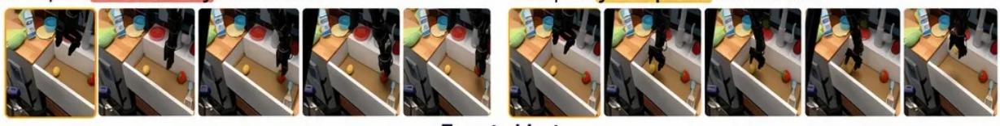
*图 6a-1: 对比指令遵循 - 目标对象辨识（给定相同初始帧，"拿起黄色土豆"vs"拿起红色杯子"生成截然不同的视频）*

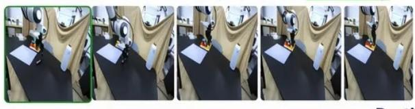
*图 6a-2: 对比指令遵循 - 目的地辨识（"放到木盘上"vs"放到白纸上"）*

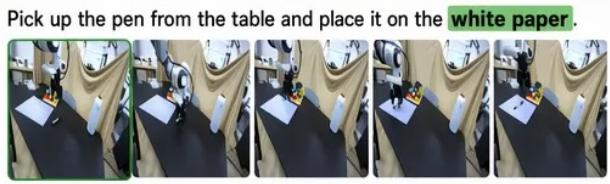
*图 6a-3: 对比指令遵循 - 动作类型辨识（"递给某人"vs"放进笔筒"）*

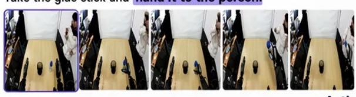
*图 6a-4: 对比指令遵循的另一种语义边界区分示例*

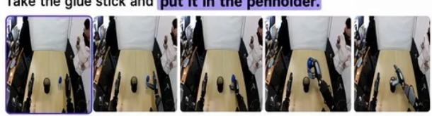
*图 6b-1: 复杂指令遵循 - 抽象目标示例*


*图 6b-2: 复杂指令遵循 - 多步骤顺序执行示例（按顺序抓取红黄甜椒并放置）*

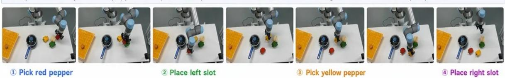
*图 6b-3: 关键动作里程碑标注示例（彩色标签标记生成序列中的关键步骤）*

**结论**：给定相同初始帧，仅改变一个关键词（目标物体/动作类型/放置位置）即可生成截然不同的视频，证明模型具备超越通用操作先验的细粒度语义辨别力；同时能处理需要多步依赖的长程顺序任务和抽象目标指令。

#### 5.6.2 跨形态/任务/视角泛化

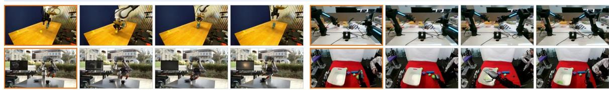
*图 7A: 跨形态泛化 - 同一指令在四种不同机器人形态（单臂/双臂/人形/灵巧手）上均能正确执行，无需特定适配*

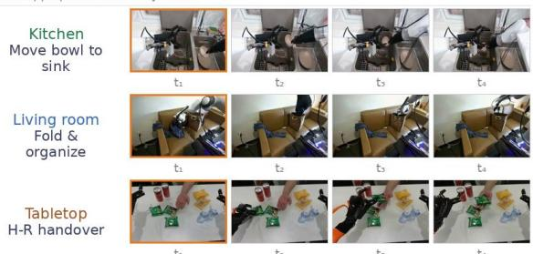
*图 7B: 跨任务 × 跨环境 - 水果抓放、碗回收、布料折叠、人机交接等多种任务均展现任务适配的接触动力学*

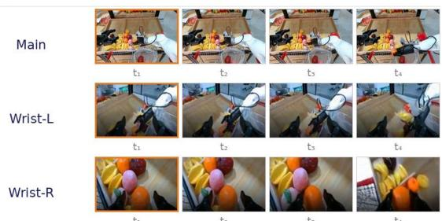
*图 7C: 多视角一致性 - 同一集的主视角和左右腕视角同时生成，跨视角保持几何一致*

#### 5.6.3 零样本鲁棒性（RoboTwin-IF）

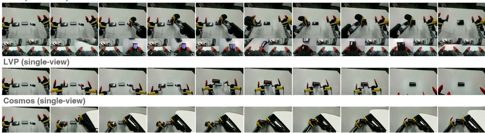
*图 8a: RoboTwin-IF 零样本任务 01 - 装配小型电子设备*

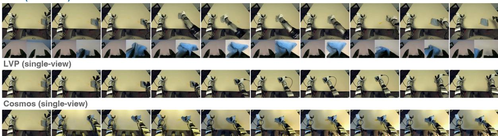
*图 8b: RoboTwin-IF 零样本任务 03 - 用灰布擦拭浅桌上的黄色液体污渍*

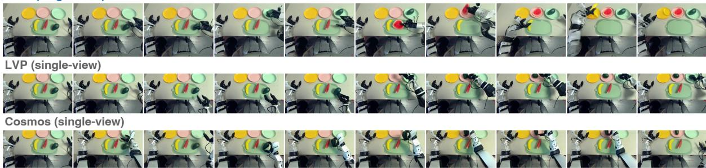
*图 8c: RoboTwin-IF 零样本任务 04 - 将香蕉、西瓜片、鳄梨放到颜色匹配的盘子里*

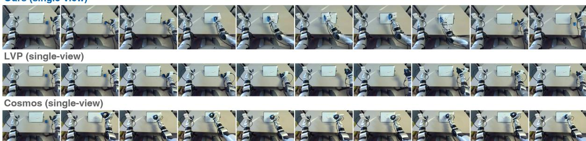
*图 8d: RoboTwin-IF 零样本白板擦除任务*

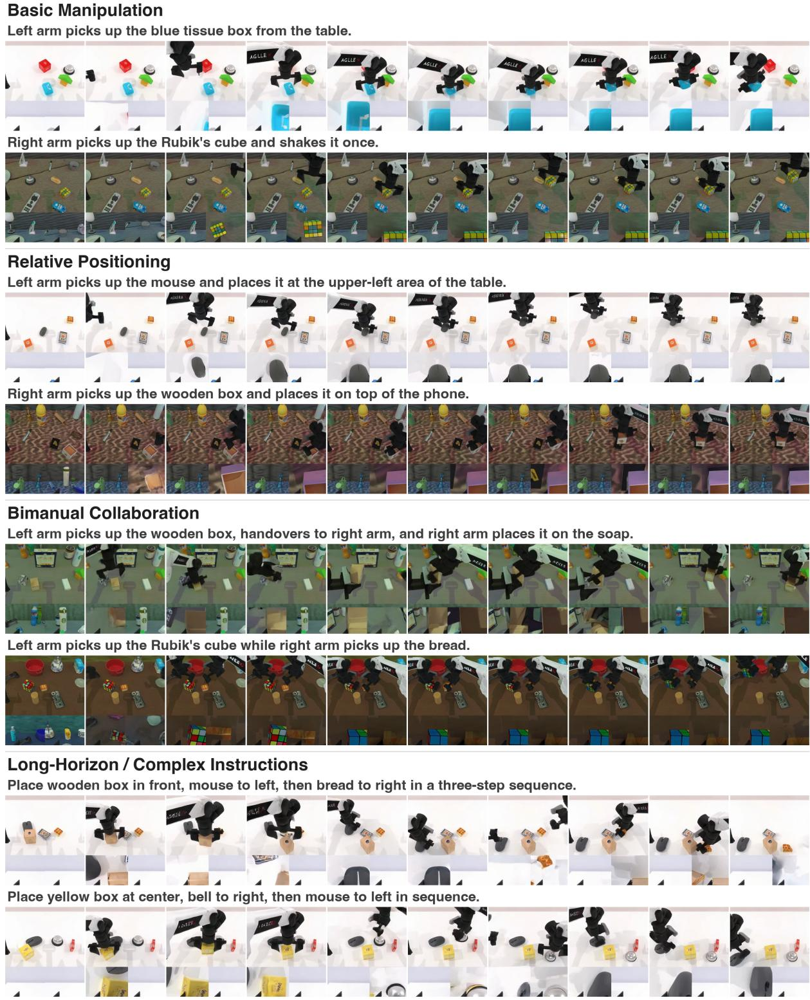
*图 9: RoboTwin-IF 中复杂双手机协调任务（双手分别搬运木盒、鼠标、魔方、面包等）*

### 5.7 跨域泛化

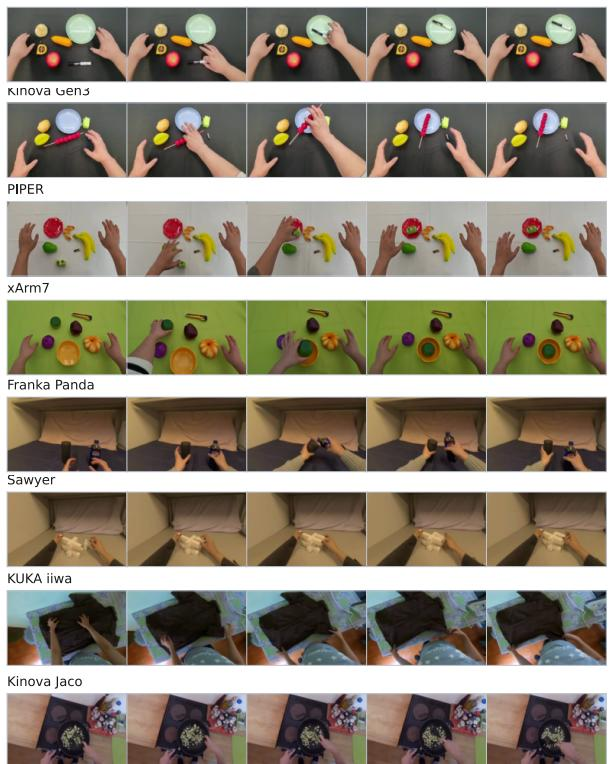
*图 10a: 人-机器人迁移 - 跨 8 种目标形态保留任务意图同时适配形态特定运动学约束*

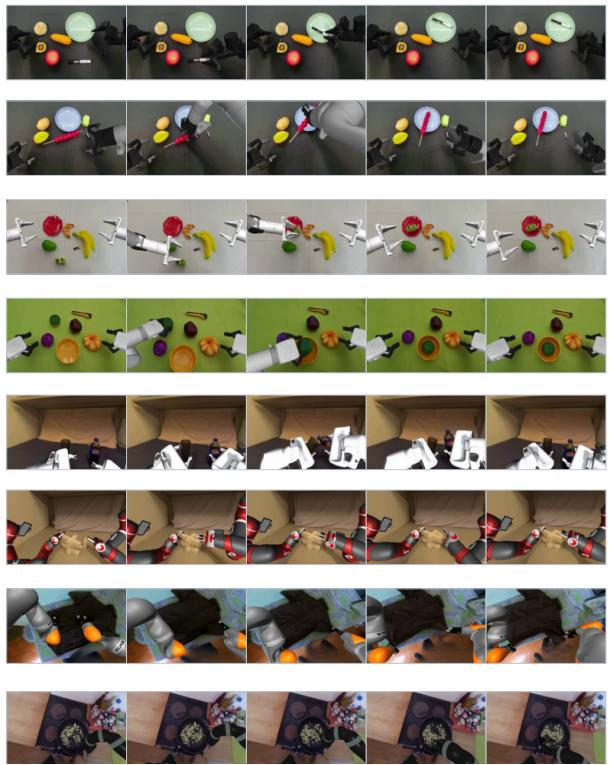
*图 10b: 人-机器人迁移示例集 - 不同形态对相同人类演示的转换结果*

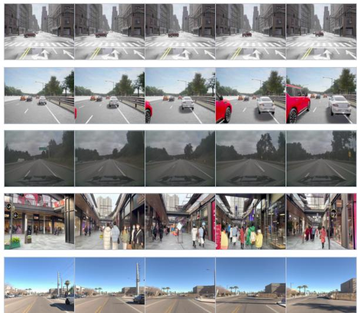
*图 11a: 自动驾驶生成 - 来自 Bench2Drive、NVIDIA PhysicalAI-AD、Sekai、Waymo 的驾驶场景*

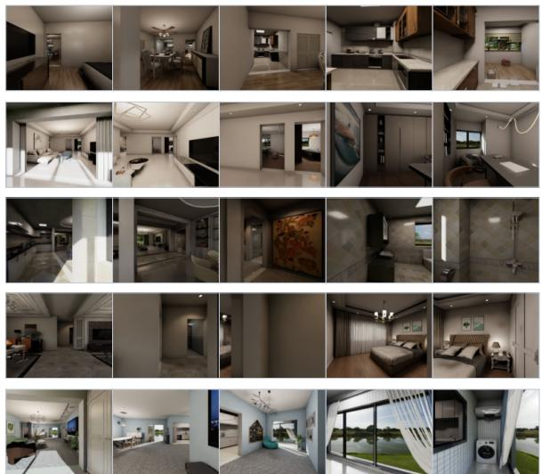
*图 11b: 室内导航生成 - VLNVerse 语言引导的第一人称穿越*

---

## 六、实验结果解读

### 6.1 为什么本文方法能取得整体优势？

#### 6.1.1 数据层面的核心驱动

EWK 数据集在**多样性、规模、物理一致性**三个维度上的均衡是性能突破的根本原因：

| 优势维度 | 数据贡献 |
|---------|----------|
| **HSD 超亚军 33%** | 操作数据占具身数据 ~90%，提供丰富接触物理实例 |
| **运动平滑度 0.990** | 多视角拼接训练提供时序一致性监督 |
| **物理遵循全满分** | 大量物理可验证性数据和显式物理约束标注 |
| **跨形态泛化** | 20+ 形态数据让模型学到**形态无关**的动作语义 |

#### 6.1.2 架构层面的核心驱动

1. **MLLM 动作编码器**：不仅语义清晰，更通过内化的世界知识隐式约束物体几何和物理合理转移
2. **60 层双流 MMDiT**：通过逐层联合注意力实现**细粒度跨模态对齐**，而非仅在最后融合
3. **非对称 3D RoPE**：将更多位置编码容量分配给空间维度，符合视频"高空间变化、中等时间变化"的特性

#### 6.1.3 训练层面的核心驱动

- **T2I 联合训练**：保证物体形态几何正确，自动迁移到视频生成防变形
- **通用 + 专家渐进**：避免**灾难性遗忘**，让具身专业化和通用视觉能力同步推进
- **四阶段 SFT 渐进**：从简单跨形态数据 → 多视角 → 复杂任务，循序渐进避免训练震荡

### 6.2 哪些指标提升最显著，原因是什么？

| 指标 | 提升 | 归因 |
|------|------|------|
| **HSD（运动保真度）** | +33% vs LVP | 多形态操作数据 + MLLM 语义约束 + 多视角拼接训练 |
| **GR1-Object IF** | 第 1 名（0.878） | 500+ 动作类别层次化标注，提供精细的物体-动作组合语义 |
| **物理遵循** | 全部 5 项满分 | EWPD 物理可验证原则 + MLLM 内化物理知识 |
| **SceneC（场景一致性）** | 0.914 | 非对称 3D RoPE + Scalable RoPE 的空间感知能力 |

### 6.3 哪些指标还有改进空间？

| 指标 | 现况 | 改进方向 |
|------|------|---------|
| **GR1-Behavior IF** | 0.832，略低于 LVP（0.889） | 长程行为泛化能力需要更复杂的多步推理训练数据 |
| **PBench Aesthetic/Imaging** | 0.455/0.649 偏低 | 因任务型输出分辨率需求，并非通用视频生成的主战场 |
| **Common Sense 帧/时序质量** | 1.72，低于 Veo3(1.93) | 输出分辨率限制像素级质量 |
| **DreamGen GR1-Env IF** | 0.793，未达到最优（0.933） | 环境级泛化数据可能需要更多环境多样性 |

### 6.4 与基线的关键差异

| 关键差异 | 体现 |
|---------|------|
| **vs 通用模型（Sora/Veo/Wan）** | 具身物理大幅领先，但常识帧/时序质量略逊 |
| **vs 具身专业模型（LVP/Cosmos/Vidar）** | 跨域泛化（驾驶/导航/迁移）大幅领先，EWMBench HSD 领先 33% |
| **vs 闭源同等规模** | 物理遵循可与 Veo3/Wan2.6 持平，但综合排名仍有差距 |
| **核心差异** | 唯一同时在 4 大 benchmark 取得领先的**统一自然语言接口**世界模型 |

---

## 七、总结与思考

### 7.1 本文核心思想

Qwen-RobotWorld 的核心思想可以一句话概括：

> **以自然语言作为统一动作接口，通过大规模跨具身领域数据 + MLLM 编码的物理世界知识 + 通用-专家联合训练，构造一个能跨形态、跨任务、跨场景的统一世界模型。**

### 7.2 主要贡献全景

| 维度 | 本文方案 | 论文价值 |
|------|---------|----------|
| **统一性** | 用语言替代异构动作接口 | 消除跨形态迁移的工程鸿沟 |
| **可扩展性** | 数据驱动的 EWK + 自动化 MANO 管线 | 突破物理机器人采集瓶颈 |
| **可解释性** | 五层层次化标注 | 让动作描述更可控、更可调试 |
| **实用性** | 一套骨干支持三大应用 | 适配合成数据/虚拟评估/规划引导 |

### 7.3 三大代表性应用

| 应用 | 价值 | 论文未深入展开之处 |
|------|------|-------------------|
| **合成数据生成** | 为下游策略训练提供数据增强 | 具体增广策略、与 VLA 训练的回路 |
| **虚拟评估环境** | 提供可扩展的策略评估平台 | 与真实环境的 sim-to-real gap |
| **语言引导规划** | 作为下游机器人控制的规划信号 | 推理时控制频率、与 RL/IL 的整合 |

### 7.4 个人点评

#### 7.4.1 优点

1. **统一性显著**：自然语言接口设计简洁优雅，让跨形态合并训练真正可行
2. **数据 - 架构 - 训练三方深度耦合**：每方都有针对性创新（动作-语言映射 / 双流 MMDiT / 渐进课程）
3. **实际落地导向**：三大应用方向明确，不只是学术刷点
4. **开源友好**：在 4 个 benchmark 的开源第 1 表现值得肯定

#### 7.4.2 待提升之处

1. **缺独立消融实验**：作为技术报告可以理解，但每个创新点的独立贡献难以严格量化
2. **分辨率限制影响 PBench 像素评分**：为任务型输出做的取舍，但影响通用性
3. **长程行为泛化（GR1-Behavior IF）**：略低于 LVP，可能是未来改进方向
4. **多模型对比仅限于已有 benchmark**：缺少对极端场景（如罕见物体、新颖技能）的覆盖

#### 7.4.3 对该领域的启示

1. **统一的代价是平均每个领域的精度** —— 但跨域互补的物理知识带来了整体优势
2. **MLLM 作为通用编码器** + 内化世界知识 是一个值得继续探索的范式
3. **人-机器人迁移作为数据扩展器** 比纯物理采集更具规模化前景
4. **统一世界模型 + 下游任务特定适配** 的两阶段路线，比"一个模型解决所有问题"更现实

### 7.5 未来工作可能方向

1. 引入显式物理仿真器作为损失监督
2. 拓展到更长时序（数十秒至分钟级）规划
3. 与 VLA 模型形成闭环（生成 → 执行 → 反馈 → 重生成）
4. 引入触觉/音频多模态作为额外条件信号

---

*本解读由 paper-reader 技能按 7 大模块模板生成。*
