# From Quantity to Quality: Boosting LLM Performance with Self-Guided Data Selection for Instruction Tuning

Ming Li1,2, Yong Zhang1, Zhitao Li1, Jiuhai Chen2, Lichang Chen2, Ning Cheng1, Jianzong Wang1\* , Tianyi Zhou2\*, Jing Xiao1,

1Ping An Technology (Shenzhen) Co., Ltd., China 2University of Maryland {minglii, tianyi}@umd.edu, jzwang@188.com

## Abstract

In the realm of Large Language Models (LLMs), the balance between instruction data quality and quantity is a focal point. Recognizing this, we introduce a self-guided methodology for LLMs to autonomously discern and select cherry samples from open-source datasets, effectively minimizing manual curation and potential cost for instruction tuning an LLM. Our key innovation, the Instruction-Following Difficulty (IFD) metric, emerges as a pivotal metric to identify discrepancies between a model’s expected responses and its intrinsic generation capability. Through the application of IFD, cherry samples can be pinpointed, leading to a marked uptick in model training efficiency. Empirical validations on datasets like Alpaca and WizardLM underpin our findings; with a mere 10% of original data input, our strategy showcases improved results. This synthesis of self-guided cherry-picking and the IFD metric signifies a transformative leap in the instruction tuning of LLMs, promising both efficiency and resource-conscious advancements. Codes, data, and models are available.1

## 1 Introduction

Large Language Models (LLMs) have revolutionized the landscape of artificial intelligence (Touvron et al., 2023a,b; Penedo et al., 2023; Scao et al., 2022). Notable models such as GPT-3 (Brown et al., 2020) and GPT-4 (OpenAI, 2023) leverage extensive datasets and advanced training methodologies to exhibit high-level text understanding and generation capabilities (Liu et al., 2023, 2024b; Chen et al., 2023b; Sun et al., 2024; Liu et al., 2024a). Instruction tuning (Wei et al., 2022; Longpre et al., 2023) is a method employed to refine the performance of LLMs by providing specific guidelines or instructions during the model’s training phase. It operates by supplying LLMs with explicit training instructions to produce the corresponding outputs that are more congruent with the desired ones (Xu et al., 2024). A well-formulated instruction or prompt provides essential contextual information, refining the model’s capability to generate relevant and task-specific outputs (Taori et al., 2023; Ouyang et al., 2022).

Previously, instruction tuning was regarded as relying on amassing vast datasets (Khashabi et al., 2020; Ye et al., 2021; Wei et al., 2022; Wang et al., 2022). However, a seminal revelation from the LIMA (Zhou et al., 2023) highlights the art of instruction tuning: rather than a sheer volume of data, it’s the quality of the data that dictates the model’s performance. LIMA’s findings emphasize that even a limited amount of manually curated, high-quality data can elevate the model’s instruction-following capability. While it underscores the significance of data quality, the question of how to automatically identify high-quality data from a vast ocean of available datasets remains under investigation.

In our study, we introduce a novel approach for autonomously identifying the most impactful training samples, which we refer to as “cherry data”, from extensive open-source datasets. These data samples are particularly effective in enhancing LLM instruction tuning. Central to our hypothesis is the idea that LLMs, through initial training with a small amount of instruction data, can inherently learn to discern and follow instructions, allowing them to estimate the difficulty of instruction data.

Our method involves a self-guided process that begins with familiarizing the model with a small subset of the dataset during the “Learning from Brief Experience” phase. This phase lays the groundwork for the subsequent “Evaluating Based on Experience” phase, where we introduce the Instruction-Following Difficulty (IFD) score. This metric evaluates how much help the instruction provides to the generation of the corresponding response, by comparing the loss in model responses with and without instructional context. The higher IFD score, indicating less instructional help, suggests a greater difficulty with instructions. On the contrary, the lower IFD score represents that the given instruction can directly benefit the language model largely even without further training, representing the easiness and necessity of the instruction. Thus in the final “Retraining from Self-Guided Experience” phase, we use data with relatively large IFD scores as the cherry data to train our model, resulting in what we term “cherry models”. This methodology, which emphasizes data quality over quantity, differs markedly from existing techniques that rely on external models for data curation.

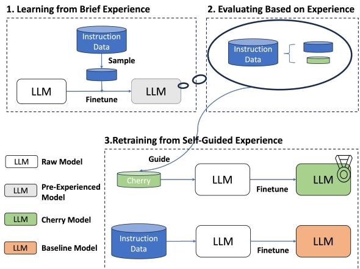  
Figure 1: Overview of our proposed method.

Extensive experimental results validate the efficacy of our method. By applying our methodology to the Alpaca and WizardLM instruction tuning datasets, our model outperforms the official Alpaca model with only approximately 5% data selected and outperforms the reimplemented WizardLM model with approximately 10% data selected. The key contributions of this paper:

• We propose a self-guided approach enabling models to autonomously select the “cherry data” from vast open-source datasets. This innovation minimizes manual curation and optimizes the use of existing data resources, reducing costs and streamlining training.

• We introduce the Instruction-Following Difficulty (IFD) score as a metric to measure how much help the instruction can provide to the generation of the corresponding response, revealing the model-specific difficulty of the given data sample. Using the IFD metric, we can pinpoint the data that is most helpful for a specific model.

• Backed by validation on training datasets like Alpaca and WizardLM, our strategy demonstrates enhanced outcomes with only 10% of the original data input, emphasizing our approach’s efficiency and transformative impact.

• We provide a different model-specific view in measuring the difficulty of new instructions, which may benefit future instruction data generation work.

## 2 Methodology

As illustrated in Figure 1, our methodology is divided into three core phases: Learning from Brief Experience, Evaluating Based on Experience, and Retraining from Self-Guided Experience. The initial phase emphasizes equipping the model with a basic instruction-following capability. The subsequent phase introduces a novel metric to evaluate the instruction-following difficulty score of each sample based on the previously trained preexperienced model. Finally, after obtaining difficulty scores in the target dataset, the cherry samples are selected to train our final model, which we call the cherry models.

## 2.1 Learning from Brief Experience

This phase aims to equip the initial model with a basic instruction-following capability by forcing the model to first experience a subset of the target dataset. Specifically, for the initial full target dataset, $D _ { 0 }$ contains n triplets $x \quad =$ (Instruction, [Input], Answer), we define the string Question = map(Instruction, [Input]) as the complete instruction. The map function is aligned with the original target dataset. Each word in Question(Q) and Answer(A) is denoted as $x _ { i } ^ { Q }$ and $x _ { i } ^ { A }$ respectively. Let $L L M _ { \theta }$ denote the LLM we use and θ represent the weight of LLMs, specifically, $\theta _ { 0 }$ represents the pre-trained base LLM model. Then the instruction embeddings for each sample $x _ { j }$ are obtained by:

$$
[ h _ {j, 1} ^ {Q},.. h _ {j, m} ^ {Q} ] = L L M _ {\theta_ {0}} (w _ {j, 1} ^ {Q},.. w _ {j, m} ^ {Q})\tag{1}
$$

$$
h _ {j} ^ {Q} = \frac {\sum_ {i = 1} ^ {m} h _ {j , i} ^ {Q}}{m}\tag{2}
$$

where $w _ { j , i } ^ { Q }$ represents the $i _ { t h }$ word of Question strings of sample $j$ and $h _ { j , i } ^ { Q }$ represents its corresponding last hidden states.

To ensure the diversity of instructions exposed to the initial model, the basic clustering technique K-Means on these instruction embeddings is utilized. Motivated by LIMA’s finding, we try to make this experience process as brief as possible by sampling only a few instances in each cluster which we call pre-experienced samples. Specifically, we generate 100 clusters on instruction embeddings and sample 10 instances in each cluster. Then the initial model is trained for only 1 epoch with these samples to obtain our brief pre-experienced model.

## 2.2 Evaluating Based on Experience

In this stage, we introduce the Instruction-Following Difficulty (IFD) score, a metric devised to evaluate the difficulty each instructional sample presents. Our primary motivation, adhering to the goal of minimizing cross-entropy loss in model training, guides the use of this metric. It specifically targets gauging the impact of training data by isolating the instructional component’s influence from that of the answer. To achieve this, we employ a method that compares the loss when the model generates responses both with and without the context provided by instruction. This comparison is crucial as it forms the basis of the IFD score, effectively quantifying the extent to which instruction aids in response generation.

In the instruction-tuning process, the loss of a sample pair $( Q , A )$ is calculated by continuously predicting the next tokens given the instruction $Q$ and their proceeding words:

$$
L _ {\theta} (A | Q) = - \frac {1}{N} \sum_ {i = 1} ^ {N} \log P (w _ {i} ^ {A} | Q, w _ {1} ^ {A}, w _ {2} ^ {A}, \ldots , w _ {i - 1} ^ {A}; \theta)\tag{3}
$$

where $N$ is the number of words of the groundtruth answer A. We denote this averaged crossentropy loss as the Conditioned Answer Score $s _ { \theta } ( A | Q ) = L _ { \theta } ( A | Q )$ This metric evaluates the model’s capability to generate appropriate responses based on provided instructions. It measures the extent to which the model’s output aligns with both the instruction and the corresponding correct answer.

However, a higher $s _ { \theta } ( A | Q )$ does not mean a harder instruction to follow, it may be caused by the inherent characteristic of string A itself. In the pre-LLM era, when models are required to learn both the knowledge and instruction-following ability during finetuning, it is reasonable to use $s _ { \theta } ( A | Q )$ as an indicator for the difficulty of a sample. However, things change a little for current

LLMs, which have learned most of the knowledge in the pre-training phase and only need to learn to align and follow the instructions. Thus to estimate the difficulty of following instructions of a given sample, we introduce the Direct Answer Score $s _ { \theta } ( A )$

$$
s _ {\theta} (A) = - \frac {1}{N} \sum_ {i = 1} ^ {N} \log P (w _ {i} ^ {A} | w _ {1} ^ {A}, \dots , w _ {i - 1} ^ {A}; \theta).\tag{4}
$$

which measures LLM’s ability to generate this answer alone. It gauges the inherent difficulty or challenge posed by the answer in isolation, without the contextual guidance from its corresponding instruction. A higher direct answer score may suggest that the answer is inherently more challenging or intricate for the model to generate.

Further, analyzing the balance between a sample’s inherent challenge and the model’s capabilities in following it sheds light on the intricacies of estimating the difficulty of the instruction of a given sample. Specifically, we try to estimate the Instruction-Following Difficulty (IFD) scores $\mathrm { I F D } _ { \theta } ( Q , A )$ on following instruction of a given $( Q , A )$ pairs by calculating the ratio between $s _ { \theta } ( A )$ and $s _ { \theta } ( A | Q )$

$$
\mathrm{IFD} _ {\theta} (Q, A) = \frac {s _ {\theta} (A | Q)}{s _ {\theta} (A)}\tag{5}
$$

By utilizing this metric, the influence of LLM’s intrinsic ability to fit the answer string is partially alleviated. The score measures the degree to which given instruction benefits the alignment of the corresponding response. High IFD scores infer the inability of the model to align responses to the given corresponding instructions, which in turn indicates the difficulty of an instruction. It is worth noting that this $\mathrm { I F D } _ { \theta } ( Q , A )$ is a model-specific value, and we use our pre-experienced model to obtain all these values in the target dataset.

To further filter out the sample whose instruction is misaligned with its response, a threshold of 1 is set. Typically, the Conditioned Answer Score is always smaller than the Direct Answer Score due to the intrinsic nature of the next token prediction: With the context given, the prediction for the latter tokens should be easier. Thus if the IFD score is greater than 1, the Conditioned Answer Score is even larger than the Direct Answer Score, which means the given instruction provides no useful context for the prediction of the response. In this situation, we think there exists a misalignment between the instruction and the corresponding response.

Although our experiments reveal that learning from brief experiences is important, it makes the whole pipeline complicated and efficient. However, Superfiltering (Li et al., 2024b) expands the use of IFD scores and shows that (1) Good prompting can relieve the burden of training a pre-experienced model; (2) The IFD scores calculated by weak language models are consistent with strong models, making it possible to utilize small models for filtering, further pushing forward the efficiency of data filtering for instruction tuning.

## 3 Experimental Setup

## 3.1 Datasets

Training Datasets The Alpaca dataset (Taori et al., 2023) encompasses 52002 instruction-following samples. Developed using the self-instruct (Wang et al., 2023b) approach with text-davinci-003. Though initially competitive, its dependence on text-davinci-003 posed data quality concerns. WizardLM dataset (Xu et al., 2023) leverages the Evol-Instruct algorithm to improve the quality of instruction data. The incorporation of ChatGPT during the reformulation guarantees high fidelity of data. We utilize the WizardLM70K for our experiment.

Test Datasets To ensure comprehensive and unbiased assessment, we employed 5 diverse test sets: Vicuna (Chiang et al., 2023), Koala (Vu et al., 2023), WizardLM (Xu et al., 2023), Self-instruct (Wang et al., 2023b), and LIMA (Zhou et al., 2023). These test sets contain approximately 1000 human curated instructions, open-domain or closeddomain for different tasks from different sources. Among them, Vicuna and WizardLM further provide the specific sub-category for each instruction, making it possible for in-depth analysis.

## 3.2 Implementation Details

For experiments on the LLaMA-7B pre-trained model, our training configuration aligns with the original Alpaca and WizardLM, by utilizing the the Alpaca codebase2. For experiments on LLaMA2- 7B and LLaMA2-13B models, we utilize the Vicuna codebase3. The detailed training configuration can be found in Appendix A.

## 3.3 Evaluation Metrics

## 3.3.1 Pair-wise Comparison

Evaluating the instruction-following capabilities of LLMs is challenging. Extensive research is still dedicated to creating automated evaluation metrics for LLMs (Chang et al., 2023) since human evaluation is both labor-intensive and potentially influenced by subjective biases. Leveraging the recent advancements in independent LLM evaluations (Zheng et al., 2023; Chiang et al., 2023; Li et al., 2023b), we utilize GPT4 and ChatGPT for comparative evaluations. Specifically, for each instruction in the test dataset, models that need to be compared are prompted to generate responses respectively. Then an API model, either GPT4 or ChatGPT, assigns scores for their responses. The model is regarded to be better in this dataset only if its answer is preferred by the judging model.

In the evaluation, each model’s response is rated by the judge on a scale from 1 to 10, reflecting attributes like relevance and accuracy. To further address the positional bias (Ko et al., 2020; Wang et al., 2023a), we send the responses of two models to the judge twice with different orders and compare their scores. Thus we define one model to be seen as winning only if it does not lose in both the ordering4, specifically:

• Wins: outperforms in both or wins in one and ties in the other.

• Tie: ties in both or wins in one and loses in the other.

• Loses: lags in both or ties in one and loses in the other.

## 3.3.2 Benchmarks

The performances on two recently popular benchmarks for LLMs are also provided: Huggingface Open LLM Leaderboard and AlpacaEval Leaderboard. Huggingface Open LLM Leaderboard evaluates LLMs using (Gao et al., 2021), a unified framework to test generative language models on a large number of different evaluation tasks, on 4 key benchmarks including ARC (Clark et al., 2018), HellaSwag (Zellers et al., 2019), MMLU (Hendrycks et al., 2021) and TruthfulQA (Lin et al., 2022). AlpacaEval Leaderboard provides an LLMbased automatic evaluation based on AlpacaFarm (Dubois et al., 2023) evaluation set, in which the model responses are compared with responses of Davinci003 by GPT4.

Ours (10%) vs. WizardLM\* (100%)(GPT4)

## 3.3.3 Human Evaluation

To better illustrate the efficacy of our method, further human evaluation is conducted. Specifically, we randomly sampled 20 instructions from each test set to generate a new random set containing 100 instructions in total. Then 3 human participants are asked to compare the responses generated by the models to be compared. For each comparison, 3 options are given (Win, Tie, and Loss) and the final results are determined by the majority voting of the participants.

## 4 Experimental Results

## 4.1 Main Results

In this section, we first present our primary pairwise evaluation results in Figure 2. (a) our model trained with only approximately 5% of the original Alpaca data beats the Alpaca model trained with full data. (b) our model trained with only approximately 10% of the original WizardLM data beats the reimplemented WizardLM model under the same training configuration which is described in the Implementation Details.

Moreover, we craft subsets containing the top 5%, 10%, 15%, and 20% of the training datasets to train models, enabling us to investigate the performance changes. As shown in Figure 3, we draw the overall winning rate changes across the data growth, which is calculated as (Num(Win)−Num(Lose))/Num(All) +1, providing a direct indicator on the comparison with the full-data trained models. A consistent observation across both datasets is that with merely 10% of selectively chosen data, our models manage to exceed the results of models trained on the full dataset. These findings not only highlight the efficiency of our data selection strategy but also underscore the potential of training powerful models with significantly reduced data requirements. By validating our approach on the renowned Alpaca dataset and the more intricate WizardLM dataset, the wide applicability and robustness of our proposed method are highlighted.

The comparison between our cherry models with baseline models on Huggingface Open LLM Leaderboard and AlpacaEval Leaderboard are presented in Table 1 where we can see our cherry model using 5% Alpaca data outperforms the official Alpaca on both benchmarks, our cherry model using 10% WizardLM data has a close performance compared with our re-implemented WizardLM.

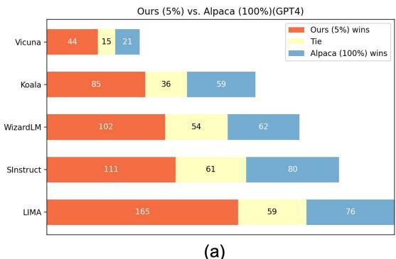  
(a)

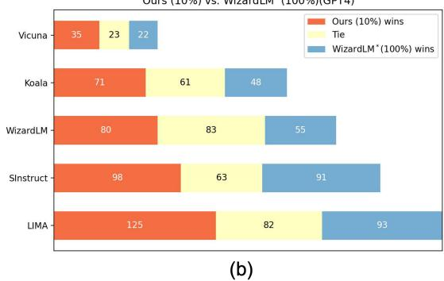  
Figure 2: Comparing our models trained on selected data with full data. (a) Comparison between our model with 5% Alpaca data and the official Alpaca model. (b) Comparison between our model with 10% WizardLM data and the reimplemented WizardLM model. Both (a) and (b) use GPT4 as the judge. Each horizontal bar represents a comparison in a specific test set.

These results further showcase the effectiveness of our automatically selected data.

Moreover, the human evaluation results also showcase the usefulness of our method. When comparing the Cherry Alpaca (5%) and the Alpaca (100%), there are 49/100 wins for our cherry alpaca, 25/100 ties, and 26/100 losses. When comparing the Cherry WizardLM (10%) and the reimplemented WizardLM (100%), there are 37/100 wins for our Cherry WizardLM, 32/100 ties, and 31/100 losses.

## 4.2 Ablation on Data Selection Mechanism

In this section, we perform ablation studies comparing our method with other data selection mechanisms. The results are presented in Figure 4, and the evaluation is based on ChatGPT as the judge on all 5 test datasets. Moreover, the ablation results on the Open LLM Leaderboard and human evaluation are in Appendix B.

## 4.2.1 Data Randomly Selected

We train various LLaMA-7B models using randomly chosen data and compare their performance with the model trained with full data. As shown in Figure 4 (labeled as Random), models trained on 5%, 10%, or 15% random data consistently underperformed against the official Alpaca model. Notably, with an equivalent amount of data, our model surpasses the performance of models using randomly selected data, underlining our method’s superiority.

<table><tr><td rowspan="2"></td><td colspan="5">Huggingface Open LLM Leaderboard</td><td>AlpacaEval</td></tr><tr><td>Average</td><td>ARC</td><td>HellaSwag</td><td>MMLU</td><td>TruthfulQA</td><td>AlpacaEval</td></tr><tr><td>Official Alpaca</td><td>50.21</td><td>42.65</td><td>76.91</td><td>41.73</td><td>39.55</td><td>26.46</td></tr><tr><td>Ours (5% Alpaca)</td><td>52.06</td><td>53.92</td><td>79.49</td><td>36.51</td><td>38.33</td><td>34.74</td></tr><tr><td>Reimplemented WizardLM*</td><td>52.79</td><td>53.07</td><td>77.44</td><td>37.75</td><td>42.90</td><td>61.99</td></tr><tr><td>Ours (10% WizardLM)</td><td>51.59</td><td>52.90</td><td>78.95</td><td>33.08</td><td>41.41</td><td>61.44</td></tr></table>

Table 1: The comparison of performance on Huggingface Open LLM Leaderboard and AlpacaEval Leaderboard.

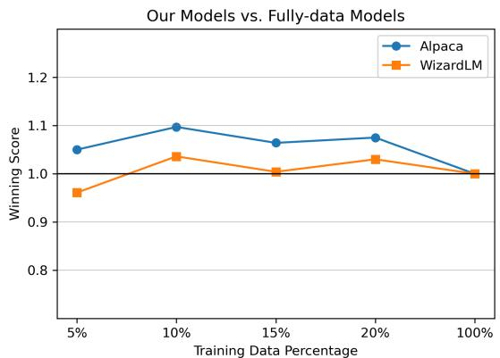  
Figure 3: The winning score changes over data growth by comparing our models with full-data models. The winning score is calculated as (Num(Win)−Num(Lose))/Num(All) +1. The Number of Wins, Losses, and All are calculated across all five test sets we used. When the value is higher than 1.0, it means this model performs better than the comparison.

## 4.2.2 Data with Diversity

In this experiment, we train a series of models only considering the diversity of the data samples. Specifically, we utilize the K-means algorithm for the clustering, and then sample data from each cluster. It is a direct baseline for the situation where only the diversity of data is considered. As illustrated in Figure 4 (labeled as Diversity), these models render subpar performance and are similar to the random trained models. This result shows that filtering data by only diversity is not enough for instruction tuning.

## 4.2.3 Data with Low IFD Score

In this experiment, we aim to further underscore the efficacy of our proposed IFD score. We train models using data chosen based on low IFD scores on the pre-experienced model, a direct antithesis to our primary experimental setting. As illustrated in Figure 4 (labeled as Low IFD score), models trained using low IFD scores obtain the least performance compared with all the methods. This observation highlights the prowess of our metric in sifting through high-quality data: a higher score consistently yields superior results, while a lower score deteriorates the model’s intrinsic performance. This experiment directly showcases the consistent relationship between the performance and the IFD score values.

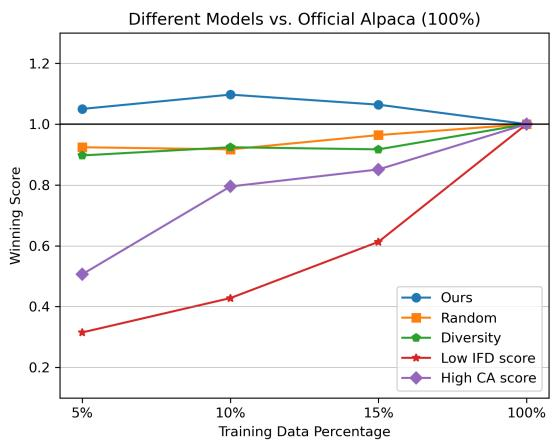  
Figure 4: The overall winning score changes by comparing models using different data selection strategies with the official Alpaca model.

## 4.2.4 Data with High CA Scores

For this comparison, we train models on data selected by higher Conditioned Answer scores which is equivalent to the loss or perplexity, and is a commonly accepted baseline. As Figure 4 (labeled as High CA score) elucidates, models in this group trail the official Alpaca model significantly. The salient difference between these models and ours rests on the elimination of Direct Answer scores. In models relying solely on CA scores, the underlying comprehension of the pre-trained LLM towards original answer texts isn’t factored in, rendering high CA scores ineffective in gauging the intricate nuances of the instruction following.

## 4.3 Ablation on Pre-Experienced Data

## 4.3.1 Number of Pre-Experience Data

Following the findings from LIMA that 1000 high quality samples are enough to train a reasonably good model, we set the amount of data used for our pre-experienced model as 1000. However, it is still under-investigated how many data samples are required to equip the model with basic instructionfollowing ability. Thus this section analyzes the necessity of employing pre-experience models and how the number of pre-experienced data affects the final performance of our cherry models. For these comparisons, we conduct the experiments where 0, 100, 300, and 500 pre-experienced samples are utilized to train the pre-experienced models. Using 0 pre-experienced samples represents direct using the initial raw model as the pre-experienced model. We calculate the IFD scores from these different preexperienced models and select the top 5%, 10%, and 15% samples for training while keeping other experimental conditions constant.

As shown in Figure 5, when no pre-experienced model is utilized, the corresponding cherry models have the least performance. However, even in the absence of a pre-experienced model, our IFD score remains effective in identifying the good training data subset as it outperforms the Alpaca model when using 10% of the data. When 100 samples are utilized, the corresponding cherry models are slightly better than no samples used but with a similar trend, which indicates that 100 samples are not enough for the model to acquire the basic instruction-following ability. When adding the number of pre-experienced samples to 300, a distinct performance gain is discovered, and further addition of samples does not make the performance of corresponding cherry models better. We hypothesize this is when the model is equipped with the basic instruction-following capability.

## 4.3.2 Distribution of Pre-Experience Data

To better illustrate what distribution of data is required in the pre-experience process, extensive experiments are conducted to consider choosing data by “Difficulty”, “Diversity” and “Random”. In the “Difficulty” setting, we select 1000 pre-experienced samples by calculating the IFD scores based on the initial raw model. In the “Diversity” setting, we select 1000 data by implementing the K-means algorithm. In the “Random” setting, we directly select pre-experienced data randomly. After obtaining these data samples with different distributions, preexperienced models are trained for selecting further cherry data. The performance of using 5%, 10%, and 15% cherry data compared with the Alpaca model is shown in Table 2. Comparing random selection and data diversity and instruction difficulty, they all surpass the Alpaca model and are comparable to each other, indicating the effectiveness of both strategies and further proving that our IFD metric is robust across different pre-experienced models. This experiment further illustrates that what matters is this pre-experience process, rather than the sampling strategies for this process.

<table><tr><td></td><td>5%</td><td>10%</td><td>15%</td><td>100%</td></tr><tr><td>Difficulty (1000)</td><td>1.057</td><td>1.072</td><td>1.096</td><td>1</td></tr><tr><td>Diversity (1000)</td><td>1.050</td><td>1.097</td><td>1.064</td><td>1</td></tr><tr><td>Random (1000)</td><td>1.007</td><td>1.047</td><td>1.077</td><td>1</td></tr></table>

Table 2: The overall winning score changes by comparing models with different strategies of selecting preexperienced samples with the official Alpaca model, utilizing ChatGPT.

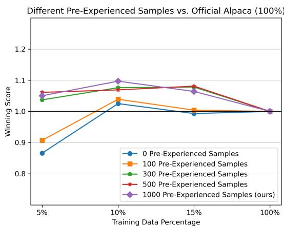  
Figure 5: The overall winning score changes by comparing models with different numbers of pre-experienced samples with the official Alpaca model.

## 4.4 Results on LLaMA2 Models

In this section, experiments on newer LLaMA2- 7B and LLaMA2-13B models are conducted as shown in Table 3. In these experiments, the IFD score of each sample is calculated directly based on the corresponding LLaMA2 pre-trained models by using prompts from Vicuna (Chiang et al., 2023). On both LLaMA2-7B and LLaMA2-13B models, our cherry models trained with much less data outperform the models trained with original full data. These experimental results illustrate the consistent advantages of our method and further verify the generalizability of our method.

<table><tr><td rowspan="2"></td><td colspan="5">Huggingface Open LLM Leaderboard</td><td>AlpacaEval</td></tr><tr><td>Average</td><td>ARC</td><td>HellaSwag</td><td>MMLU</td><td>TruthfulQA</td><td>AlpacaEval</td></tr><tr><td>Alpaca llama2 7b</td><td>55.25</td><td>54.35</td><td>78.65</td><td>47.02</td><td>40.98</td><td>27.75</td></tr><tr><td>Ours (5% Alpaca)</td><td>55.78</td><td>57.94</td><td>80.37</td><td>44.19</td><td>40.62</td><td>36.78</td></tr><tr><td>Ours (10% Alpaca)</td><td>56.31</td><td>58.02</td><td>80.42</td><td>46.64</td><td>40.18</td><td>-</td></tr><tr><td>Ours (15% Alpaca)</td><td>56.37</td><td>57.42</td><td>80.68</td><td>46.40</td><td>40.95</td><td>-</td></tr><tr><td>Alpaca llama2 13b</td><td>58.78</td><td>57.59</td><td>81.98</td><td>54.05</td><td>41.49</td><td>35.00</td></tr><tr><td>Ours (5% Alpaca)</td><td>61.21</td><td>62.37</td><td>84.00</td><td>55.65</td><td>42.82</td><td>46.82</td></tr><tr><td>Ours (10% Alpaca)</td><td>61.02</td><td>62.97</td><td>83.88</td><td>55.29</td><td>41.93</td><td>-</td></tr><tr><td>Ours (15% Alpaca)</td><td>61.23</td><td>62.37</td><td>83.48</td><td>55.56</td><td>43.42</td><td>-</td></tr></table>

Table 3: The comparison of performance on Huggingface Open LLM Leaderboard and AlpacaEval Leaderboard.

## 5 Cherry Data Characteristics

## 5.1 Distribution Characteristics

In this segment, our focus is on understanding the distributional properties of the cherry data within the original dataset. Specifically, we first compute the embedding of each instruction in the Alpaca dataset and employ t-SNE for dimensionality reduction, mapping high-dimensional embeddings to 2D space. The visualized vectors, color-coded based on the top or least 5% difficulty ratios, are showcased in Figure 6. Contrary to conventional beliefs, our cherry data isn’t uniformly scattered. Instead, clear boundaries exist between samples of high and low difficulty, challenging prior assumptions that selected data should span the entire instruction spectrum and maximize diversity.

To delve deeper into the distributional intricacies of instruction embeddings, the clusters with dense high IFD scores and clusters with dense low IFD scores are manually examined. Clusters dominated by low IFD score samples are replete with rudimentary tasks like editing punctuation, words, or sentences. In contrast, high IFD score clusters are typified by deeper, more intricate tasks such as storytelling or elucidation of phenomena. We posit that these in-depth tasks are paramount for aligning large language models, compelling them to rearrange and access their intrinsic knowledge repositories. Our methodology lends partial credence to this hypothesis, leaving room for further exploration.

## 5.2 Pattern Characteristics

To better understand the pattern characteristics of the selected cherry data, we further utilize the Berkeley Neural Parser to discern the verb-noun structure within the instruction of each data sample. This analytical approach enables us to identify the main verb and its direct noun object in each instruction, providing a direct insight into what kind of instructions are prone to be assigned with higher

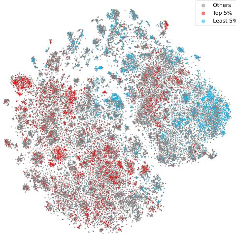  
Figure 6: Visualization using t-SNE on instruction embeddings from the Alpaca dataset. Red points represent samples with the top 5% IFD scores and Blue points represent samples with the least 5% IFD scores.

IFD scores or lower IFD scores. This experiment is conducted based on the Alpaca data, the top 10 occurred verb-noun pairs from the top 5% IFD scores data and the least 5% IFD scores data are shown in Table 4.

From this experiment, a clear discrepancy is revealed between the pattern characteristics of high-IFD data and low-IFD data. The high-IFD data mainly involves creative and complex instructions like “write story”, “generate list”, and “explain concept”, which require a lot of creativity, thinking skills, and deep understanding. On the contrary, the low-IFD data are more about following rules and need less creativity, showing a wide range in how much thinking and creativity different tasks demand from language models. As a result, the reason why IFD is a valid metric for data filtering can be summarized by its ability to find the instructions that need more creativity and deep understanding.

## 6 Related Work

## 6.1 Data-driven Instruction Tuning

Previous instruction tuning collections are typically handcrafted or task-related (Khashabi et al., 2020;

<table><tr><td colspan="3">Top 5% IFD</td><td colspan="3">Lease 5% IFD</td></tr><tr><td>Verb</td><td>Noun</td><td>Count</td><td>Verb</td><td>Noun</td><td>Count</td></tr><tr><td>Write</td><td>Story</td><td>119</td><td>Rewrite</td><td>Sentence</td><td>155</td></tr><tr><td>Generate</td><td>Story</td><td>98</td><td>Edit</td><td>Sentence</td><td>89</td></tr><tr><td>Generate</td><td>List</td><td>66</td><td>Change</td><td>Sentence</td><td>37</td></tr><tr><td>Explain</td><td>Concept</td><td>48</td><td>Classify</td><td>Sentence</td><td>36</td></tr><tr><td>Create</td><td>Story</td><td>44</td><td>Convert</td><td>Sentence</td><td>27</td></tr><tr><td>Write</td><td>Essay</td><td>42</td><td>Edit</td><td>Text</td><td>25</td></tr><tr><td>Create</td><td>List</td><td>28</td><td>Translate</td><td>Sentence</td><td>24</td></tr><tr><td>Write</td><td>Post</td><td>27</td><td>Replace</td><td>Word</td><td>16</td></tr><tr><td>Write</td><td>Paragraph</td><td>27</td><td>Rearrange</td><td>Word</td><td>15</td></tr><tr><td>Create</td><td>Poem</td><td>25</td><td>Arrange</td><td>Word</td><td>14</td></tr></table>

Table 4: The top 10 occurred verb-noun pairs from the top 5% IFD scores data and the least 5% IFD scores data. Instructions that require creativity, thinking skills, and deep understanding tend to be assigned with higher IFD scores while instructions that are more about following rules and need less creativity tend to have lower scores.

Ye et al., 2021; Wei et al., 2022; Wang et al., 2022; Du et al., 2022; Honovich et al., 2023), (Wang et al., 2023b) utilized GPT3 (Brown et al., 2020) to generate 52k distinct instructions, paving the way to generating instruction data set by distilling from teacher models (Xu et al., 2024). After the release of Meta LLaMA(Touvron et al., 2023a), the world witnessed a surge of open-sourced instruction tuning datasets and LLMs(Taori et al., 2023; Chiang et al., 2023; Xu et al., 2023; Ye et al., 2023; Ding et al., 2023; Li et al., 2023a, 2024a).

## 6.2 Coreset Selection

Coreset selection is pivotal in machine learning, aimed at identifying a representative subset of data points to expedite learning in various models. This approach finds its effectiveness in SVM learning (Tsang et al., 2005), K-means (Har-Peled and Kushal, 2005), and logistic regression (Munteanu et al., 2018). In neural network training, recent advancements, such as those by Toneva et al. (2018), explore the dynamics of data point utility during training. They find that points infrequently forgotten have minimal impact on final model accuracy. Paul et al. (2021) demonstrate that expected loss gradient norm scores averaged over various weight initializations, effectively prune training data without significantly compromising accuracy. Mindermann et al. (2022) use Bayesian probability theory to estimate the individual impact of training points on holdout loss, refining training efficiency.

## 6.3 Instruction Data Selection

Though consensus has been made that "quality is all you need" (Touvron et al., 2023b; Zhou et al., 2023) for instruction tuning, finding high-quality data other than through human curation is still an under-explored topic. Instruction Mining (Cao et al., 2023) evaluates various indicators and applies a statistical regression model for data selection by training numerous models. In contrast, AL-PAGASUS (Chen et al., 2023a) utilizes an external, fully-trained LLM (ChatGPT) to score each sample. While effective, this approach may neglect the intrinsic abilities of the base model, relying excessively on external models. Our work aims to develop a methodology utilizing the representation feature of the target model to identify high-quality data for instruction tuning, advancing the field with a more simple and efficient approach.

## 6.4 Pointwise Mutual Information

IFD ’s concept is related to Pointwise Mutual Information (PMI), a widely used metric in NLP for assessing word pair associations and contextual relevance. Both IFD and PMI aim to evaluate correlations between elements, such as questions and answers, despite employing distinct methodologies. For instance, Holtzman et al. (2021) leverage PMI to manage surface form competition in generative language models. They employ PMI to assess the alignment between responses and posed questions, similar to IFD’s role in assessing question-answer interactions in instructional data. Wiegreffe et al. (2023) further deepens the understanding of PMI by proposing methods to increase the probability mass of answer choices. And numerous other PMI applications concentrate on the dialogue task (Mou et al., 2016; Zhou et al., 2019). These varied applications underscore PMI’s contributions to advancing natural language processing, offering valuable context for our IFD metric.

## 7 Conclusion

Our study illuminates the potential of harnessing the innate capabilities of LLMs for selecting high-quality instruction tuning data that fit the model. Through our innovative self-guided approach, LLMs demonstrate the ability to discern and cherry-pick the most pertinent data samples. Central to our methodology is the Instruction-Following Difficulty score, a novel metric adept at gauging the nuanced differences between a model’s autonomous outputs and expected responses. Our findings not only emphasize the importance of data quality over quantity but also underscore the potential for cost-effective LLM training.

## Limitation

The main limitation of this method is the inconvenience of training the pre-experienced model. The concept of the Instruction-Following Difficulty score proposed by us is simple and effective, while the inconvenient pre-experienced phase makes it hard to directly put our method into usage in realworld scenarios. Though experiments on LLaMA2 models show that calculating IFD scores directly on the base LLaMA2 models also promises a good selection, we believe using the pre-experienced phase is valuable since it equips base models with the basic instruction-following ability, making the calculation of Conditioned Answer Score more reasonable. As a result, we believe the use of the preexperienced phase could be a tradeoff: From the Research Viewpoint, using pre-experienced models is more reasonable and performs better. From the Real-world Implementation Viewpoint, directly using the base model is more efficient and at the same time effective as well.

## Acknowledgement

This paper is supported by the Key Research and Development Program of Guangdong Province under grant No.2021B0101400003. Li and Zhou are partially supported by the Gift Fund from Adobe. The corresponding author is Jianzong Wang from Ping An Technology (Shenzhen) Co., Ltd (jzwang@188.com) and Tianyi Zhou from the University of Maryland (tianyi@umd.edu).

## References

Tom Brown, Benjamin Mann, Nick Ryder, Melanie Subbiah, Jared D Kaplan, Prafulla Dhariwal, Arvind Neelakantan, Pranav Shyam, Girish Sastry, Amanda Askell, Sandhini Agarwal, Ariel Herbert-Voss, Gretchen Krueger, Tom Henighan, Rewon Child, Aditya Ramesh, Daniel Ziegler, Jeffrey Wu, Clemens Winter, Chris Hesse, Mark Chen, Eric Sigler, Ma teusz Litwin, Scott Gray, Benjamin Chess, Jack Clark, Christopher Berner, Sam McCandlish, Alec Radford, Ilya Sutskever, and Dario Amodei. 2020. Language models are few-shot learners. In Advances in Neural Information Processing Systems, volume 33, pages 1877–1901. Curran Associates, Inc.

Yihan Cao, Yanbin Kang, and Lichao Sun. 2023. Instruction mining: High-quality instruction data selection for large language models.

Yupeng Chang, Xu Wang, Jindong Wang, Yuan Wu, Linyi Yang, Kaijie Zhu, Hao Chen, Xiaoyuan Yi,

Cunxiang Wang, Yidong Wang, Wei Ye, Yue Zhang, Yi Chang, Philip S. Yu, Qiang Yang, and Xing Xie. 2023. A survey on evaluation of large language models.

Lichang Chen, Shiyang Li, Jun Yan, Hai Wang, Kalpa Gunaratna, Vikas Yadav, Zheng Tang, Vijay Srinivasan, Tianyi Zhou, Heng Huang, and Hongxia Jin. 2023a. Alpagasus: Training a better alpaca with fewer data.

Pei Chen, Soumajyoti Sarkar, Leonard Lausen, Balasubramaniam Srinivasan, Sheng Zha, Ruihong Huang, and George Karypis. 2023b. Hytrel: Hypergraphenhanced tabular data representation learning. In Advances in Neural Information Processing Systems, volume 36, pages 32173–32193. Curran Associates, Inc.

Wei-Lin Chiang, Zhuohan Li, Zi Lin, Ying Sheng, Zhanghao Wu, Hao Zhang, Lianmin Zheng, Siyuan Zhuang, Yonghao Zhuang, Joseph E. Gonzalez, Ion Stoica, and Eric P. Xing. 2023. Vicuna: An opensource chatbot impressing gpt-4 with 90%\* chatgpt quality.

Peter Clark, Isaac Cowhey, Oren Etzioni, Tushar Khot, Ashish Sabharwal, Carissa Schoenick, and Oyvind Tafjord. 2018. Think you have solved question answering? try arc, the ai2 reasoning challenge.

Tri Dao, Daniel Y. Fu, Stefano Ermon, Atri Rudra, and Christopher Ré. 2022. FlashAttention: Fast and memory-efficient exact attention with IO-awareness. In Advances in Neural Information Processing Systems.

Ning Ding, Yulin Chen, Bokai Xu, Yujia Qin, Zhi Zheng, Shengding Hu, Zhiyuan Liu, Maosong Sun, and Bowen Zhou. 2023. Enhancing chat language models by scaling high-quality instructional conversations. arXiv preprint arXiv:2305.14233.

Zhengxiao Du, Yujie Qian, Xiao Liu, Ming Ding, Jiezhong Qiu, Zhilin Yang, and Jie Tang. 2022. GLM: General language model pretraining with autoregressive blank infilling. In Proceedings of the 60th Annual Meeting of the Association for Computational Linguistics (Volume 1: Long Papers), pages 320–335, Dublin, Ireland. Association for Computational Linguistics.

Yann Dubois, Xuechen Li, Rohan Taori, Tianyi Zhang, Ishaan Gulrajani, Jimmy Ba, Carlos Guestrin, Percy Liang, and Tatsunori B. Hashimoto. 2023. Alpacafarm: A simulation framework for methods that learn from human feedback.

Leo Gao, Jonathan Tow, Stella Biderman, Sid Black, Anthony DiPofi, Charles Foster, Laurence Golding, Jeffrey Hsu, Kyle McDonell, Niklas Muennighoff, Jason Phang, Laria Reynolds, Eric Tang, Anish Thite, Ben Wang, Kevin Wang, and Andy Zou. 2021. A framework for few-shot language model evaluation.

Sariel Har-Peled and Akash Kushal. 2005. Smaller coresets for k-median and k-means clustering. In Proceedings of the twenty-first annual symposium on Computational geometry, pages 126–134.

Dan Hendrycks, Collin Burns, Steven Basart, Andy Zou, Mantas Mazeika, Dawn Song, and Jacob Steinhardt. 2021. Measuring massive multitask language understanding. In International Conference on Learning Representations.

Ari Holtzman, Peter West, Vered Shwartz, Yejin Choi, and Luke Zettlemoyer. 2021. Surface form competition: Why the highest probability answer isn’t always right. In Proceedings of the 2021 Conference on Empirical Methods in Natural Language Processing, pages 7038–7051.

Or Honovich, Thomas Scialom, Omer Levy, and Timo Schick. 2023. Unnatural instructions: Tuning language models with (almost) no human labor. In Proceedings of the 61st Annual Meeting of the Association for Computational Linguistics (Volume 1: Long Papers), pages 14409–14428, Toronto, Canada. Association for Computational Linguistics.

Daniel Khashabi, Sewon Min, Tushar Khot, Ashish Sabharwal, Oyvind Tafjord, Peter Clark, and Hannaneh Hajishirzi. 2020. UNIFIEDQA: Crossing format boundaries with a single QA system. In Findings of the Association for Computational Linguistics: EMNLP 2020, pages 1896–1907, Online. Association for Computational Linguistics.

Diederik P. Kingma and Jimmy Ba. 2017. Adam: A method for stochastic optimization.

Miyoung Ko, Jinhyuk Lee, Hyunjae Kim, Gangwoo Kim, and Jaewoo Kang. 2020. Look at the first sentence: Position bias in question answering. In Proceedings of the 2020 Conference on Empirical Methods in Natural Language Processing (EMNLP), pages 1109–1121, Online. Association for Computational Linguistics.

Ming Li, Lichang Chen, Jiuhai Chen, Shwai He, Jiuxiang Gu, and Tianyi Zhou. 2024a. Selective reflection-tuning: Student-selected data recycling for llm instruction-tuning. ArXiv, abs/2402.10110.

Ming Li, Lichang Chen, Jiuhai Chen, Shwai He, Heng Huang, Jiuxiang Gu, and Tianyi Zhou. 2023a. Reflection-tuning: Data recycling improves llm instruction-tuning. ArXiv, abs/2310.11716.

Ming Li, Yong Zhang, Shwai He, Zhitao Li, Hongyu Zhao, Jianzong Wang, Ning Cheng, and Tianyi Zhou. 2024b. Superfiltering: Weak-to-strong data filtering for fast instruction-tuning. ArXiv, abs/2402.00530.

Xuechen Li, Tianyi Zhang, Yann Dubois, Rohan Taori, Ishaan Gulrajani, Carlos Guestrin, Percy Liang, and Tatsunori B. Hashimoto. 2023b. Alpacaeval: An automatic evaluator of instruction-following models. https://github.com/tatsu-lab/alpaca\_eval.

Stephanie Lin, Jacob Hilton, and Owain Evans. 2022. TruthfulQA: Measuring how models mimic human falsehoods. In Proceedings of the 60th Annual Meeting of the Association for Computational Linguistics (Volume 1: Long Papers), pages 3214–3252, Dublin, Ireland. Association for Computational Linguistics.

Fuxiao Liu, Kevin Lin, Linjie Li, Jianfeng Wang, Yaser Yacoob, and Lijuan Wang. 2024a. Mitigating hallucination in large multi-modal models via robust instruction tuning. In The Twelfth International Conference on Learning Representations.

Fuxiao Liu, Xiaoyang Wang, Wenlin Yao, Jianshu Chen, Kaiqiang Song, Sangwoo Cho, Yaser Yacoob, and Dong Yu. 2023. Mmc: Advancing multimodal chart understanding with large-scale instruction tuning.

Xiaoyu Liu, Paiheng Xu, Junda Wu, Jiaxin Yuan, Yifan Yang, Yuhang Zhou, Fuxiao Liu, Tianrui Guan, Haoliang Wang, Tong Yu, Julian McAuley, Wei Ai, and Furong Huang. 2024b. Large language models and causal inference in collaboration: A comprehensive survey.

S. Longpre, Le Hou, Tu Vu, Albert Webson, Hyung Won Chung, Yi Tay, Denny Zhou, Quoc V. Le, Barret Zoph, Jason Wei, and Adam Roberts. 2023. The flan collection: Designing data and methods for effective instruction tuning. ArXiv, abs/2301.13688.

Sören Mindermann, Jan M Brauner, Muhammed T Razzak, Mrinank Sharma, Andreas Kirsch, Winnie Xu, Benedikt Höltgen, Aidan N Gomez, Adrien Morisot, Sebastian Farquhar, et al. 2022. Prioritized training on points that are learnable, worth learning, and not yet learnt. In International Conference on Machine Learning, pages 15630–15649.

Lili Mou, Yiping Song, Rui Yan, Ge Li, Lu Zhang, and Zhi Jin. 2016. Sequence to backward and forward sequences: A content-introducing approach to generative short-text conversation. In Proceedings of COLING 2016, the 26th International Conference on Computational Linguistics: Technical Papers, pages 3349–3358.

Alexander Munteanu, Chris Schwiegelshohn, Christian Sohler, and David Woodruff. 2018. On coresets for logistic regression. volume 31.

OpenAI. 2023. Gpt-4 technical report.

Long Ouyang, Jeffrey Wu, Xu Jiang, Diogo Almeida, Carroll Wainwright, Pamela Mishkin, Chong Zhang, Sandhini Agarwal, Katarina Slama, Alex Ray, John Schulman, Jacob Hilton, Fraser Kelton, Luke Miller, Maddie Simens, Amanda Askell, Peter Welinder, Paul F Christiano, Jan Leike, and Ryan Lowe. 2022. Training language models to follow instructions with human feedback. In Advances in Neural Information Processing Systems, volume 35, pages 27730–27744. Curran Associates, Inc.

Mansheej Paul, Surya Ganguli, and Gintare Karolina Dziugaite. 2021. Deep learning on a data diet: Find ing important examples early in training. In Advances in Neural Information Processing Systems.

Guilherme Penedo, Quentin Malartic, Daniel Hesslow, Ruxandra Cojocaru, Alessandro Cappelli, Hamza Alobeidli, Baptiste Pannier, Ebtesam Almazrouei, and Julien Launay. 2023. The refinedweb dataset for falcon llm: Outperforming curated corpora with web data, and web data only.

Teven Le Scao, Angela Fan, Christopher Akiki, Elizabeth-Jane Pavlick, Suzana Ili’c, Daniel Hesslow, Roman Castagn’e, Alexandra Sasha Luccioni, Franccois Yvon, Matthias Gallé, Jonathan Tow, Alexander M. Rush, Stella Rose Biderman, Albert Webson, Pawan Sasanka Ammanamanchi, Thomas Wang, Benoît Sagot, Niklas Muennighoff, Albert Villanova del Moral, Olatunji Ruwase, Rachel Bawden, Stas Bekman, Angelina McMillan-Major, Iz Beltagy, Huu Nguyen, Lucile Saulnier, Samson Tan, Pedro Ortiz Suarez, Victor Sanh, Hugo Laurenccon, Yacine Jernite, Julien Launay, Margaret Mitchell, Colin Raffel, Aaron Gokaslan, Adi Simhi, Aitor Soroa Etxabe, Alham Fikri Aji, Amit Alfassy, Anna Rogers, Ariel Kreisberg Nitzav, Canwen Xu, Chenghao Mou, Chris C. Emezue, Christopher Klamm, Colin Leong, Daniel Alexander van Strien, David Ifeoluwa Adelani, Dragomir R. Radev, Eduardo Gonz’alez Ponferrada, Efrat Levkovizh, Ethan Kim, Eyal Bar Natan, Francesco De Toni, Gérard Dupont, Germán Kruszewski, Giada Pistilli, Hady ElSahar, Hamza Benyamina, Hieu Trung Tran, Ian Yu, Idris Abdulmumin, Isaac Johnson, Itziar Gonzalez-Dios, Javier de la Rosa, Jenny Chim, Jesse Dodge, Jian Zhu, Jonathan Chang, Jorg Frohberg, Josephine L. Tobing, Joydeep Bhattacharjee, Khalid Almubarak, Kimbo Chen, Kyle Lo, Leandro von Werra, Leon Weber, Long Phan, Loubna Ben Allal, Ludovic Tanguy, Manan Dey, Manuel Romero Muñoz, Maraim Masoud, Mar’ia Grandury, Mario vSavsko, Max Huang, Maximin Coavoux, and Mayank Singh. 2022. Bloom: A 176b-parameter open-access multilingual language model. ArXiv, abs/2211.05100.

Wangtao Sun, Haotian Xu, Xuanqing Yu, Pei Chen, Shizhu He, Jun Zhao, and Kang Liu. 2024. Itd: Large language models can teach themselves induction through deduction.

Rohan Taori, Ishaan Gulrajani, Tianyi Zhang, Yann Dubois, Xuechen Li, Carlos Guestrin, Percy Liang, and Tatsunori B. Hashimoto. 2023. Stanford alpaca: An instruction-following llama model. https:// github.com/tatsu-lab/stanford\_alpaca.

Mariya Toneva, Alessandro Sordoni, Remi Tachet des Combes, Adam Trischler, Yoshua Bengio, and Geoffrey J Gordon. 2018. An empirical study of example forgetting during deep neural network learning. In International Conference on Learning Representations.

Hugo Touvron, Thibaut Lavril, Gautier Izacard, Xavier Martinet, Marie-Anne Lachaux, Timothée Lacroix,

Baptiste Rozière, Naman Goyal, Eric Hambro, Faisal Azhar, Aurelien Rodriguez, Armand Joulin, Edouard Grave, and Guillaume Lample. 2023a. Llama: Open and efficient foundation language models.

Hugo Touvron, Louis Martin, Kevin Stone, Peter Albert, Amjad Almahairi, Yasmine Babaei, Nikolay Bashlykov, Soumya Batra, Prajjwal Bhargava, Shruti Bhosale, Dan Bikel, Lukas Blecher, Cristian Canton Ferrer, Moya Chen, Guillem Cucurull, David Esiobu, Jude Fernandes, Jeremy Fu, Wenyin Fu, Brian Fuller, Cynthia Gao, Vedanuj Goswami, Naman Goyal, Anthony Hartshorn, Saghar Hosseini, Rui Hou, Hakan Inan, Marcin Kardas, Viktor Kerkez, Madian Khabsa, Isabel Kloumann, Artem Korenev, Punit Singh Koura, Marie-Anne Lachaux, Thibaut Lavril, Jenya Lee, Diana Liskovich, Yinghai Lu, Yuning Mao, Xavier Martinet, Todor Mihaylov, Pushkar Mishra, Igor Molybog, Yixin Nie, Andrew Poulton, Jeremy Reizenstein, Rashi Rungta, Kalyan Saladi, Alan Schelten, Ruan Silva, Eric Michael Smith, Ranjan Subramanian, Xiaoqing Ellen Tan, Binh Tang, Ross Taylor, Adina Williams, Jian Xiang Kuan, Puxin Xu, Zheng Yan, Iliyan Zarov, Yuchen Zhang, Angela Fan, Melanie Kambadur, Sharan Narang, Aurelien Rodriguez, Robert Stojnic, Sergey Edunov, and Thomas Scialom. 2023b. Llama 2: Open foundation and fine-tuned chat models.

Ivor W Tsang, James T Kwok, Pak-Ming Cheung, and Nello Cristianini. 2005. Core vector machines: Fast svm training on very large data sets. Journal of Machine Learning Research, 6(4).

Thuy-Trang Vu, Xuanli He, Gholamreza Haffari, and Ehsan Shareghi. 2023. Koala: An index for quantifying overlaps with pre-training corpora.

Peiyi Wang, Lei Li, Liang Chen, Dawei Zhu, Binghuai Lin, Yunbo Cao, Qi Liu, Tianyu Liu, and Zhifang Sui. 2023a. Large language models are not fair evaluators.

Yizhong Wang, Yeganeh Kordi, Swaroop Mishra, Alisa Liu, Noah A. Smith, Daniel Khashabi, and Hannaneh Hajishirzi. 2023b. Self-instruct: Aligning language models with self-generated instructions. In Proceedings of the 61st Annual Meeting of the Association for Computational Linguistics (Volume 1: Long Papers), pages 13484–13508, Toronto, Canada. Association for Computational Linguistics.

Yizhong Wang, Swaroop Mishra, Pegah Alipoormolabashi, Yeganeh Kordi, Amirreza Mirzaei, Atharva Naik, Arjun Ashok, Arut Selvan Dhanasekaran, Anjana Arunkumar, David Stap, Eshaan Pathak, Giannis Karamanolakis, Haizhi Lai, Ishan Purohit, Ishani Mondal, Jacob Anderson, Kirby Kuznia, Krima Doshi, Kuntal Kumar Pal, Maitreya Patel, Mehrad Moradshahi, Mihir Parmar, Mirali Purohit, Neeraj Varshney, Phani Rohitha Kaza, Pulkit Verma, Ravsehaj Singh Puri, Rushang Karia, Savan Doshi, Shailaja Keyur Sampat, Siddhartha Mishra, Sujan Reddy A, Sumanta Patro, Tanay Dixit, and Xudong Shen. 2022. Super-NaturalInstructions: Generalization via declarative instructions on 1600+ NLP tasks.

In Proceedings of the 2022 Conference on Empirical Methods in Natural Language Processing, pages 5085–5109, Abu Dhabi, United Arab Emirates. Association for Computational Linguistics.

Jason Wei, Maarten Bosma, Vincent Zhao, Kelvin Guu, Adams Wei Yu, Brian Lester, Nan Du, Andrew M. Dai, and Quoc V Le. 2022. Finetuned language models are zero-shot learners. In International Conference on Learning Representations.

Sarah Wiegreffe, Matthew Finlayson, Oyvind Tafjord, Peter Clark, and Ashish Sabharwal. 2023. Increasing probability mass on answer choices does not always improve accuracy. In Proceedings of the 2023 Conference on Empirical Methods in Natural Language Processing, pages 8392–8417.

Can Xu, Qingfeng Sun, Kai Zheng, Xiubo Geng, Pu Zhao, Jiazhan Feng, Chongyang Tao, and Daxin Jiang. 2023. Wizardlm: Empowering large language models to follow complex instructions.

Xiaohan Xu, Ming Li, Chongyang Tao, Tao Shen, Reynold Cheng, Jinyang Li, Can Xu, Dacheng Tao, and Tianyi Zhou. 2024. A survey on knowledge distillation of large language models.

Qinyuan Ye, Bill Yuchen Lin, and Xiang Ren. 2021. CrossFit: A few-shot learning challenge for crosstask generalization in NLP. In Proceedings of the 2021 Conference on Empirical Methods in Natural Language Processing, pages 7163–7189, Online and Punta Cana, Dominican Republic. Association for Computational Linguistics.

Seonghyeon Ye, Yongrae Jo, Doyoung Kim, Sungdong Kim, Hyeonbin Hwang, and Minjoon Seo. 2023. Selfee: Iterative self-revising llm empowered by selffeedback generation. Blog post.

Rowan Zellers, Ari Holtzman, Yonatan Bisk, Ali Farhadi, and Yejin Choi. 2019. HellaSwag: Can a machine really finish your sentence? In Proceedings of the 57th Annual Meeting of the Association for Computational Linguistics, pages 4791–4800, Florence, Italy. Association for Computational Linguistics.

Lianmin Zheng, Wei-Lin Chiang, Ying Sheng, Siyuan Zhuang, Zhanghao Wu, Yonghao Zhuang, Zi Lin, Zhuohan Li, Dacheng Li, Eric. P Xing, Hao Zhang, Joseph E. Gonzalez, and Ion Stoica. 2023. Judging llm-as-a-judge with mt-bench and chatbot arena.

Chunting Zhou, Pengfei Liu, Puxin Xu, Srini Iyer, Jiao Sun, Yuning Mao, Xuezhe Ma, Avia Efrat, Ping Yu, Lili Yu, Susan Zhang, Gargi Ghosh, Mike Lewis, Luke Zettlemoyer, and Omer Levy. 2023. Lima: Less is more for alignment.

Kun Zhou, Kai Zhang, Yu Wu, Shujie Liu, and Jingsong Yu. 2019. Unsupervised context rewriting for open domain conversation. In Proceedings of the 2019 Conference on Empirical Methods in Natural Language Processing and the 9th International Joint Conference on Natural Language Processing (EMNLP-IJCNLP), pages 1834–1844.

## A Implementation Details

For experiments on the LLaMA-7B pre-trained model, our training framework aligns with protocols from Alpaca and WizardLM datasets. The Adam optimizer (Kingma and Ba, 2017), with a $2 \times 1 0 ^ { - 5 }$ learning rate and a batch size of 128, steers the training across three epochs. Our preexperienced models, however, undergo just a single epoch of training. Training on the Alpaca dataset necessitated a max input length of 512. For WizardLM, we opted for a 1024 input length due to hardware constraints while its original model used 2048, which offers an inherent edge to the original model. Another challenge with WizardLM was “AI censure” instances. Taking a leaf from the Vicuna strategy, we filtered these samples, resulting in a streamlined WizardLM subset with 63655 entries. Our data selection methodology was then applied to this subset. For experiments on LLaMA2-7B and LLaMA2-13b models, we utilize the instruction prompt from Vicuna (Chiang et al., 2023). Thanks to the Flash Attention mechanism (Dao et al., 2022), all models on LLaMA2 use the max length of 2048.

## B Ablation on Data Selection Mechanism

The ablation results of different methods on the Open LLM Leaderboard and Human Evaluation results are shown in Table 5. The human evaluation configuration is aligned with the main results. The win-tie-lose counts are from the perspective of our model: It represents our model better when the Win count is greater than the Lose count.

<table><tr><td rowspan="2"></td><td colspan="5">Huggingface Open LLM Leaderboard</td><td colspan="4">Human Evaluation</td></tr><tr><td>Avg</td><td>ARC</td><td>HellaSwag</td><td>MMLU</td><td>TruthfulQA</td><td>Win</td><td>Tie</td><td>Lose</td><td>Winning Score</td></tr><tr><td>Ours 5%</td><td>52.06</td><td>53.92</td><td>79.49</td><td>36.51</td><td>38.33</td><td>-</td><td>-</td><td>-</td><td>-</td></tr><tr><td>Random 5%</td><td>50.61</td><td>53.52</td><td>79.33</td><td>32.90</td><td>36.67</td><td>58</td><td>23</td><td>19</td><td>1.39</td></tr><tr><td>Diversity 5%</td><td>49.48</td><td>53.41</td><td>79.29</td><td>29.19</td><td>36.04</td><td>61</td><td>21</td><td>18</td><td>1.43</td></tr><tr><td>Low IFD 5%</td><td>50.77</td><td>53.92</td><td>79.09</td><td>34.83</td><td>35.25</td><td>87</td><td>8</td><td>5</td><td>1.82</td></tr><tr><td>High CA 5%</td><td>47.51</td><td>51.45</td><td>75.50</td><td>35.41</td><td>26.67</td><td>76</td><td>15</td><td>9</td><td>1.67</td></tr></table>

Table 5: The ablation performance on Huggingface Open LLM Leaderboard and Human Evaluation.

## C Performance across Sub-Categories

To evaluate the performance variations of our model, we scrutinize the capabilities across diverse instruction tasks. To accomplish this, we compare the response of our cherry models, trained with 5% Alpaca data and 10% WizardLM data, to their corresponding comparing models, the official Alpaca and the reimplemented WizardLM across subcategories in the WizardLM and Vicuna test sets, as displayed in Table 6 and Table 7.

Our cherry model trained on Alpaca data exhibits superior or at least comparable performance to the official Alpaca model on most of the subcategories in the Vicuna and WizardLM test sets. Notably, exceptions are observed in the Math and Coding categories, corroborating the observations made by (Chen et al., 2023a). We surmise that the base 7B models inherently perform sub-optimally on these two tasks, necessitating a greater volume of data samples to effectively learn the alignment.

Our cherry model trained on WizardLM data also has a better or comparable performance compared with the reimplemented WizardLM model on most of the subcategories. Specifically, Our model underperforms in Math, Code, Complex Format, and Counterfactual. The main reason our model loses in these categories is the abundance of training data for these categories in the original dataset and the supreme abilities of the original WizardLM in these tasks, which is mentioned in (Xu et al., 2023). As a consequence, when we reduce the number of data used, our model can not be trained on these data-needed categories as much as the original model, thus leading to a relatively incomparable performance.

<table><tr><td></td><td>Math</td><td>Coding</td><td>Writing</td><td>Generic</td><td>Knowledge</td><td>Roleplay</td><td>Common-sense</td><td>Fermi</td><td>Counterfactual</td></tr><tr><td>Alpaca</td><td>0.33 / 0.33 / 0.33</td><td>0.14 / 0.43 / 0.43</td><td>0.60 / 0.20 / 0.20</td><td>0.60 / 0.10 / 0.30</td><td>0.60 / 0.20 / 0.20</td><td>0.60 / 0.10 / 0.30</td><td>0.60 / 0.20 / 0.30</td><td>0.50 / 0.30 / 0.20</td><td>0.70 / 0.10 / 0.20</td></tr><tr><td>WizardLM</td><td>0.00 / 0.33 / 0.67</td><td>0.00 / 0.29 / 0.71</td><td>0.60 / 0.20 / 0.20</td><td>0.40 / 0.40 / 0.20</td><td>0.70 / 0.30 / 0.00</td><td>0.40 / 0.30 / 0.30</td><td>0.70 / 0.30 / 0.00</td><td>0.50 / 0.30 / 0.20</td><td>0.20 / 0.20 / 0.60</td></tr></table>

Table 6: The comparison between our cherry models and their corresponding comparing models on sub-categories in Vicuna test sets, using GPT4 as the judge.

<table><tr><td></td><td>Math</td><td>CodeGeneration</td><td>Writing</td><td>Computer</td><td>Reasoning</td><td>ComplexFormat</td><td>CodeDebug</td><td>CommonSense</td><td>Counterfactual</td></tr><tr><td>Alpaca</td><td>0.21 / 0.37 / 0.42</td><td>0.28 / 0.33 / 0.39</td><td>0.56 / 0.17 / 0.28</td><td>0.40 / 0.33 / 0.27</td><td>0.31 / 0.54 / 0.15</td><td>0.50 / 0.25 / 0.25</td><td>0.50 / 0.50 / 0.00</td><td>0.55 / 0.11 / 0.33</td><td>1.00 / 0.00 / 0.00</td></tr><tr><td>WizardLM</td><td>0.42 / 0.37 / 0.21</td><td>0.33 / 0.28 / 0.39</td><td>0.50 / 0.44 / 0.06</td><td>0.33 / 0.40 / 0.27</td><td>0.38 / 0.23 / 0.38</td><td>0.25 / 0.25 / 0.50</td><td>0.40 / 0.40 / 0.20</td><td>0.56 / 0.44 / 0.00</td><td>0.00 / 0.38 / 0.62</td></tr><tr><td></td><td>Multilingual</td><td>Roleplay</td><td>Biology</td><td>Technology</td><td>Ethics</td><td>TruthfulQA</td><td>Sport</td><td>Law</td><td>Medicine</td></tr><tr><td>Alpaca</td><td>0.29 / 0.29 / 0.42</td><td>0.67 / 0.17 / 0.17</td><td>0.50 / 0.00 / 0.50</td><td>0.83 / 0.17 / 0.00</td><td>0.67 / 0.00 / 0.33</td><td>0.60 / 0.00 / 0.40</td><td>1.00 / 0.00 / 0.00</td><td>0.40 / 0.00 / 0.60</td><td>0.80 / 0.00 / 0.20</td></tr><tr><td>WizardLM</td><td>0.14 / 0.71 / 0.14</td><td>0.33 / 0.33 / 0.33</td><td>0.17 / 0.50 / 0.33</td><td>0.50 / 0.50 / 0.00</td><td>0.17 / 0.83 / 0.00</td><td>0.80 / 0.20 / 0.00</td><td>0.20 / 0.60 / 0.20</td><td>0.20 / 0.60 / 0.20</td><td>0.80 / 0.00 / 0.20</td></tr></table>

Table 7: The comparison between our cherry models and their corresponding comparing models on sub-categories in WizardLM test sets, using GPT4 as the judge.

## D Results with Official WizardLM

In this section, we provide the results of using 40% of the WizardLM data to have a comparable performance with the official WizardLM model in a relatively unfair setting. The official WizardLM is uncensored and trained with the max token size of 2048, while our model is trained with the max token size of 1024, representing an inherent disadvantage of our model. However, even with this situation, our model can still reach a comparable performance with the official WizardLM model, inferring the effectiveness of our method.

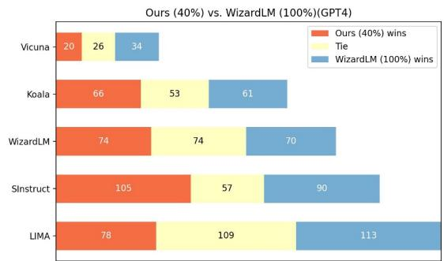  
Figure 7: Comparing our models trained on cherry data with official WizardLM trained on full data using GPT4 as the judge.

<table><tr><td rowspan="2"></td><td colspan="5">Huggingface Open LLM Leaderboard</td><td>AlpacaEval</td></tr><tr><td>Average</td><td>ARC</td><td>HellaSwag</td><td>MMLU</td><td>TruthfulQA</td><td>AlpacaEval</td></tr><tr><td>Official WizardLM</td><td>54.18</td><td>51.60</td><td>77.70</td><td>42.70</td><td>44.70</td><td>67.64</td></tr><tr><td>Ours (40% WizardLM)</td><td>52.83</td><td>53.07</td><td>77.79</td><td>35.29</td><td>45.17</td><td>65.09</td></tr></table>

Table 8: The comparison of performance on Huggingface Open LLM Leaderboard and AlpacaEval Leaderboard.

## E Cherry Data General Characteristics

Our goal in this section is to determine if the data selected based on the IFD scores aligns with known characteristics of high-quality training data. To this end, we randomly sample 100 instances from data with the top 5% scores and the least 5% scores. Utilizing ChatGPT, we evaluate each instruction on six aspects: Scope, Complexity, Clarity, Depth, Simplicity, and Knowledge Required. The results are depicted in Figure 8. Data with a higher IFD score generally scored higher in Scope, Complexity, Depth, and Knowledge Required, but lower in Clarity and Simplicity. Simplicity, in particular, have the most pronounced discrepancy. This lends credence to our assertion that our IFD scores aptly gauge instruction complexity. Consequently, our method gravitates towards selecting more intricate samples

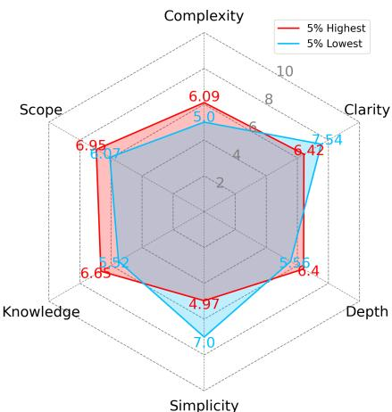  
Figure 8: The comparison between data instances with top 5% and least 5% IFD scores from Alpaca data. We prompt ChatGPT to score the instruction of each data instance with respect of Scope, Complexity, Clarity, Depth, Simplicity, and Knowledge Required.

As mentioned in the previous section, we try to evaluate each instruction into six aspects, Scope, Complexity, Clarity, Depth, Simplicity, and Knowledge Required. We define these aspects as follows:

• Scope: The instruction encompasses the breadth and range of actions or information necessary for successful completion.

• Complexity: The instruction integrates multiple steps or concepts that require careful attention and understanding.

• Clarity: The instruction is articulated straightforwardly, ensuring it’s easily understood without ambiguity.

• Depth: The instruction provides thorough details and nuances, ensuring a comprehensive understanding of the task at hand.

• Simplicity: While thorough, the instruction avoids unnecessary jargon or convolutions, making it accessible and easy to follow.

• Knowledge Required: The instruction acknowledges and, if necessary, provides the foundational knowledge or context the user needs for successful execution.

From the previous Figure 8, we can see samples selected with top IFD scores have larger scores in the aspects that reflect the difficulty of instruction, including Scope, Complexity, Depth, and Knowledge Required. These samples only underscore samples with the lowest IFD scores on the aspect of Clarity and Simplicity. This experiment detailedly illustrates the difference between samples with high or low IFD scores and verifies the effectiveness of our method in measuring the difficulty of an instruction.

## F Cherry Example Analysis

To illustrate the implications of our findings and demonstrate the characteristics of the data selected by our method, we provide several examples in Figure 9.

The first positive example presents the situation that both the direct answer score (DA) and the conditioned answer score (CA) are relatively high. In this situation, the high DA means that it is hard for the initial pre-trained LLM to generate this poem, and the high CA means given the instruction does not make the generation of this poem much easier. So it is valuable for LLM to learn this sample. The second positive example presents the situation that both the CA score and DA score are relatively low. The low DA score means that LLM has learned this knowledge it is easy for LLM to generate this sentence. However, providing the corresponding instruction does not change the situation much, indicating the poor ability to follow this instruction.

The first negative example presents a situation where the response is too short. Due to the intrinsic nature of next token prediction that longer texts tend to have lower perplexity, the DA score is relatively high for the response that is too short and thus causes the IFD Score large, which we believe is a good feature of our method. The second negative example presents a situation where the DA score and CA score are relatively small. In this example, the response is quoted from a book that LLM must have read, thus as a known knowledge, it is easy for LLM to reproduce this sentence. However, with an instruction included, the CA score becomes even much lower, indicating LLM has gained quite a good ability in following this instruction. The third example presents the most common situation, where the instruction is simply not difficult enough.

<table><tr><td>Positive Examples</td><td>Negative Examples</td></tr><tr><td>[Instruction] Create a poem that tells the story of a struggle against an unseen force. [Input] [Response] A distant enemy looms on the horizon, Selves of the light fight despite fear and fatigue. Innumerable obstacles barring their mission, Though seeming to weaken, strengths within achieve.</td><td>[Instruction] What emotion is expressed in this tweet? [Input] I&#x27;m so frustrated right now!! [Response] Frustration [Direct Answer score (DA)] 6.593 [Conditioned Answer score (CA)] 0.601 [IFD score] 0.091</td></tr><tr><td>Roots of bravery sustained their cause, Though many obstacles pushed and pulled. Heart&#x27;s noise drowned out every pause, Escaping each struggle stronger and full.</td><td rowspan="2">[Instruction] Identify a famous quote from the given book [Input] Book: Pride and Prejudice by Jane Austen [Response] &quot;It is a truth universally acknowledged, that a single man in possession of a good fortune, must be in want of a wife.&quot; [Direct Answer score (DA)] 0.497 [Conditioned Answer score] 0.026 [IFD score] 0.053</td></tr><tr><td>The reward of their labors thought clear and light, The force of the shadows still kept them at bay. Yet further pushed and tired through the night, Triumph steadily came in a growing display.</td></tr><tr><td>Peace of their struggle found in the morning&#x27;s glow, Rising higher than any unseen force&#x27;s ebb and flow. [Direct Answer score (DA)]3.970 [Conditioned Answer score (CA)]3.337 [IFD score]0.928</td><td rowspan="2">[Instruction] Generate a report summarizing a conversation about car maintenance. [Input] Joe and Lisa were discussing the importance of regular car maintenance such as oil changes, tire rotations, and brake inspects. Joe believes that regular car maintenance is essential for keeping the car operating properly and avoiding major repairs. Lisa believes that some car maintenance procedures are unnecessary and are a waste of money. [Response] Joe and Lisa discussed the importance of regular car maintenance such as oil changes, tire rotations, and brake inspections. Joe believes that regular car maintenance is essential for keeping the car operating properly and avoiding major repairs while Lisa believes that some procedures are unnecessary and are a waste of money. It is agreed that regular oil changes and tire rotations are important to maintain the health of the car but that some other maintenance procedures can be skipped depending on the age and condition of the car. [Direct Answer score (DA)] 1.667 [Conditioned Answer score] 0.599 [IFD score] 0.359</td></tr><tr><td>[Instruction] Give a brief description of the coronavirus. [Input] [Response] Coronavirus is a type of virus that can cause illnesses ranging from the common cold to severe diseases such as Middle East Respiratory Syndrome (MERS) and Severe Acute Respiratory Syndrome (SARS). The virus is named for the crown-like spikes on its surface. It spreads primarily through close contact with an infected person, through small droplets from the nose or mouth after coughing or sneezing. Symptoms can include fever, tiredness, and dry cough. In severe cases, it can cause difficulty breathing, pneumonia, kidney failure, and even death. [Direct Answer score (DA)]0.761 [Conditioned Answer score (CA)]0.696 [IFD score]0.914</td></tr></table>

Figure 9: Example instances selected by our proposed method. 2 positive examples and 3 negative examples are provided.

## G Additional Discussion

## G.1 Fully-trained Model as Pre-Experienced Model?

In our method, efforts are conducted to keep the preexperience process as simple as possible, however, there still exists a question of whether the fullytrained model can be the pre-experienced model for selecting the cherry samples. To better illustrate this question, the fully-trained Alpaca model is utilized as the pre-experienced model for selecting the cherry data, 5%, 10%, and 15% of the cherry data are selected and the corresponding cherry models are trained. The performances are shown in Table 9, in which the models with the fully-trained Alpaca hardly surpass the Alpaca with fewer data and our models. This experiment proves that the fully-trained model is not appropriate in selecting samples for the initial raw model, which is caused by the overly distribution gap between the fullytrained models and raw models.

<table><tr><td></td><td>5%</td><td>10%</td><td>15%</td><td>100%</td></tr><tr><td>Ours</td><td>1.050</td><td>1.097</td><td>1.064</td><td>1</td></tr><tr><td>Fully-trained Alpaca</td><td>0.968</td><td>0.999</td><td>1.005</td><td>1</td></tr></table>

Table 9: The overall winning score changes over the data growth comparing models with fully-trained Alpaca as the pre-experienced model with the official Alpaca model. All the comparison in this table is performed by ChatGPT.

## G.2 How Many Cherry Samples are Required?

While extensive experiments with our method on Alpaca and WizardLM prove the effectiveness of our method in selecting high-quality samples from the original target dataset automatically, it is still under-exploring how much data is optimal. Unlike (Chen et al., 2023a) in which the scores of target samples are scarce, the dense scores from our method provide better flexibility in deciding how much data you can use. However, this flexibility is also a curse that makes it hard to conclude the optimal number of data to select, which is influenced by various factors including the absolute values of the IFD scores, the distribution of hard examples, and the number of data in original datasets. However, from our empirical study, we think selecting samples with the top 10% IFD scores would be a safe and reasonable choice.

## H Prompt for Evaluation

In this section, we provide the detailed prompt we used for evaluating the performance of two responses for the same instruction as shown in Figure 10.

<table><tr><td>Prompt for Performance Evaluation</td></tr><tr><td>System PromptYou are a helpful and precise assistant for checking the quality of the answer.</td></tr><tr><td>User Prompt[Question]Question[The Start of Assistant 2’s Answer]Answer 2[The End of Assistant 2’s Answer][The Start of Assistant 2’s Answer]Answer 2[The End of Assistant 2’s Answer]</td></tr></table>

We would like to request your feedback on the performance of two AI assistants in response to the user question displayed above.

Please rate the helpfulness, relevance, accuracy, level of details of their responses. Each assistant receives an overall score on a scale of 1 to 10, where a higher score indicates better overall performance. Please first output a single line containing only two values indicating the scores for Assistant 1 and 2, respectively. The two scores are separated by a space. In the subsequent line, please provide a comprehensive explanation of your evaluation, avoiding any potential bias and ensuring that the order in which the responses were presented does not affect your judgment.

## I Detailed Main Comparison

## I.1 Comparison with the Official Alpaca

As shown in Figure 11, we present the detailed comparison between our cherry models with the official Alpaca (7B) model across different test set with different percentage of cherry data, from 5% to 15%, using ChatGPT as the judge. Starting from 5% of the full data, our cherry models outperform the official Alpaca model in all these data scales.

## I.2 Comparison with the Reimplemented WizardLM

As shown in Figure 12, we present the detailed comparison between our cherry models with the reimplemented WizardLM (7B) model across different test set with different percentage of cherry data, from 5% to 15%, using ChatGPT as the judge. Our cherry models begin outperforming the reimplemented WizardLM from the scale of 10% of the data.

## I.3 Comparison with the Official WizardLM

As shown in Figure 13, we show the detailed comparison between our cherry models with the reimplemented WizardLM (7B) model across different test set with different percentage of cherry data, from 5% to 40%, using ChatGPT as the judge. When compared with the official WizardLM data, our cherry model achieves a comparable performance when using 40% of the WizardLM data, which is positive considering the inherent disadvantage of our training configuration.

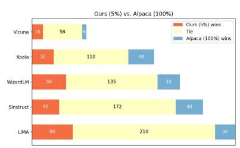  
(a)

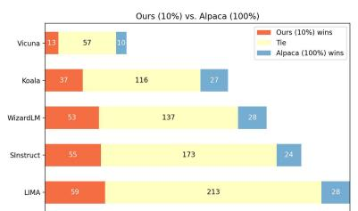  
(b)

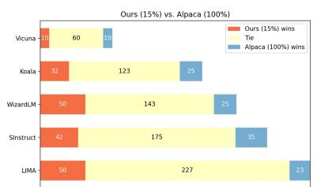  
(c)  
Figure 11: Comparing our cherry models with the official Alpaca model from 5% to 15% of the data using ChatGPT as the judge. Each horizontal bar represents a comparison in a specific test set.

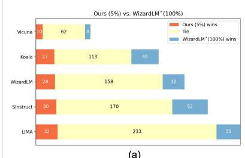  
(a)

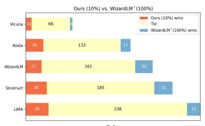  
(b)

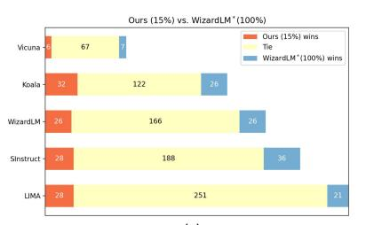  
(c)  
Figure 12: Comparing our cherry models with the reimplemented WizardLM model from 5% to 15% of the data using ChatGPT as the judge. Each horizontal bar represents a comparison in a specific test set.

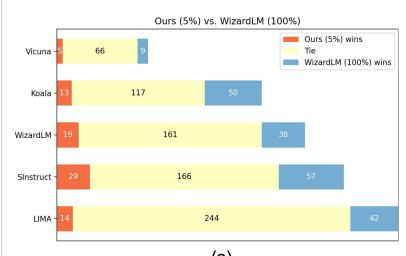  
(a)

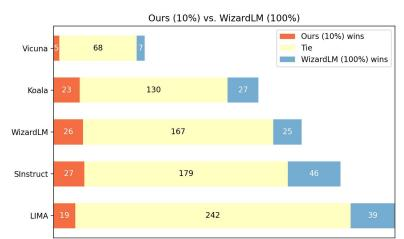

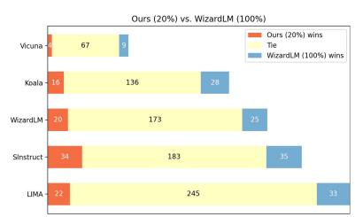  
(d)

(b)  
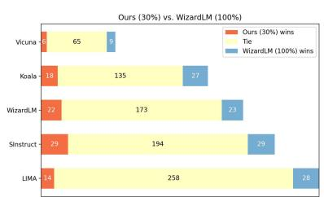  
(e)

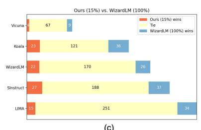  
(c)

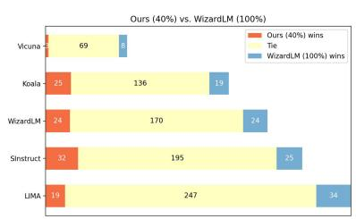  
(f)  
Figure 13: Comparing our cherry models with the official WizardLM model from 5% to 40% of the data using ChatGPT as the judge. Each horizontal bar represents a comparison in a specific test set.

## J Detailed Ablation Comparison

## J.1 Data Randomly Selected

As shown in Figure 14(a)(b)(c), we show the detailed comparison between the models trained with randomly selected data with our cherry models across different test set with different percentage of data, from 5% to 15%, using ChatGPT as the judge. From 5% to 15% of the data, our cherry models consistently outperform the random models.

## J.2 Data with Low IFD Score

As shown in Figure 15, we show the detailed comparison between the models trained with data selected with low IFD scores with our cherry models across different test set with different percentage of data, from 5% to 15%, using ChatGPT as the judge. From 5% to 15% of the data, our cherry models consistently have better performances.

## J.3 Data with High CA Scores

As shown in Figure 16, we show the detailed comparison between the models trained with data selected with high conditioned answer scores with our cherry models across different test set with different percentage of data, from 5% to 15%, using ChatGPT as the judge. From 5% to 15% of the data, our cherry models consistently have better performances.

## J.4 Number of Pre-Experienced Data

Figure 17 shows the comparisons when different numbers of pre-experienced samples are utilized to train the pre-experienced model.

## J.5 Distribution of Pre-Experience Data

Figure 18 shows the comparisons when IFD scores are used as the strategy to select pre-experienced data to train the pre-experienced model.

## J.6 Fully-trained Model as Pre-Experienced Models

Figure 19 shows the detailed comparisons when the fully-trained official Alpaca is utilized as the pre-experienced model for selecting cherry data.

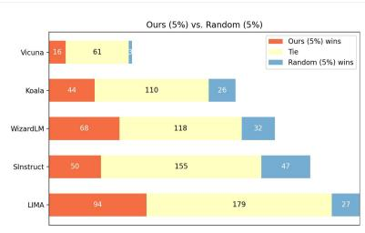  
(a)

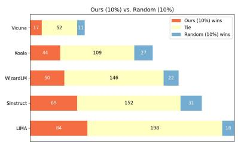  
(b)

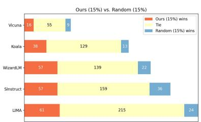  
(c)  
Figure 14: Comparing our cherry models with models utilizing randomly selected data from 5% to 15%, using ChatGPT as the judge. Each horizontal bar represents a comparison in a specific test set.

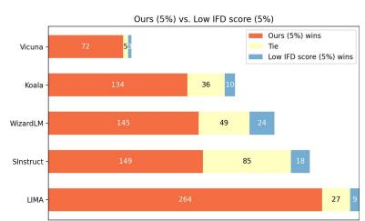  
(a)

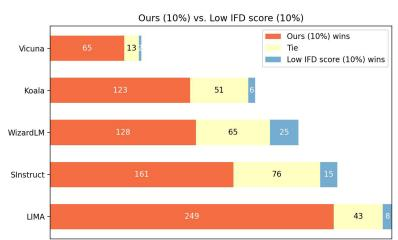  
(b)

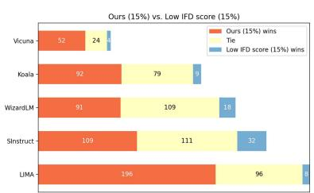  
(c)  
Figure 15: Comparing our cherry models with models trained with data selected with low IFD score from 5% to 15%, using ChatGPT as the judge. Each horizontal bar represents a comparison in a specific test set.

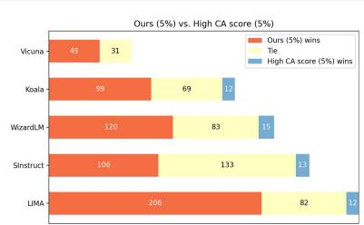  
(a)

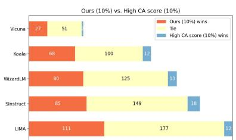  
(b)

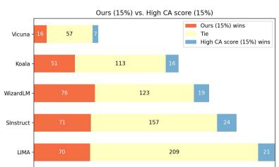  
(c)  
Figure 16: Comparing our cherry models with models trained with data selected with high conditioned answer scores from 5% to 15%, using ChatGPT as the judge. Each horizontal bar represents a comparison in a specific test set.

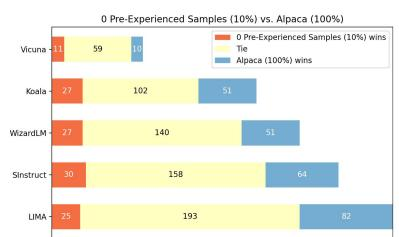

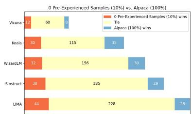  
(a)

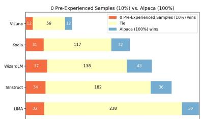

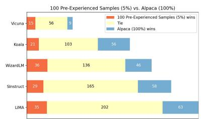

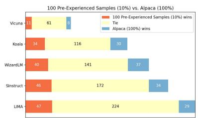

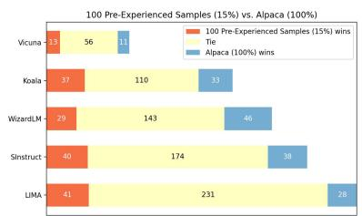

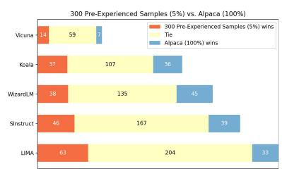

(b)  
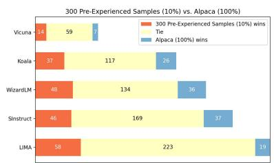  
(c)

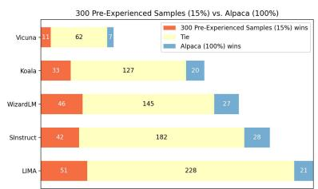

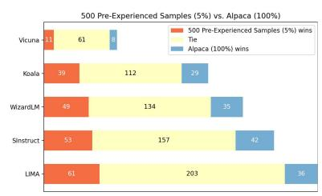

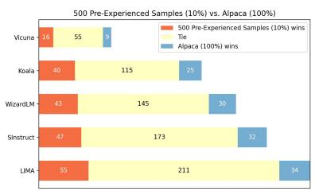  
(d)

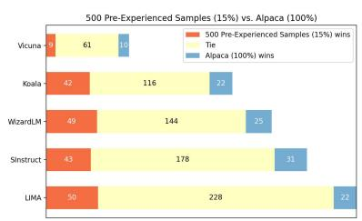

Figure 17: Comparing our cherry models with different numbers of pre-experienced samples with the Alpca mode from 5% to 15%, using ChatGPT as the judge. (a)(b)(c) and (d) represent the situation where 0, 100, 300 and 500 pre-experienced samples are utilized respectively.  
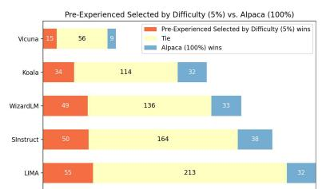  
(a)

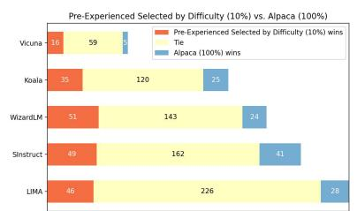  
(b)

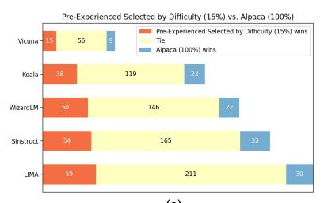  
(c)

Figure 18: Comparing models whose pre-experienced data are selected by considering the difficulty of instructions with the Alpca model from 5% to 15%, using ChatGPT as the judge.  
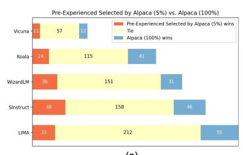  
(a)

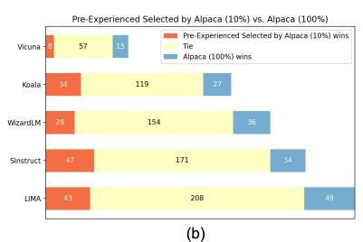

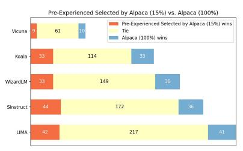  
(c)  
Figure 19: Comparing models with fully-trained Alpaca as the pre-experienced model with the Alpca model from 5% to 15%, using ChatGPT as the judge.

In this section, some positive examples with top 5% IFD scores in the Alpaca dataset are presented in Figure 20 and 21. Negative examples with the least 5% IFD scores are presented in Figure 22.

## K More Examples

<table><tr><td colspan="2">Positive Example</td></tr><tr><td>[Instruction] Design a wellness plan for the given audience[Input] Expectant Mothers[Response]This wellness plan for expectant mothers should include strategies for physical, emotional and mental health. Physical health should include exercise, a healthy diet and adequate rest. Expectant mothers should strive for at least 30 minutes of moderate exercise such as walking or swimming every day. A nutritious diet should include a variety of fruits, vegetables and proteins. Adequate sleep is essential for the body and mind to recharge, so make sure to get seven to eight hours per night.Stress management is important for emotional and mental health. This can include mindfulness activities, journaling or talking to a friend. Participating in activities like yoga, meditation or guided visualization can also be beneficial. Make sure to take time every day to treat yourself, whether it be by getting a massage or simply taking a long bubble bath.Make sure to take prenatal vitamins as prescribed by your doctor and attend all of your obstetrician checkups. It's also important to stay hydrated by drinking plenty of water. Schedule regular check-ins with your doctor to ensure the health of both you and your baby.____[Instruction] Identify the types of bias in machine learning[Input][Response]The types of bias in machine learning include sampling bias, data bias, selection bias, measurement bias, model bias and inference bias. Sampling bias occurs when the dataset is not representative of the population;data bias happens when data is skewed or incomplete; selection bias arises when data is chosen in a non-random way; measurement bias is caused by incorrect labels or noisy data; model bias arises when the model is overly reliant on specific features or data; and inference bias is caused by the model being too simplistic.</td><td>[Instruction] Generate a story about a journey in space.[Input][Response]It was a beautiful day on Earth, but Andrew was not content to stay on land. He wanted to explore and experience the vastness of space. So, on that fateful day, he set off on an intergalactic voyage to the farthest reaches of the stars....Exploring this new universe felt like a dream, and Andrew found himself discovering more wonders than he had ever imagined. One of his greatest adventures was traveling to a star that had never been seen by anyone before him.Years passed, and Andrew eventually returned to Earth, full of stories and memories of his travels. He had learned a great deal about the universe and made many friends along the way. His journey had taught him that space is full of boundless possibilities and wonders, and he will never forget his time in the stars.____[Instruction] Provide an analysis of the impact of carbohydrates on human health.[Input][Response]Carbohydrates are an important part of a balanced human diet and have been linked to a variety of health benefits when consumed in appropriate amounts. Carbohydrates are the main source of energy for the body and are important for the brain, organs, and muscles to function properly. ... Choosing complex carbohydrates, such as fruits and vegetables, whole grains, and legumes, instead of simple carbohydrates that are found in processed and refined foods, can help to provide essential vitamins, minerals and other nutrients. Ultimately, carbohydrates are a necessary part of a healthy diet and should be consumed in moderation and in a balanced way.</td></tr><tr><td>[Instruction] Outline the steps a startup would need to take to increase brand awareness[Input][Response]Steps to Increase Brand Awareness for a Startup:1. Identify target customers: Understand the target demographic and research their needs and interests.2. Develop a content strategy: Use content to engage, inform or entertain customers in order to establish a connection with them.3. Share the story: Create a website and create social media platforms to share the story, mission or purpose of the startup with customers.4. Make it interactive: Encourage audience participation via competitions, surveys, or polls.5. Track and analyze data: Measure the response of customers and use the insights to inform any changes or adjustments."</td><td>[Instruction] What are the major components of the Java programming language?[Input][Response]The major components of the Java programming language are the Java Virtual Machine (JVM), the Java Runtime Environment (JRE), the Java Platform, the Java Development Kit (JDK), and the Java Libraries. These components provide core components such as threading, garbage collection, memory management and reflection, as well as APIs such as the I/O package, networking, graphics, and more. The JDK is the most fundamental component and is required to compile Java programs. It contains a compiler, interpreter, and other tools needed to create Java applications. The JRE, on the other hand, contains the necessary components to execute the Java programs. The JVM takes the compiled Java programs and executes them. Lastly, the Java Libraries are a vast collection of software packages written in Java that provide the necessary components for programmers to develop applications.</td></tr><tr><td>[Instruction] Create a poem that is related to the season of Fall.[Input][Response]The leaves are falling, leaves of autumn gold, A gentle breeze, a chill that blows, The sun that slowly sets, before night comes to fold, A season of beauty, with dreams to behold. The days grow shorter, the sky turns gray, The land it sighs as summer slips away, Orange, yellow, and crimson begin to display, Bringing in a vibrant beauty, during this time of day. The winds blow cold, as Frost begins to bite, The air whispers, chill and full of fright, It is the season of change, and so we all must write, The story of our lives, in the midst of this night."</td><td>[Instruction] Given a historical event, narrate an account of it in one paragraph.[Input] The sinking of the Titanic[Response]The sinking of the Titanic was one of the most devastating maritime disasters in history. On April 15th, 1912, the illustrious luxury liner set sail on its maiden voyage from Southampton, England, bound for New York City. Despite being touted as the ünsinkable ship, the Titanic struck an iceberg and sunk in the early morning hours of the 15th. It took over two hours for the ship to completely disappear beneath the surface of the Atlantic Ocean. Over 1,500 souls were lost, and the disaster shocked the world. To this day, the tragedy of the Titanic serves as a somber reminder of the power of the sea and the fragility of human life.</td></tr><tr><td colspan="2">Negative Example</td></tr><tr><td>[Instruction] What are the three primary colors? [Input] [Response] The three primary colors are red, blue, and yellow.</td><td>[Instruction] Edit the given text so it reads correctly in terms of grammar, sentence structure and spelling. [Input] Me and my friend went to the cinema last night and we saw a really great movei. [Response] My friend and I went to the cinema last night and we saw a really great movie.</td></tr><tr><td>[Instruction] Determine if the following sentence is in the simple or the perfect tense: I have celebrated my birthday. [Input] [Response] The sentence is in the perfect tense.</td><td>[Instruction] Rewrite the following sentence in a more concise way: "The dog that I saw in the park, it was black in color." [Input] The dog that I saw in the park, it was black in color. [Response] I saw a black dog in the park.</td></tr><tr><td>[Instruction] Evaluate this sentence for spelling and grammar mistakes [Input] He finished his meal and left the restaurant [Response] He finished his meal and left the restaurant.</td><td>[Instruction] Categorize the following text into one of the two sentiment classes: positive or negative. [Input] I didn't like the product very much because it was too slow and not user friendly. [Response] Negative.</td></tr><tr><td>[Instruction] Rewrite the following sentence using active voice. [Input] The news report was read by the captain. [Response] The captain read the news report.</td><td>[Instruction] What type of capital did the company have? [Input] The company received an equity funding of $5 million. [Response] The company had equity capital.</td></tr><tr><td>[Instruction] Based on the description, determine if the following text is positive or negative sentiment. [Input] It was a disastrous event. [Response] Negative sentiment</td><td>[Instruction] Name the three main mountain ranges in the United States. [Input] [Response] The three main mountain ranges in the United States are the Rocky Mountains, the Appalachian Mountains, and the Sierra Nevada Mountains.</td></tr><tr><td>[Instruction] What is the force on a 1 kg mass due to the gravitational force? [Input] [Response] The force on a 1 kg mass due to the gravitational force is 9.8 N.</td><td rowspan="2">[Instruction] Edit the following sentence so it uses the word licentious: Bill and Ted's behavior was inappropriate. [Input] [Response] Bill and Ted's licentious behavior was inappropriate.</td></tr><tr><td>[Instruction] Transform the following sentence into the passive voice [Input] I bought a book [Response] A book was bought by me.</td></tr></table>

Figure 20: Positive examples sampled from the alpaca dataset with top 5% IFD scores.

Figure 21: Positive examples sampled from the alpaca dataset with top 5% IFD scores.

Figure 22: Negative examples sampled from the alpaca dataset with the least 5% IFD scores.