# Qwen3-VL 技术报告深度解读

## 一、研究动机与背景

视觉语言模型（Vision-Language Models, VLMs）在近年来取得了长足进步，从基础的视觉感知逐步演进到图像与视频的高级多模态推理。然而，一个核心矛盾始终存在：**如何在赋予模型强大视觉能力的同时，不削弱甚至增强其底层大语言模型（LLM）的纯文本语言能力？**

Qwen3-VL 正是在这一背景下诞生的。Qwen 团队的目标是打造一个真正"全能"的视觉语言模型，它在三个核心维度上追求极致：

1. **更强的纯文本理解能力**：多模态模型不应以牺牲文本能力为代价。Qwen3-VL 甚至在多项纯文本基准上超越了同级别的纯文本模型。
2. **鲁棒的长上下文理解**：原生支持 256K token 的上下文窗口，能够处理交错排列的文本、图像和视频输入，实现长文档和长视频中的信息检索与交叉引用。
3. **高级多模态推理**：在单图、多图和视频任务上均展现领先性能，在 MMMU、MathVista、MathVision 等综合性评估中表现卓越。

Qwen3-VL 系列包含多种规格以适应不同的延迟-质量权衡：
- **Dense 模型**：2B / 4B / 8B / 32B
- **MoE（混合专家）模型**：30B-A3B（总参数 30B，激活 3B）/ 235B-A22B（总参数 235B，激活 22B）

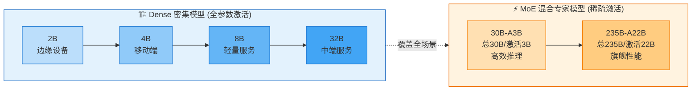

> 从 2B 到 235B-A22B，六种规格覆盖了从边缘设备到云端超算的完整部署场景。MoE 模型通过稀疏激活实现"总参数大、推理快"的效果——235B 的旗舰模型每次推理仅激活 22B 参数。

---

## 二、模型架构：三大核心技术创新

Qwen3-VL 沿用了 Qwen2.5-VL 的三模块架构：**视觉编码器（Vision Encoder）** + **MLP 视觉-语言融合器（Vision-Language Merger）** + **大语言模型（LLM）**。在此基础上，Qwen3-VL 引入了三项关键架构升级。

**视觉编码器**采用 SigLIP-2 架构，旗舰模型默认使用 **SigLIP2-SO-400M** 变体，2B 和 4B 等小规模模型则采用 **SigLIP2-Large（300M）**。为了有效支持动态分辨率，视觉编码器采用 **2D-RoPE**，并结合 **CoMP（Continual Multimodal Pre-training）** 方法根据输入尺寸插值绝对位置编码，使得同一编码器可以灵活处理不同分辨率的图片。

**MLP 视觉-语言融合器**是一个**两层 MLP 网络**，将视觉编码器输出的 2×2 相邻 Patch 特征压缩为单个视觉 token，对齐到 LLM 的隐藏维度。此外，为支持 DeepStack 机制，Qwen3-VL 部署了三个专用 Merger，分别处理 ViT 不同深度的特征。

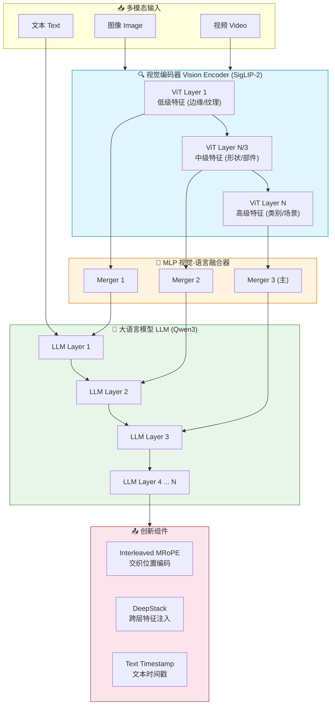

> 上图展示了 Qwen3-VL 的完整架构：视觉编码器提取多层级特征，通过三个专用 Merger 分别注入 LLM 的前三层（DeepStack 机制），同时 Interleaved MRoPE 和文本时间戳分别增强位置编码和时序感知。

### 2.1 Interleaved MRoPE：交织式多模态旋转位置编码

Qwen2-VL 首次提出了 MRoPE（Multimodal Rotary Position Embedding），将嵌入维度划分为时间（t）、水平（h）和垂直（w）三个子空间，各自分配不同的旋转频率。但这种分块方式导致了**频率谱的不平衡**，削弱了长视频理解能力。

Qwen3-VL 提出了 **Interleaved MRoPE**：将 t、h、w 三个分量**交织分布**到低频和高频带上，使每个时空轴都能在高低频段得到均匀表示。这种平衡的频率谱有效缓解了原始 MRoPE 的频谱偏差，大幅度提升了对长视频的位置建模能力。

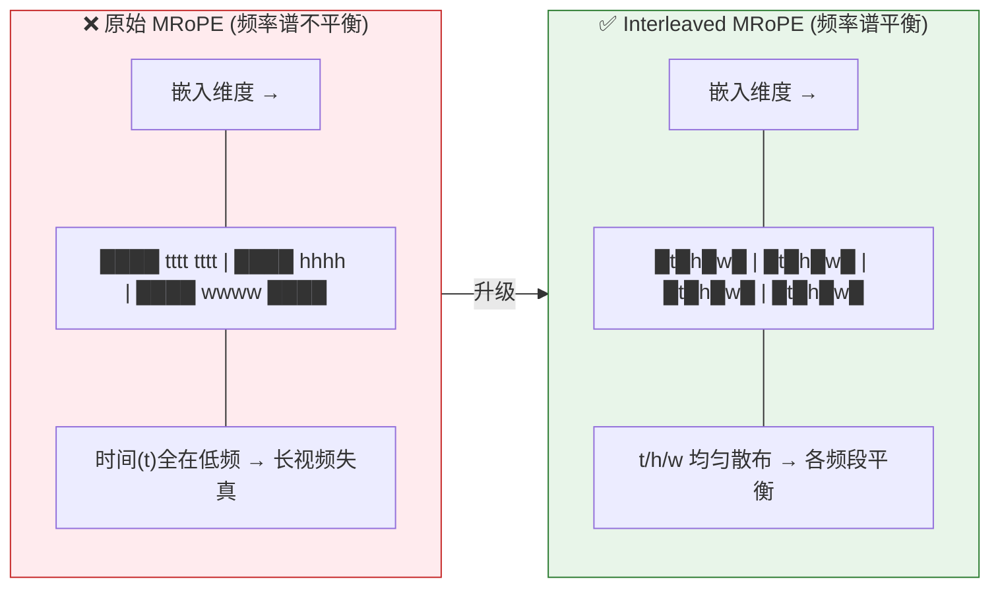

> 💡 **通俗理解**：原始 MRoPE 像把时间信息全放在"低音区"，空间信息放在"高音区"——导致时间信号在长视频中容易"失真"。Interleaved MRoPE 则将时空信息均匀散布在所有频段，如同均衡器一样让每个维度都获得充分的表达。

### 2.2 DeepStack：跨层视觉特征融合

DeepStack 机制（Meng et al., 2024）是 Qwen3-VL 的另一大亮点。传统 VLM 只在 LLM 的最底层注入视觉 token，导致高层语义信息与底层视觉特征之间的对齐不够充分。

Qwen3-VL 扩展了 DeepStack 的思想，从 ViT 的**三个不同中间层**提取视觉特征，通过专用的 Vision-Language Merger 将其投影为视觉 token，**分别注入到 LLM 的前三层的隐藏状态中**。这种设计使得：

- **低层 ViT 特征**（边缘、纹理等低级视觉信息）直接进入 LLM 第一层
- **中层 ViT 特征**（形状、部件等中级语义）进入 LLM 第二层
- **高层 ViT 特征**（物体类别、场景等高级语义）进入 LLM 第三层

这在不增加上下文长度的情况下，显著增强了多层次视觉-语言对齐能力。消融实验表明，DeepStack 在 InfoVQA 和 DocVQA 等细粒度视觉理解任务上带来了显著提升。

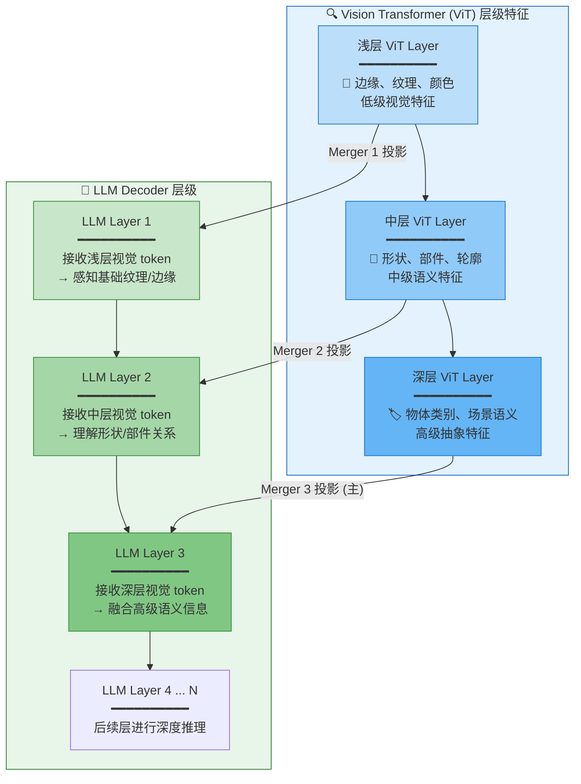

> 传统 VLM 仅在 LLM 第一层注入最深层的 ViT 特征，丢失了大量中低级视觉信息。DeepStack 实现了**低→中→高**三级特征的对应注入，让模型同时保留细节纹理和高级语义。

### 2.3 Video Timestamp：文本化视频时间戳

Qwen2.5-VL 使用与绝对时间绑定的 MRoPE 来赋予模型时序感知。但这种方法存在两个问题：
1. 对于长视频，时间位置 ID 过大且稀疏，削弱了模型对长时间上下文的理解
2. 需要大量不同帧率的均匀采样数据，极大增加了训练成本

Qwen3-VL 用**显式文本时间戳**替代了位置编码方案。每个视频时间片段前被添加格式化的时间戳文本，例如 `<3.0 seconds>` 或 HMS（时:分:秒）格式。这种方法虽然略微增加了上下文长度，但为模型提供了更直接、更精确的时间感知能力，对视频定位（Video Grounding）和密集描述（Dense Captioning）任务尤为有效。

| 对比维度 | Qwen2.5-VL (T-MRoPE) | Qwen3-VL (文本时间戳) |
|---------|----------------------|---------------------|
| 时间表示 | 隐式（位置编码） | 显式（格式化文本） |
| 长视频适配 | 位置ID过大稀疏，效果差 | 统一格式，稳定表达 |
| 训练成本 | 需大量均匀fps采样 | 成本显著降低 |
| 可解释性 | 低 | 高 |

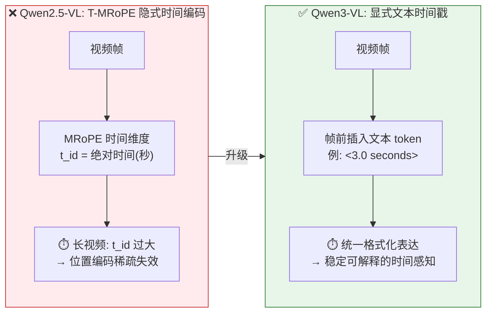

> 从隐式位置编码转向显式文本标记，不仅是工程简化，更本质地改变了模型"理解时间"的方式——从数值插值变为语义理解。

### 2.4 图像处理管线：从像素到 Visual Token 的完整旅程

当我们输入一张任意分辨率的图片时，Qwen3-VL 内部经历了一个精细的多阶段处理流程。下面我们逐步拆解整个过程。

#### 第一步：动态分辨率处理（Dynamic Resolution）

传统 VLM 通常将图片强制缩放到固定尺寸（如 224×224 或 336×336），这会丢失大量细节信息——尤其对于文档、图表、UI 截图等需要精细感知的场景。

Qwen3-VL 继承并增强了 **动态分辨率** 策略：不做暴力缩放，而是根据原图分辨率自适应调整，保持宽高比不变，仅在必要时调整到 ViT 能处理的合理尺寸。这使得模型能够在高分辨率文档场景中精准识别小字，在低分辨率自然图像场景中节省计算。

#### 第二步：Patch 切分与嵌入（Patch Embedding）

将图片送入 Vision Transformer（ViT）后，图像首先被切分成固定大小的 **Patch**（如 16×16 像素块），每个 Patch 通过线性投影转换为一个向量——这就是一个 **Visual Token**。

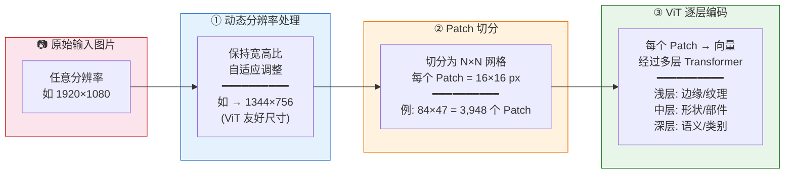

> 分辨率越高 → Patch 越多 → Visual Token 越多 → 模型能"看到"的细节越丰富，但计算成本也越高。动态分辨率的本质是在细节与效率之间找到最优权衡。

#### 第三步：2×2 Patch 合并（核心压缩）

这是 Qwen3-VL 中最关键的压缩操作。ViT 输出的特征图是一个二维网格（如 84×47），如果直接把近 4000 个 Visual Token 全部送入 LLM，会极大消耗上下文长度（256K 的上下文窗口也经不起几张高分辨率图）。

Qwen3-VL 使用 **MLP Vision-Language Merger** 对 ViT 输出进行 **2×2 空间压缩**：

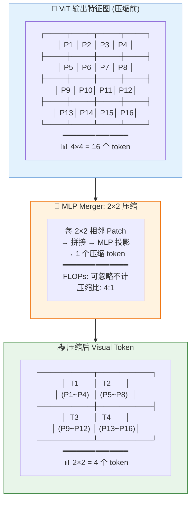

> 核心要点：Merger 不只是一个维度对齐工具——它通过 2×2 的空间压缩，将 Visual Token 数量**减少到原来的 1/4**，在几乎不损失信息的前提下大幅节约了 LLM 的上下文预算。这也是 Qwen3-VL 能在 256K 窗口内同时处理多张高分辨率图片的关键原因。

#### 第四步：结合 DeepStack 的多层级注入

经过基础 Merger 压缩后的 Visual Token 并非全部在同一点进入 LLM。Qwen3-VL 利用 DeepStack 机制，从 ViT 的**三个不同深度**提取特征，分别压缩后注入到 LLM 的前三层：

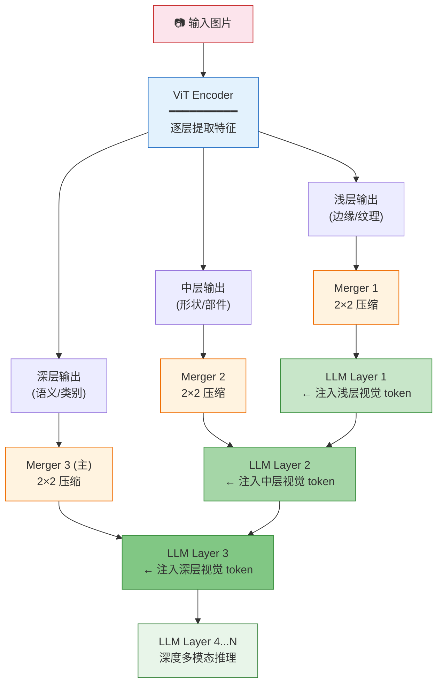

#### 完整 Pipeline 总结

把以上四步串联起来，一张图片从输入到变成 LLM 可理解的 token 序列，经历了如下完整流程：

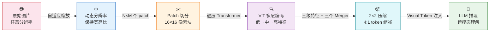

| 阶段 | 输入 | 输出 | 关键操作 |
|------|------|------|---------|
| ① 动态分辨率 | 任意分辨率图片 | ViT 友好尺寸图片 | 保持宽高比的自适应缩放 |
| ② Patch 切分 | 调整后的图片 | N×M 个 16×16 Patch | 线性投影为 token 向量 |
| ③ ViT 编码 | N×M 个 token | 多层特征图 | Transformer 逐层抽象 |
| ④ 2×2 合并 | 原始分辨率特征 | 1/4 压缩的 Visual Token | MLP Merger 空间压缩 |
| ⑤ 多级注入 | 三级压缩特征 | LLM 前三层输入 | DeepStack 层级注入 |

> 🎯 **关键数字**：以一张 1344×756 的图片为例——切分为 84×47≈3,948 个 Patch → 经 2×2 压缩后仅剩约 987 个 Visual Token。对于 256K 上下文的 Qwen3-VL 来说，这意味着单次可以处理超过 **200 张** 高清图片，或超过 **2 小时** 的高帧率视频。

### 2.5 Dense vs MoE：两种参数架构的深度对比

Qwen3-VL 系列同时包含 Dense（密集）和 MoE（混合专家）两种架构变体。这不是简单的"大模型 vs 小模型"之分，而是**两种根本不同的计算范式**。

#### 什么是 Dense 架构？

Dense 模型是传统的 Transformer 架构：**每个 token 经过每一层时，该层的所有参数都会被激活和计算**。

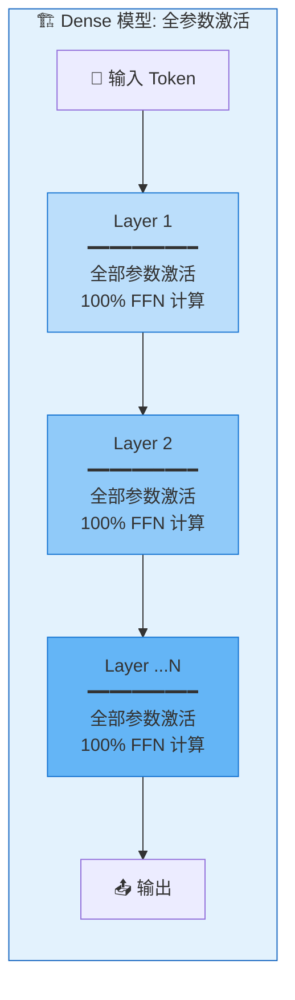

> 特点：每个 token 的计算量恒定，模型总参数量 = 每次推理的激活参数量。优点是简单稳定，缺点是参数效率低——大量参数可能对当前 token 贡献甚微。

#### 什么是 MoE 架构？

MoE（Mixture of Experts）将 FFN 层替换为**多个并行的"专家"子网络** + 一个**路由门控（Router/Gate）**。每个 token 只激活其中少数几个专家。

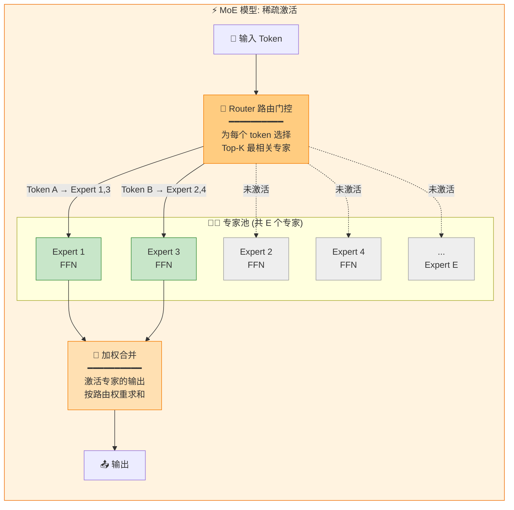

> 核心思想：**"总参数多，但每次只用一小部分"**。Router 学会根据 token 的内容语义将其路由到最擅长的专家——比如数学 token 去 Expert A，代码 token 去 Expert B，视觉 token 去 Expert C。

#### 直观类比

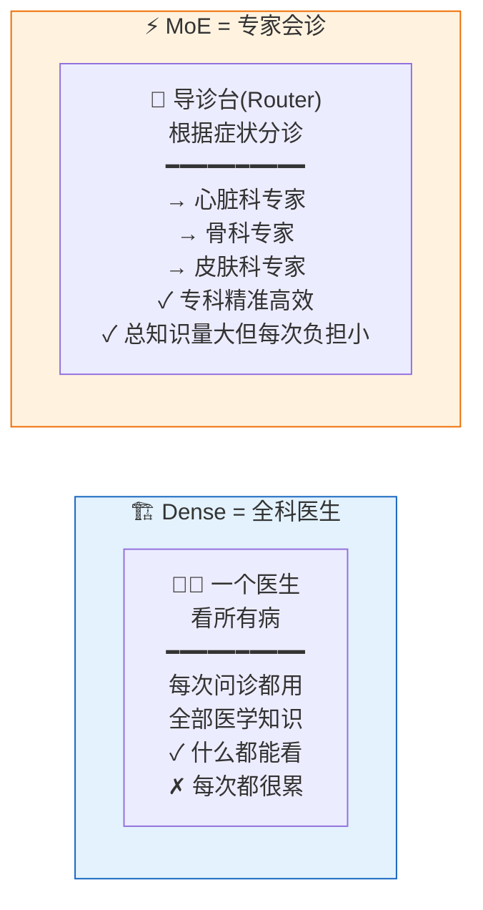

#### Qwen3-VL 的 MoE 配置

Qwen3-VL 提供两个 MoE 变体：

| 模型 | 总参数 | 激活参数 | 激活比例 | 定位 |
|------|--------|---------|---------|------|
| **Qwen3-VL-30B-A3B** | 30B | 3B | 10% | 高效中端推理 |
| **Qwen3-VL-235B-A22B** | 235B | 22B | 9.4% | 旗舰性能天花板 |

两个 MoE 模型的**激活参数比例都在 10% 左右**——这意味着每次推理的实际计算量仅相当于同规模 Dense 模型的 1/10，但却拥有 10 倍于激活量的"知识储备"。

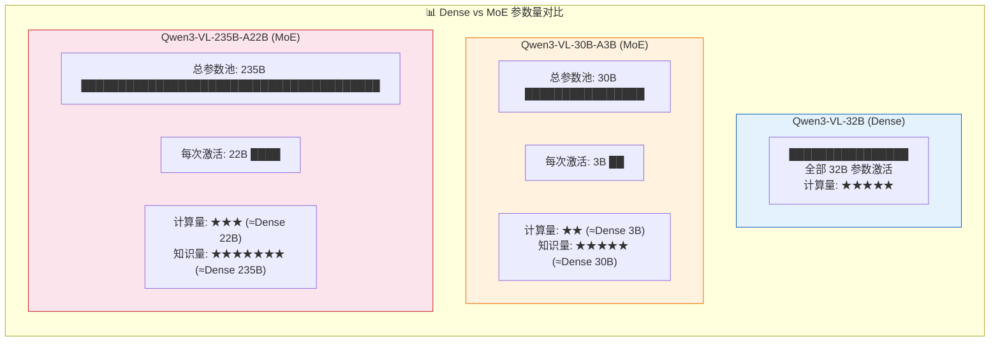

> 关键洞察：**30B-A3B 的推理成本 ≈ Dense 3B 模型，但知识容量 ≈ Dense 30B 模型**。这就是 MoE 的"四两拨千斤"——用 1/10 的计算量撬动 10 倍的知识。

#### 如何选择？

| 场景 | 推荐架构 | 原因 |
|------|---------|------|
| 边缘设备 / 手机端 | Dense 2B/4B | MoE 需要加载全部专家参数，内存占用大 |
| 低延迟实时交互 | Dense 8B/32B | Dense 推理速度稳定可预测，无路由开销 |
| 云端高吞吐服务 | MoE 30B-A3B | 激活参数少 → 推理快，总参数大 → 能力强 |
| 追求极致性能 | MoE 235B-A22B | 235B 总知识 + 22B 推理成本，天花板最高 |
| 简单感知任务 | Dense 均可 | OCR/定位不需要太多"专家知识" |
| 复杂多步推理 | MoE 优先 | 不同推理步骤可路由到不同专家 |

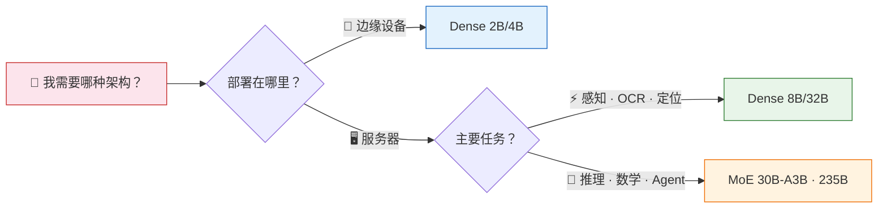

---

## 三、预训练方法：四阶段渐进式训练

Qwen3-VL 的预训练采用了系统化的四阶段策略，从基础对齐到超长上下文适应，逐步构建模型能力：

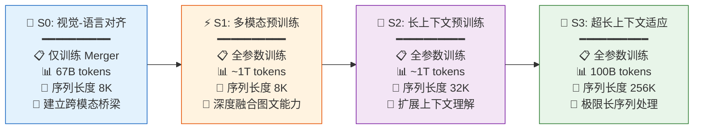

> 四阶段的设计哲学是 **"先搭桥，再铺路，后远航"**：S0 用最小代价对齐模态空间 → S1 在标准长度下充分融合图文知识 → S2/S3 逐步将上下文窗口从 8K 扩展到 256K（32 倍提升），以适配长文档和长视频场景。

| 阶段 | 目标 | 训练参数 | Token 预算 | 序列长度 |
|------|------|---------|-----------|---------|
| **S0** | 视觉-语言对齐 | 仅 Merger | 67B | 8,192 |
| **S1** | 多模态预训练 | 全部参数 | ~1T | 8,192 |
| **S2** | 长上下文预训练 | 全部参数 | ~1T | 32,768 |
| **S3** | 超长上下文适应 | 全部参数 | 100B | 262,144 |

### S0：视觉-语言对齐

此阶段仅训练 MLP Merger 层，视觉编码器和 LLM 保持冻结。使用约 67B token 的高质量数据（图像-标题对、视觉知识、OCR 数据），以最小代价建立跨模态桥梁。

### S1：多模态预训练

解冻全部参数进行端到端联合训练，约 1T token。数据混合了视觉-语言数据（交错图文文档、视觉定位、VQA、STEM 数据、少量视频数据）和纯文本数据，以维持 LLM 的语言能力。

### S2：长上下文预训练

序列长度扩展至 32,768。增加纯文本数据比例以强化长文本理解，同时引入更多视频和 Agent 指令数据，使模型能处理更长的视频和复杂多步任务。

### S3：超长上下文适应

序列长度大幅提升至 262,144（256K），使用 100B token 的专门数据集，重点关注长视频和长文档理解任务。

### 损失函数优化：平方根重加权（Square-Root Reweighting）

在训练优化方面，Qwen3-VL 做了一个关键改进：**从传统的 per-sample loss 迁移到平方根归一化的 per-token loss**。这个看似简单的变化解决了多模态训练中的一个核心矛盾——文本数据和图像/视频数据在 token 数量和语义密度上差异巨大。

具体来说，文本序列往往包含大量 token，而一张图片被压缩为相对较少的 visual token。如果简单按样本平均损失，模型会倾向于优先优化文本目标而忽视视觉目标。**平方根重加权**通过对不同模态的 token 损失进行归一化再平衡，在不损害文本能力的前提下显著提升了多模态性能。这一技巧是 Qwen3-VL 能够在多项纯文本基准上超越同级别纯文本模型的关键优化之一。

### 预训练数据全景

Qwen3-VL 的预训练数据覆盖了极为广泛的模态和任务类型：

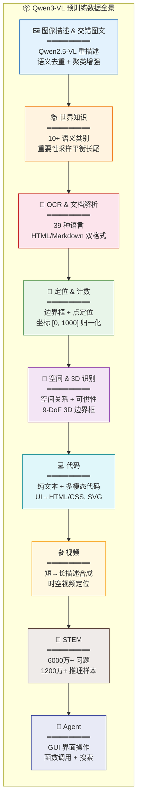

> 九大数据类别覆盖了从像素级感知（OCR/定位）到语义级理解（知识/STEM）再到行动级交互（Agent/代码）的完整能力图谱，形成 **"感知→理解→推理→行动"** 的递进训练闭环。

1. **图像描述与交错图文数据**：使用专门的 Qwen2.5-VL-32B 模型进行高质量重描述，通过语义去重和聚类增强确保数据多样性和粒度。
2. **世界知识数据**：覆盖动物、植物、地标、食物等十余个语义类别，采用基于重要性的采样策略平衡长尾分布。
3. **OCR 与文档解析**：通过粗到细的管线构建了 **3,000 万条**内部收集的 OCR 标注数据（无需人工标注），并从 Qwen2.5-VL 的 10 种非中英语言扩展至 **39 种语言**，额外合成了约 **3,000 万条**高质量多语言 OCR 样本和 **100 万+** 真实多语言图像。文档解析方面，收集 300 万 Common Crawl PDF 和 400 万内部文档，构建 QwenVL-HTML 和 QwenVL-Markdown 两种统一标注格式。
4. **定位与计数**：支持边界框定位和点定位，坐标归一化至 [0, 1000] 范围。
5. **空间理解与 3D 识别**：包含空间关系推理、物体可供性（affordance）标注、3D 边界框定位等。
6. **代码数据**：涵盖纯文本代码和多模态代码（UI 截图转 HTML/CSS、SVG 生成、可视化编程等）。
7. **视频数据**：采用短-长描述合成策略，支持时空视频定位，自适应长度采样。
8. **STEM 数据**：超过 6000 万道 K-12 及大学级别习题，1200 万条多模态推理样本。
9. **Agent 数据**：GUI 界面感知与操作、多模态函数调用、搜索工具使用等。

---

## 四、后训练（微调）方法：三阶段精细化对齐

Qwen3-VL 的后训练分为三个阶段，同时为非思考（Non-Thinking）和思考（Thinking）两种模式分别训练：

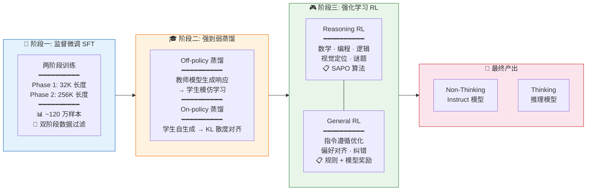

> 后训练三阶段的递进逻辑：**SFT 建立指令遵循基础 → 蒸馏传递教师模型推理能力 → RL 在可验证任务上进一步精调**，最终分叉产出非思考和思考两类模型。

### 4.1 监督微调（SFT）

SFT 阶段旨在激活模型的指令遵循能力和潜在推理技能。训练数据包含约 **120 万条样本**，其中 1/3 为纯文本，2/3 为图像-文本和视频-文本对。

采用**两阶段训练策略**以优化计算效率：
- **第一阶段**：序列长度 32K，训练一个 epoch
- **第二阶段**：序列长度扩展至 256K，混合长上下文数据和 32K 长度数据，涵盖数百页技术文档、整本教材及长达 2 小时的视频

**数据质量控制**采用双阶段过滤管线：
- **查询过滤**：识别并丢弃不可验证的查询，修正模糊指令，消除无实质内容的样本
- **响应过滤**：结合规则过滤（重复、不完整、格式错误等）和模型过滤（基于 Qwen2.5-VL 奖励模型的多维评估）

### 4.2 长链思维（Long-CoT）冷启动数据

思考模型的核心是一个精心构建的 Long-CoT 冷启动数据集，视觉-语言和纯文本样本比例约为 1:1。特别强调 STEM 和 Agent 工作流任务，采用严格的多阶段筛选：

- **难度筛选**：保留基线模型通过率低或生成长响应的样本
- **多模态必要性筛选**：丢弃 Qwen3-30B-noThink 模型仅靠文本就能正确解答的视觉数学题
- **响应质量控制**：移除包含错误答案、过度重复、语言混用或缺少推理步骤的样本

### 4.3 强到弱蒸馏（Strong-to-Weak Distillation）

此阶段通过蒸馏将强大教师模型的能力传递给轻量级学生模型：

- **Off-policy 蒸馏**：使用教师模型生成的输出进行响应蒸馏，帮助学生模型获得基础推理能力
- **On-policy 蒸馏**：学生模型自行生成响应，通过最小化 KL 散度来对齐学生和教师的 logits

蒸馏仅使用**纯文本数据**来微调 LLM 主干，但效果惊人——在文本和多模态任务上都带来了显著的推理能力提升。

### 4.4 强化学习（RL）

RL 阶段分为两部分：

#### 推理强化学习（Reasoning RL）

**数据准备**方面，Qwen3-VL 从开源和内部数据中精心筛选训练数据。对于多模态查询，使用旗舰模型 Qwen3-VL-235B-A22B 的初步检查点为每个查询**采样 16 个响应**，丢弃全部响应都为错误的查询，再通过初步 RL 实验识别并剔除改进潜力有限的数据源。最终得到约 **30,000 条**覆盖文本和多模态任务的 RL 查询。训练时再次采样 16 个响应，**过滤通过率超过 90% 的简单查询**，确保 RL 仅在具有足够学习空间的困难样本上进行。

- 覆盖数学、编程、逻辑推理、视觉定位、视觉谜题等多样任务
- 使用 SAPO（Soft Adaptive Policy Optimization）算法，在所有任务中提供一致改进
- 奖励系统包含任务特定的格式引导和语言一致性惩罚

#### 通用强化学习（General RL）

- 优化**指令遵循**（内容、格式、长度、结构化输出）和**偏好对齐**（有用性、事实准确性、风格适当性）
- 同时作为纠错机制，针对反直觉的目标计数、复杂时钟识别等易错任务进行专项训练
- 通过混合奖励系统（规则奖励 + 模型奖励）提供精准反馈

### 4.5 Thinking with Images：图像思考能力

Qwen3-VL 还具备"用图像思考"的能力，通过两阶段训练实现：

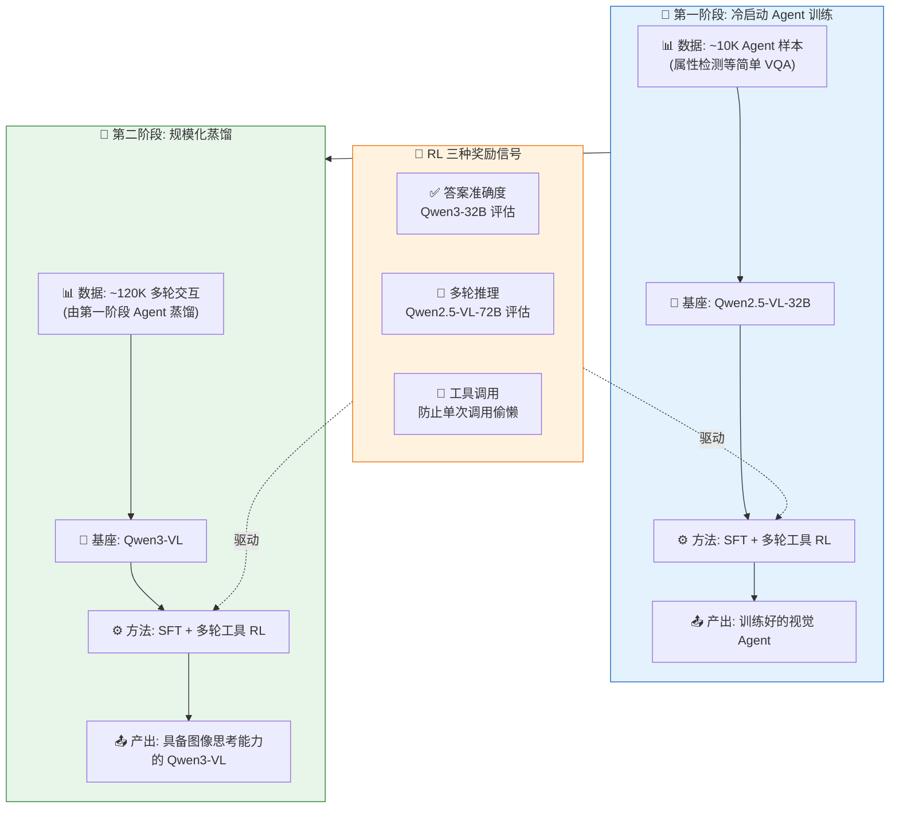

> 两阶段设计的精妙之处：先用小规模高质量数据在成熟模型上验证 Agent 训练范式，再通过蒸馏放大到更大规模、更多样化的任务上，实现从 **"think → act → analyze feedback → answer"** 的完整视觉 Agent 闭环。

- **第一阶段**：在 Qwen2.5-VL-32B 上使用约 1 万条 Agent 数据进行 SFT 和多轮工具集成 RL
- **第二阶段**：将第一阶段训练的视觉 Agent 蒸馏生成约 12 万条多轮交互数据，用于 Qwen3-VL 的后训练

RL 过程使用三种互补奖励信号：
1. **答案准确度奖励**：由 Qwen3-32B 评估最终答案是否正确
2. **多轮推理奖励**：由 Qwen2.5-VL-72B 评估推理过程是否连贯
3. **工具调用奖励**：比对实际工具调用次数与专家估计的目标次数，防止模型偷懒只调用一次工具

### 4.6 思考版 vs 指令版：同一基座，两种灵魂

Qwen3-VL 的一大特色是每个规格都同时发布 **Instruct（指令版 / Non-Thinking）** 和 **Thinking（思考版）** 两个变体。两者共享完全相同的预训练基座和模型参数架构，差异产生于后训练阶段——它们走的是**分叉训练路径**。

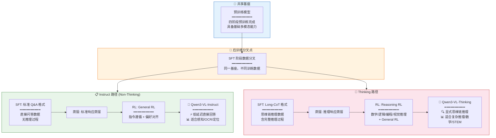

> 关键洞察：思考版和指令版不是两个模型，而是**同一基座走两条不同的后训练路径**。这种设计的精妙之处在于——你不需要为不同场景维护两套模型参数，只需要在部署时选择对应的变体即可。

#### 核心差异一：训练数据格式

| 维度 | Instruct（指令版） | Thinking（思考版） |
|------|-------------------|-------------------|
| **回答格式** | 直接给出最终答案 | 先展示推理过程，再给出答案 |
| **SFT 数据** | 标准多轮对话，简洁响应 | Long-CoT 数据，含逐步推理轨迹 |
| **数据筛选** | 质量过滤为主 | 额外难度筛选 + 多模态必要性验证 |
| **数据配比** | 约 1/3 文本 + 2/3 多模态 | 文本与多模态约 1:1 |

Thinking 版本的 Long-CoT 冷启动数据经过了极为严格的筛选：

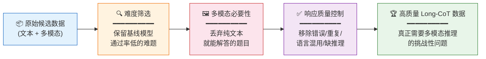

> 💡 最关键的一步是**多模态必要性筛选**：如果 Qwen3-30B-noThink 不看图片仅靠文本就能答对，该样本会被直接丢弃。这确保了 Thinking 模型学到的是真正的"视觉推理"而非"文字猜测"。

#### 核心差异二：推理时的行为

```mermaid
sequenceDiagram
    participant User as 👤 用户
    participant Ins as ⚡ Instruct 模型
    participant Think as 🧠 Thinking 模型

    User->>Ins: "图片中有几个红色杯子？"
    Ins->>User: "3 个。"
    Note over Ins,User: ⚡ 直接输出，低延迟

    User->>Think: "图片中有几个红色杯子？"
    Think->>Think: 🔍 让我仔细观察图片...<br/>我看到左侧有 2 个红色杯子...<br/>右侧角落还有 1 个...<br/>总计就是 3 个红色杯子。
    Think->>User: "经过观察和计数，<br/>图片中共有 3 个红色杯子。"
    Note over Think,User: 🔍 展示推理过程，高延迟但可解释
```

#### 核心差异三：适用场景与性能表现

```mermaid
graph TB
    subgraph Instruct_Scene["⚡ Instruct 擅长场景"]
        direction TB
        IS1["📄 OCR 文字识别<br/>━━━━━━━━━━<br/>OCRBench: 920 vs 875"]
        IS2["🎯 视觉定位<br/>━━━━━━━━━━<br/>RefCOCO: 91.9 vs 92.1<br/>(性能接近)"]
        IS3["📋 文档解析<br/>━━━━━━━━━━<br/>DocVQA: 97.1 vs 96.5<br/>(Instruct 略优)"]
        IS4["⚡ 低延迟交互<br/>GUI 操作 / 实时对话"]
    end

    subgraph Think_Scene["🧠 Thinking 擅长场景"]
        direction TB
        TS1["🔬 STEM 推理<br/>━━━━━━━━━━<br/>MMMU: 80.6 vs 78.7<br/>MathVista: 85.8 vs 84.9"]
        TS2["🧩 视觉谜题<br/>━━━━━━━━━━<br/>LogicVista: 72.2 vs 65.8<br/>VisualPuzzles: 57.2 vs 54.7"]
        TS3["📐 数学推理<br/>━━━━━━━━━━<br/>MathVision: 74.6 vs 66.5<br/>MathVerse: 85.0 vs 72.5"]
        TS4["🔍 深度分析<br/>复杂文档 / 长视频推理"]
    end

    style Instruct_Scene fill:#e8f5e9,stroke:#2e7d32
    style Think_Scene fill:#fce4ec,stroke:#c62828
```

> 数据来自 235B-A22B 旗舰模型。可以清晰看到：**Instruct 在感知类任务（OCR、定位）上持平甚至略优，Thinking 在推理类任务上大幅领先**（如 MathVerse 差距达 12.5 分）。

#### 核心差异四：推理参数配置

| 参数 | Instruct（旗舰） | Thinking（旗舰） |
|------|-----------------|-----------------|
| **Temperature** | 0.7 | 0.6 |
| **Top-p** | 0.8 | 0.95 |
| **Top-k** | 20 | 20 |
| **Presence Penalty** | 1.5 | 无（MoE）/ 1.5（Dense） |
| **最大输出长度** | 32,768 | 32,768（一般）/ 81,920（数学竞赛） |

Thinking 模型使用更高的 top-p（0.95 vs 0.8），给予推理过程更大的随机探索空间；在 AIME/HMMT 等数学竞赛场景下，输出长度扩展到 81,920 token，为深度思考留足空间。

#### 一句话总结

| | Instruct | Thinking |
|------|----------|----------|
| **本质** | 快思考（System 1） | 慢思考（System 2） |
| **类比** | 直觉式回答 | 深思熟虑后回答 |
| **代价** | 低延迟、低 token 消耗 | 高延迟、高 token 消耗 |
| **何时用** | 看图表、读文档、定位物体 | 解数学题、逻辑推理、复杂分析 |

---

### 4.7 训练基础设施

Qwen3-VL 全系列模型在**阿里云 PAI-Lingjun 人工智能计算服务**上完成训练，该平台为大规模 AI 训练提供高性能计算能力。

**预训练阶段的并行策略**基于 **Megatron-LM** 框架，采用混合并行方案：
- **张量并行（TP）**：将单层计算分布到多个 GPU
- **流水线并行（PP）**：将不同层分布到不同设备
- **上下文并行（CP）**：将长序列分段并行处理
- **专家并行（EP）**：将 MoE 专家分布到不同设备
- **ZeRO-1 数据并行（DP）**：优化器状态分片

这套混合策略在模型规模、计算负载和通信开销之间实现了细粒度平衡，即便在**万卡级别**的集群上也能保持高硬件利用率、高吞吐和低通信延迟。

**推理部署**方面，Qwen3-VL 采用 **vLLM** 和 **SGLang** 两种推理框架。vLLM 利用 PagedAttention 实现内存高效管理和大吞吐推理，SGLang 则在结构化生成和复杂 prompt 处理方面表现优异。二者互补，提供了稳定、高效、灵活的模型推理能力。

---

## 五、性能评估亮点

Qwen3-VL 在极为广泛的基准测试上展现了卓越性能，以下列举关键亮点：

### 多模态推理
- 旗舰模型 Qwen3-VL-235B-A22B 在 MathVista、MathVision、MathVerse 等多个数学推理基准上取得最佳成绩
- Thinking 模式在 MMMU 达 80.6，MMMU-Pro 达 69.3，与 GPT-5、Gemini 2.5 Pro 等顶尖模型同台竞技

### 文档理解与 OCR
- 多语言 OCR 能力从 Qwen2.5-VL 的 10 种非中英语言扩展至 39 种语言，其中 32 种语言准确率超过 70%
- 在 DocVQA、InfoVQA、ChartQA 等文档理解基准上大幅领先对手

### 视频理解
- 256K token 上下文窗口使其在 MLVU 等长视频评测中达到甚至超越 Gemini 2.5 Pro
- 8B 模型即可与 Qwen2.5-VL 72B 在视频任务上匹敌

### Agent 能力
- GUI 定位任务（ScreenSpot Pro、OSWorldG）达到 SOTA
- 32B 模型在 OSWorld 得分 41，AndroidWorld 得分 63.7，超越现有基础 VLM

### 纯文本能力

Qwen3-VL 在纯文本基准上展现了"VL 模型超越纯文本 backbone"的罕见能力。以下是关键发现：

- **旗舰 Instruct 模型（235B-A22B）** 在数学推理（AIME-25：74.7 / HMMT-25：57.4）和编程（LiveCodeBench v6：54.3）上大幅超越 DeepSeek V3 0324（AIME：46.6，HMMT：27.5）和 Claude-Opus-4（AIME：33.9），甚至优于其纯文本兄弟模型 Qwen3-235B-A22B-Instruct-2507
- **旗舰 Thinking 模型** 在 AIME-25 达 **89.7**，超过 OpenAI o3（medium，88.9）和 Claude-Opus-4（75.5）；LiveCodeBench v6 达 70.1，领先 o3（58.6）
- **中等模型（32B/30B-A3B）** 同样惊人：32B-Instruct 在 AIME-25 达 66.2，是其纯文本对应模型（20.2）的 **3 倍以上**；32B-Thinking 在 AIME-25 达 83.7，超过纯文本 32B-Thinking（72.9）
- **轻量模型（8B/4B/2B）** 通过强到弱蒸馏实现了极高性价比，如 4B-Thinking 在 AIME-25 达 74.5，接近纯文本 4B-2507（81.3）

这证明 Qwen3-VL 的多模态训练不仅没有损害文本能力，反而通过**平方根重加权**和**高质量蒸馏**等技术，使其在多模态和纯文本两个维度上都达到了新的高度。

### 关键消融实验

#### DeepStack 消融

在 15B-A2B 内部模型上，使用 200B token 预训练后进行直接评估（无后训练）。DeepStack 在所有基准上带来一致提升：

| 基准 | Baseline | DeepStack | 提升 |
|------|----------|-----------|------|
| **InfoVQA** | 71.9 | 74.2 | +2.3 |
| **DocVQA** | 89.5 | 91.1 | +1.6 |
| **AI2D** | 81.8 | 83.2 | +1.4 |
| **OCRB** | 81.0 | 83.6 | +2.6 |
| **ChartQA** | 81.5 | 83.3 | +1.8 |
| **MMMU** | 52.9 | 54.1 | +1.2 |

DeepStack 在 InfoVQA 和 DocVQA 等细粒度视觉理解任务上提升尤为显著，验证了多层级特征注入对精细视觉感知的关键作用。

#### 视觉编码器消融

相比于原始 SigLIP-2，Qwen3-ViT（继续训练的视觉编码器）在 CLIP 预训练阶段保持 ImageNet 基准上的竞争力，同时在内部的 OmniBench 综合评估上取得显著提升（36.9 → 45.5）。在 VLM 阶段配对相同 1.7B Qwen3 LLM 训练 1.5T token 后，Qwen3-ViT 在 OCRB、AI2D、InfoVQA 等任务上全面超越 SigLIP-2 基线，验证了更强大的视觉骨干对下游多模态任务的增益。

### 视频大海捞针（Needle-in-a-Haystack）

为评估长上下文能力，Qwen3-VL 在视频"大海捞针"测试中表现惊人：将关键视觉帧（"针"）插入不同时间位置的长视频中，要求模型准确定位并回答相关问题。测试采用 1 FPS 均匀采样，帧分辨率动态调整以保持恒定的视觉 token 预算。

- **256K token（约 30 分钟视频）**：准确定位并回答的准确率达 **100%**
- **通过 YaRN 位置外推至 1M token（约 2 小时视频）**：准确率仍保持 **99.5%**

这一结果充分证明了 Qwen3-VL 强大的长序列建模能力，为超长视频理解和长文档分析等应用奠定了坚实基础。

---

## 六、总结与展望

Qwen3-VL 代表了视觉语言模型的一次重大升级。通过 **Interleaved MRoPE**、**DeepStack** 和**文本化时间戳**三大架构创新，配合四阶段预训练与三阶段后训练的精密训练策略，Qwen3-VL 在保持强大纯文本能力的同时，实现了多模态理解的全面突破。

```mermaid
flowchart TB
    subgraph Arch["🏛️ 架构创新"]
        A1["Interleaved MRoPE<br/>平衡时空频率谱"]
        A2["DeepStack<br/>多层级特征注入"]
        A3["Text Timestamp<br/>显式时间感知"]
    end

    subgraph Pre["📦 预训练 (四阶段)"]
        P1["S0: 对齐<br/>67B | 8K"]
        P2["S1: 多模态<br/>1T | 8K"]
        P3["S2: 长上下文<br/>1T | 32K"]
        P4["S3: 超长<br/>100B | 256K"]
        P1 --> P2 --> P3 --> P4
    end

    subgraph Post["🎯 后训练 (三阶段)"]
        T1["SFT<br/>指令遵循"]
        T2["蒸馏<br/>能力传递"]
        T3["RL<br/>精细对齐"]
        T1 --> T2 --> T3
    end

    subgraph Result["🏆 最终能力"]
        R1["🗣️ 纯文本<br/>超越 text-only 基线"]
        R2["📐 多模态推理<br/>SOTA 数学/逻辑"]
        R3["📄 文档理解<br/>39 语言 OCR"]
        R4["🎬 视频理解<br/>256K 上下文"]
        R5["🤖 Agent<br/>GUI 操作/工具调用"]
        R6["🧭 3D 空间<br/>9-DoF 定位"]
    end

    Arch --> Pre --> Post --> Result

    style Arch fill:#fce4ec,stroke:#c62828
    style Pre fill:#e3f2fd,stroke:#1565c0
    style Post fill:#e8f5e9,stroke:#2e7d32
    style Result fill:#fff3e0,stroke:#ef6c00
```

> 从架构到训练到能力的全景链路：三大架构创新为模型提供了更强的表示能力，四阶段预训练奠定了坚实基座，三阶段后训练将能力精细打磨到极致——最终在六大维度上实现了全面突破。

未来方向包括：
- **交互式感知**：更强的实时多模态交互能力
- **工具增强推理**：深度集成外部工具和知识检索
- **实时多模态控制**：从数字界面操作到机器人系统引导
- **统一理解-生成架构**：将视觉生成能力纳入统一框架，进一步提升整体智能水平

Qwen3-VL 全系列模型已在 Apache 2.0 许可下开源，可通过以下渠道获取：
- 🤗 [Hugging Face](https://huggingface.co/Qwen)
- 🧩 [ModelScope](https://modelscope.cn/organization/qwen)
- 💻 [GitHub](https://github.com/QwenLM/Qwen3-VL)
- 💬 [Chat](https://chat.qwen.ai)

---

*本文基于 Qwen3-VL Technical Report 撰写，涵盖了模型架构、预训练方法、后训练策略和性能评估的核心内容。*
