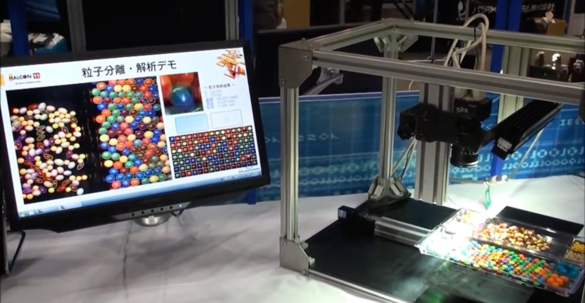
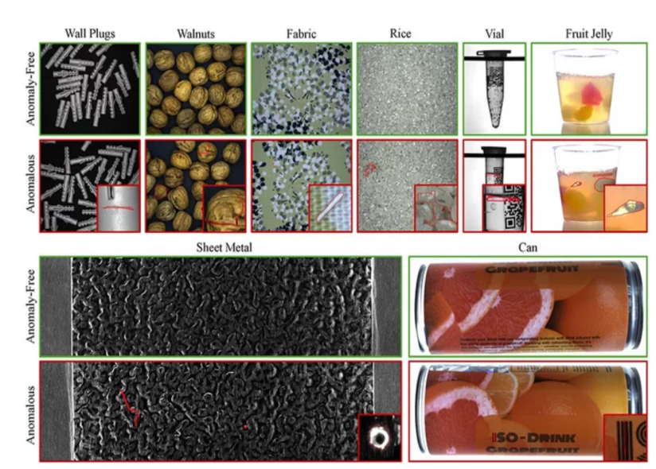
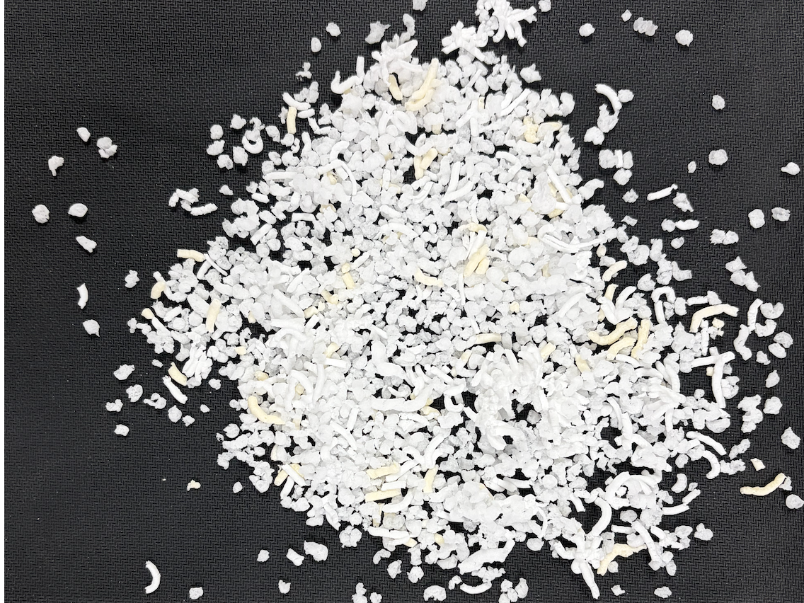

---
---

> **文档版本**：v1.0
> **最后更新**：2026-06-17
> **作者**：惟川

___
## 0. 效果展示

**微调前**

**微调后**


## 1. 项目概述

### 1.1 业务背景

电饭煲在出厂前需要经过结构安全检验，检验员需要识别电饭煲的各种结构部件（如发热盘、温控器、电源线入口等），并针对不同部件执行对应的检测标准。本项目旨在训练一个多模态大模型，使其能够通过视觉特征自动识别电饭煲结构部件的类别，辅助质检流程。

---

## 2. 原始数据与目录结构

### 2.1 原始数据目录

```
/home/liwx/GuoJi_DianFanBao/结构标签数据-第5版/
├── NTC/                         # 原始名 "NTC+"，规范化后为 "NTC"
│   ├── 正样本/
│   │   ├── 0657 (20).png        # 原始图片
│   │   └── ...
│   └── 负样本/                   # 本项目仅使用正样本
├── 发热丝/
│   ├── 正样本/
│   │   ├── 0657 (31).png        # 原始图
│   │   ├── 0657 (31)__cj.png    # 颜色抖动增强
│   │   ├── 0657 (31)__cj_hf.png # 颜色抖动+水平翻转组合增强
│   │   └── ...
│   └── 负样本/
├── 能效标签/
│   ├── 正样本/
│   └── 负样本/
└── ...（共 31 个类别目录）
```

### 2.2 原始数据统计

原始数据共 **31 个类别**，每类目录下含 `正样本/` 和 `负样本/` 两个子目录。负样本是客户自己做数据增强生成，其本质也属于正样本，不应该叫负样本，本项目仅使用正样本，后续根据类别不同选择合适的数据增强方式。

---

## 3. 数据预处理——文件夹命名规范化

### 3.1 脚本

**文件**：`normalize_folders_v5.py`

### 3.2 问题

V5 版原始数据的文件夹名带有尾部特殊符号（如 `NTC+`、`保温元件+`），需要规范化为标准二级标签名。

### 3.3 处理逻辑

```python
# 需要去除的尾部特殊符号
TRAILING_PATTERN = re.compile(r'[√\-\+/]+\s*$')

def clean_name(name: str) -> str:
    return TRAILING_PATTERN.sub('', name).strip()
```

### 3.4 使用方式

```bash
cd /home/liwx/GuoJi_DianFanBao/test_script/model-test

# 预览（dry-run，不实际改名）
python normalize_folders_v5.py

# 确认后执行改名
python normalize_folders_v5.py --apply
```

---

## 4. 数据增广（augment_v5.py）

### 4.1 脚本

**文件**：`augment_v5.py`

### 4.2 增强策略

针对电饭煲结构部件实际拍摄场景，设计了 4 种增强方法，并根据类别是否包含文字进行差异化策略：

| 增强方法 | 缩写 | 文字类* | 非文字类 | 说明 |
|----------|------|---------|---------|------|
| 颜色抖动 | `cj` | ✅ 适用 | ✅ 适用 | 随机调整亮度(±20%)、对比度(±20%)、饱和度(±20%)，模拟不同光照/白平衡 |
| 水平翻转 | `hf` | ❌ 跳过 | ✅ 适用 | 镜像翻转，翻转后部件类别不变 |
| 小角度旋转 | `rot` | ❌ 跳过 | ✅ 适用 | ±10°随机旋转，模拟拍摄角度偏差 |
| 高斯模糊 | `blur` | ✅ 适用 | ✅ 适用 | 半径 0.5~1.5 的高斯模糊，模拟轻微失焦 |

> *文字类：铭牌、能效标签、水位标识、使用标识（翻转/旋转会导致文字颠倒，不适用）

### 4.3 增强参数

```python
BRIGHTNESS_FACTOR = 0.2    # 亮度抖动范围 (±20%)
CONTRAST_FACTOR = 0.2      # 对比度抖动范围 (±20%)
SATURATION_FACTOR = 0.2    # 饱和度抖动范围 (±20%)
ROTATION_ANGLE = 10        # 旋转角度 (±10°)
BLUR_RADIUS = 1.5          # 高斯模糊半径
```

### 4.4 文件命名规范

```
原图:     image.jpg
单方法增强: image__cj.jpg          (颜色抖动)
           image__hf.jpg          (水平翻转)
           image__rot.jpg         (旋转)
           image__blur.jpg        (高斯模糊)
组合增强:   image__cj_hf.jpg       (颜色抖动+水平翻转)
           image__cj_rot_5839.jpg (颜色抖动+旋转+随机后缀，避免重名)
```

**命名规则**：以 `__` 分隔原图名和增强方法标记。这一命名规范是后续训练/验证集划分中"图像组"识别的基础。

### 4.5 增广流程

1. 遍历各类别目录，统计 `正样本/` 下图片数量
2. 对未达目标数量（默认 100 张）的类别执行增广
3. 先生成单方法增强（`cj`、`hf`、`rot`、`blur`），再生成两两组合
4. 如组合方案不足，添加随机后缀（1000~9999）生成更多变体
5. 每次增强的随机参数不同，确保增强结果具有多样性

### 4.6 使用方式

```bash
cd /home/liwx/GuoJi_DianFanBao/test_script/model-test

# 预览哪些类需要增广
python augment_v5.py --dry-run

# 默认每类目标 100 张
python augment_v5.py

# 自定义目标
python augment_v5.py --target 150

# 仅增广指定类别（调试用）
python augment_v5.py --categories 能效标签 电机
```

### 4.7 增广结果

增广后总计 **3254 张**图片（原始 1642 + 增强 1612），31 个类别中有 28 个类别达到 100 张，3 个类别因原始数量超过 100 无需增广（器具外观（正面）169 张、接地 158 张、水位标识 127 张）。

---

## 5. 训练/验证集划分（split_train_val.py）

### 5.1 脚本

**文件**：`split_train_val.py`

### 5.2 划分策略

- **划分比例**：8:2（训练集 80% / 验证集 20%），按类别各自独立划分
- **防数据泄露**：以"图像组"为单位划分，确保同一张原图及其所有增强版本不会被拆分到训练集和验证集两侧

### 5.6 使用方式

```bash
cd /home/liwx/GuoJi_DianFanBao/test_script/model-test

# 预览划分结果
python split_train_val.py --dry-run

# 默认 8:2 划分
python split_train_val.py

# 自定义比例
python split_train_val.py --ratio 0.85

# 使用硬链接代替复制（节省磁盘空间，要求同分区）
python split_train_val.py --link
```

### 5.7 数据完整性验证

脚本在划分完成后自动执行完整性验证：
- 检查每个类别的训练集和验证集合并后是否覆盖所有原始文件（无缺失）
- 检查训练集和验证集之间是否存在同名文件（无数据泄露）

---

## 6. 大模型预标注（bailian_prelabel.py）

### 6.1 脚本

**文件**：`bailian_prelabel.py`

### 6.2 整体设计

由于一开始直接使用人工标, 时间和人力成本较大，因此采用调用最强视觉大模型进行预标注，本质上也属于蒸馏较强模型的知识， 本次使用阿里云百炼平台的 Qwen3-VL-Plus模型（或本地部署Qwen/Qwen3-VL-32B-Instruct），对划分后的训练集和验证集图片进行自动标注，生成包含视觉描述（reasoning）和分类标签的标注结果。

**设计要点**：
1. **候选集判别模式**：不直接告诉模型这张图片具体属于哪个类别，让它自己推理出，并给出自己的依据
2. **两阶段视觉对比修正**：当模型在候选集中判错时，自动触发第二阶段修正——传入正确类别信息 + 误判类别的参考图，让模型通过双图对比重新生成区分性 reasoning
3. **标签由文件夹确定**：`secondary_label` 始终以文件夹名为准，`primary_label` 由映射表推导，模型输出仅用于生成 reasoning 文本

### 6.3 API 配置

```python
API_BASE = "https://dashscope.aliyuncs.com/compatible-mode/v1"
MODEL = "qwen3-vl-plus"  
```

使用 OpenAI 兼容接口，需设置环境变量 `DASHSCOPE_API_KEY`。

### 6.4 System Prompt

```text
# 角色
你是电饭煲结构部件质检专家，通过视觉特征精确识别电饭煲的各种结构部件。

# 类别体系（共31个二级类别，分属3个一级类别）
- 标签标识（2个）：铭牌、能效标签
- 器具外观（6个）：器具外观（正面）、器具外观（侧面）、器具外观（背面）、器具外观（顶面）、器具外观（底面）、器具外观（打开状态）
- 内部结构（23个）：操作面板、锅盖铰链、电源线入口、器具输入插座、电源线夹紧装置、接地、进线接线端子、感温装置、发热丝、发热盘、NTC、热熔断体、温控器、电路板（正面）、电路板（反面）、电路板安装位置、散热风扇、电子元件、发热管末端接线柱、保温发热元件、电机、使用标识、水位标识
```

### 6.5 候选集判别 Prompt

对于每张图片，根据其所属类别 `secondary_label`，从 `CONFUSABLE_NEIGHBORS` 表中获取易混淆邻居，构造候选集：

```python
def build_user_prompt(secondary_label: str) -> str:
    neighbors = CONFUSABLE_NEIGHBORS.get(secondary_label, [])
    candidates = [secondary_label] + neighbors
    # 去重并保持正确类别在第一位
    ...
    # 构造候选列表（每个候选附带视觉特征描述）
    # 要求模型选出正确类别并描述区分性特征
    # reasoning 不得直接出现类别名称
```

**候选集示例**（以"NTC"为例）：
- 候选 1：NTC（视觉特征：表面印有NTC文字标识的温度传感器）
- 候选 2：感温装置（视觉特征：传感器探头+引线结构）
- 候选 3：温控器（视觉特征：带调节结构和接线端子的开关器件）

**输出要求**：
```json
{"reasoning": "区分性视觉特征(≤100字，不含类别名)", "primary_label": "一级类别", "secondary_label": "二级类别"}
```

> **关键设计**：reasoning **不得直接出现类别名称**，迫使模型描述纯粹的视觉特征而非简单复述标签名，提升训练数据的泛化价值。

### 6.6 两阶段视觉对比修正

#### 6.6.1 触发条件

当 `compose_annotation()` 后处理检测到模型判定的 `secondary_label` 与文件夹标签不一致时（`_label_mismatch == True`），触发修正流程。

#### 6.6.2 视觉对比模式（优先）

1. 从模型误判类别的训练集中随机采样一张图片作为参考图（`sample_reference_image()`）
2. 构造多轮对话：
   - **System**：角色定义 + 类别体系
   - **User 第一轮**：原始图片 + 候选集判别 Prompt
   - **Assistant**：模型首轮错误响应（原始输出）
   - **User 第二轮**：原始图片（图 A）+ 参考图（图 B）+ 修正指令

3. 修正指令要求模型：
   - 对比图 A 与图 B 的视觉差异（形状、结构、材质、尺寸比例、布局）
   - 聚焦图 A 自身的区分性视觉特征
   - 融入对比句式（如"……而非……"、"与……不同，……"）
   - **绝对不出现**"第一张""第二张""图 A""图 B""参考图"等多图元语言
   - 最终 reasoning 读起来是对单张图片的独立描述

#### 6.6.3 纯文本修正模式（fallback）

当无法采样到参考图时，回退到纯文本修正：
- 仅通过文本告知模型正确答案
- 要求模型基于正确类别重新生成区分性视觉特征描述

#### 6.6.4 修正效果

| 指标 | 训练集 | 验证集 |
|------|--------|--------|
| 总标注数 | 2518 | 733 |
| 模型误判数 | 458 | 146 |
| 修正成功数 | 458 | 146 |
| 视觉对比修正数 | 458 | 146 |
| 误判率 | 18.2% | 19.9% |
| 修正成功率 | 100% | 100% |

> 所有误判样本均通过视觉对比模式成功修正，修正后的 reasoning 描述具备更强的区分性。

### 6.7 后处理流程（compose_annotation）

```python
def compose_annotation(raw_output: str, secondary_label: str) -> dict:
    """
    后处理流程：
    1. 解析模型输出的 JSON
    2. reasoning 裁剪到 100 字以内
    3. primary_label 由映射表推导（不依赖模型）
    4. secondary_label 以文件夹名为准（已知正确）
    5. 清理模型输出的 secondary_label（处理冒号分割、括号描述等异常）
    6. 记录 _model_label 和 _label_mismatch 标记
    """
```

**模型标签清洗逻辑**：
- 冒号分割：`"电子元件：单个独立的元器件特写..."` → `"电子元件"`
- 括号描述：`"保温发热元件（视觉特征"` → `"保温发热元件"`
- 注意：`"电路板（正面）"` 等合法类别包含括号，不可误切

### 6.8 输出格式

每条标注结果：

```json
{
  "reasoning": "白色塑料封装体较小，内部金属探头细长且被透明硅胶套管紧密包裹，引线仅两根（蓝、白），表面可见微小字符标识；区别于带金属外壳与多芯引线、结构更粗壮的同类器件。",
  "primary_label": "内部结构",
  "secondary_label": "NTC",
  "_model_label": "感温装置",
  "_label_mismatch": true,
  "_corrected": true,
  "_corrected_model_label": "感温装置",
  "_compared_with_ref": true,
  "image": "/home/liwx/GuoJi_DianFanBao/结构标签数据-第5版-split/NTC/训练集/0657 (20).png",
  "split": "训练集"
}
```

**字段说明**：

| 字段 | 说明 |
|------|------|
| `reasoning` | 视觉特征描述（≤100字，不含类别名），训练时的 assistant 回答核心内容 |
| `primary_label` | 一级类别（由映射表推导） |
| `secondary_label` | 二级类别（文件夹名为准，已知正确） |
| `_model_label` | 模型在候选集中的判定结果（用于追踪模型准确率） |
| `_label_mismatch` | 模型判定与正确标签是否不一致 |
| `_corrected` | 是否经过两阶段修正 |
| `_corrected_model_label` | 修正前模型的误判标签 |
| `_compared_with_ref` | 是否使用了视觉对比模式修正 |
| `image` | 图片绝对路径 |
| `split` | 所属集合（训练集/验证集） |

### 6.9 使用方式

```bash
cd /home/liwx/GuoJi_DianFanBao/test_script/model-test

# 设置 API Key
export DASHSCOPE_API_KEY="sk-xxx"

# 全量标注
python bailian_prelabel.py

# 每类只标 5 张（快速测试）
python bailian_prelabel.py --max-per-class 5

# 只标指定类别
python bailian_prelabel.py --categories 发热丝 发热盘

# 断点续标（从已有结果继续）
python bailian_prelabel.py --resume

# 禁用两阶段修正
python bailian_prelabel.py --no-correct

# 自定义请求间隔（防止限流）
python bailian_prelabel.py --sleep 1.5
```

## 7. 人工审核标注（review_prelabel_web.py）

### 7.1 脚本

**文件**：`review_prelabel_web.py`



### 7.2 设计目的

预标注脚本（bailian_prelabel.py）通过两阶段修正仍可能存在描述不够精准、区分性不够强的问题。人工审核工具允许标注员在浏览器中逐张查看预标注结果，就地修改 reasoning 文本，并即时保存。

### 7.3 核心架构：双文件（侧车）模式

为解决审核工具与预标注脚本并发写入同一 JSON 文件导致的冲突问题，采用**主文件 + 侧车文件**的双文件设计：

| 文件 | 角色 | 读写权限 | 说明 |
|------|------|----------|------|
| 主文件（`prelable-*.json`） | 预标注原始结果 | 外部脚本写，本工具**只读** | 由 bailian_prelabel.py 独占写入 |
| 侧车文件（`*.edited.json`） | 人工编辑记录 | 本工具写，外部脚本不触碰 | 存放人工修改过的 reasoning |

**合并逻辑**：读取时先加载主文件，再用侧车文件中的编辑覆盖对应条目，生成合并视图。保存时仅写入侧车文件，**绝不触碰主文件**，避免与预标注脚本的写入冲突。

### 7.4 主要功能

| 功能 | 说明 |
|------|------|
| 图像展示 | 深色背景居中显示，支持滚轮缩放（Ctrl+滚轮）、按钮缩放 |
| 标签对比 | 同时展示一级标签、二级标签、模型预测标签（`_model_label`），不匹配时红色高亮 |
| Reasoning 编辑 | 文本框编辑视觉特征描述，实时字符计数，保存后显示"已编辑"标记 |
| 原文保留 | 编辑后自动保存原始 reasoning 到 `_reasoning_original` 字段，可随时对比 |
| 列表导航 | 左侧列表展示所有条目，红点标记标签不匹配，绿点标记已编辑 |
| 过滤模式 | 支持"仅标签不匹配"和"仅未编辑"两种过滤 |
| 快捷键 | ←/→ 上下张导航，Ctrl+S 保存，Ctrl+Enter 保存并跳到下一张 |
| 自动轮询 | 每 2.5 秒检测主文件/侧车文件变化，有更新时自动重载（有未保存修改时不自动重载） |
| 导出到主文件 | 将侧车编辑合并回主文件，标记 `_reasoning_exported` 和导出时间 |

### 7.5 并发安全设计

| 机制 | 说明 |
|------|------|
| 主文件只读 | 审核工具绝不写主文件，避免与预标注脚本相互覆盖 |
| 原子写入 | 使用 `mkstemp` + `os.replace` 原子写入侧车文件，避免多线程/多客户端写入冲突 |
| 线程锁 | `RLock` 保护所有读写操作 |
| 读取重试 | 主文件可能被外部脚本非原子写入导致临时损坏，读取时最多重试 6 次 |
| 导出冲突检测 | 导出前检查主文件 mtime，若被外部修改则拒绝导出（除非 `force=True`） |

### 7.6 使用方式

```bash
cd /home/liwx/GuoJi_DianFanBao/test_script/model-test

# 默认加载同目录下最新的 prelable-v5-*.json，监听 5000 端口
python review_prelabel_web.py

# 指定 JSON 文件
python review_prelabel_web.py --json /abs/path/to/prelable_val.json

# 自定义端口和监听地址
python review_prelabel_web.py --port 8000 --host 0.0.0.0

# 自动选择同目录下 mtime 最新的 prelable-*.json
python review_prelabel_web.py --auto-latest
```

浏览器打开 `http://localhost:5000` 即可使用。

### 7.7 审核流程

1. 启动工具，自动加载预标注 JSON 文件
2. 浏览器中逐张查看图像、标签和 reasoning
3. 勾选"仅标签不匹配"过滤，优先审核模型误判（红色标记）的条目
4. 对 reasoning 不够精准的条目进行编辑修改
5. Ctrl+S 保存或 Ctrl+Enter 保存并跳到下一张
6. 审核完成后，点击"导出到主文件"将编辑合并回主 JSON
7. 导出后的主文件即可用于后续 ShareGPT 格式转换

---

## 8. ShareGPT 格式转换（convert_to_sharegpt.py）

### 8.1 脚本

**文件**：`convert_to_sharegpt.py`

### 8.2 目的

将预标注 JSON 转换为 LLaMA-Factory 支持的 **ShareGPT** 多模态格式。

### 8.3 ShareGPT 格式说明

每条样本的结构：

```json
{
  "conversations": [
    {
      "from": "human",
      "value": "<image>\n请对这张图片进行分类。"
    },
    {
      "from": "gpt",
      "value": "{\"reasoning\":\"白色塑料封装体较小...\",\"primary_label\":\"内部结构\",\"secondary_label\":\"NTC\"}"
    }
  ],
  "system": "# 角色\n你是电饭煲结构部件分类专家...",
  "images": [
    "/home/liwx/GuoJi_DianFanBao/结构标签数据-第5版-split/NTC/训练集/0657 (20).png"
  ]
}
```

**关键设计**：
- `human` 消息中的 `<image>` 占位符与 `images` 数组中的图片路径一一对应
- `gpt` 消息为紧凑 JSON 字符串（无多余空格，键顺序固定为 `reasoning` → `primary_label` → `secondary_label`）
- `system` 字段包含角色定义、类别体系和输出格式说明，与推理时保持一致

### 8.4 System Prompt（微调数据集版）

```text
# 角色
你是电饭煲结构部件分类专家，通过视觉特征识别电饭煲的各种结构部件属于哪个类别。

# 类别（共 31 个二级类别，分属 3 个一级）
- 标签标识（2个）：铭牌、能效标签
- 器具外观（6个）：器具外观（正面）、器具外观（侧面）、器具外观（背面）、器具外观（顶面）、器具外观（底面）、器具外观（打开状态）
- 内部结构（23个）：操作面板、锅盖铰链、电源线入口、器具输入插座、电源线夹紧装置、接地、进线接线端子、感温装置、发热丝、发热盘、NTC、热熔断体、温控器、电路板（正面）、电路板（反面）、电路板安装位置、散热风扇、电子元件、发热管末端接线柱、保温发热元件、电机、使用标识、水位标识

# 输出格式（JSON）
{"reasoning": "特征描述(≤100字)", "primary_label": "一级类别", "secondary_label": "二级类别"}
```

> **注意**：此 System Prompt 与预标注阶段的 System Prompt 略有不同——预标注版本为"质检专家"，微调版本为"分类专家"，且微调版本额外包含了输出格式说明。推理时需使用与此一致的 System Prompt。

### 8.5 转换结果

| 数据集 | 输入文件 | 输出文件 | 条数 |
|--------|---------|---------|------|
| 训练集 | `prelable-v5-_train.cleaned.json` | `ricecooker_classifier_train.json` | 2518 |
| 验证集 | `prelable-v5-_val.json` | `ricecooker_classifier_val.json` | 733 |
| 元数据 | — | `dataset_info.json` | — |

### 8.6 使用方式

```bash
cd /home/liwx/GuoJi_DianFanBao/test_script/model-test

# 默认输入/输出
python3 convert_to_sharegpt.py

# 自定义路径
python3 convert_to_sharegpt.py \
    --train prelable-v5-_train.cleaned.json \
    --val prelable-v5-_val.json \
    --output-dir .
```

---

## 9. LLaMA-Factory 数据集注册

### 9.1 注册方式

将数据集信息写入 LLaMA-Factory 的全局 `dataset_info.json` 文件：

**文件**：`/home/liwx/LlamaFactory/data/dataset_info.json`

在文件中添加以下两个条目：

```json
{
  "ricecooker_classifier_train": {
    "file_name": "/home/liwx/GuoJi_DianFanBao/test_script/model-test/ricecooker_classifier_train.json",
    "formatting": "sharegpt",
    "columns": {
      "messages": "conversations",
      "system": "system",
      "images": "images"
    }
  },
  "ricecooker_classifier_val": {
    "file_name": "/home/liwx/GuoJi_DianFanBao/test_script/model-test/ricecooker_classifier_val.json",
    "formatting": "sharegpt",
    "columns": {
      "messages": "conversations",
      "system": "system",
      "images": "images"
    }
  }
}
```

**字段说明**：

| 字段 | 值 | 说明 |
|------|-----|------|
| `file_name` | 绝对路径 | ShareGPT 格式 JSON 文件的绝对路径 |
| `formatting` | `sharegpt` | 数据格式为 ShareGPT |
| `columns.messages` | `conversations` | 对话内容字段名 |
| `columns.system` | `system` | System Prompt 字段名 |
| `columns.images` | `images` | 图片路径数组字段名 |

### 9.2 数据集名称对应关系

| YAML 配置中的名称 | 数据集条目名 | 用途 |
|-------------------|-------------|------|
| `dataset: ricecooker_classifier_train` | `ricecooker_classifier_train` | 训练集 |
| `eval_dataset: ricecooker_classifier_val` | `ricecooker_classifier_val` | 验证集 |

---

## 10. LoRA 微调配置详解（qwen3vl_lora_sft_ricecooker.yaml）

### 10.1 配置文件

**文件**：`/home/liwx/LlamaFactory/examples/train_lora/qwen3vl_lora_sft_ricecooker.yaml`

### 10.2 完整配置

```yaml
### model
model_name_or_path: /data/liwx/Models_Weights/Models_Weights/Qwen3-VL-4B-Instruct
image_max_pixels: 589824  # 768x768，恢复默认分辨率以保留细粒度部件特征
video_max_pixels: 16384
trust_remote_code: true

### method
stage: sft
do_train: true
finetuning_type: lora
lora_rank: 16
lora_alpha: 32  # = lora_rank × 2
lora_dropout: 0.05  # 防止过拟合
lora_target: all

### dataset
dataset: ricecooker_classifier_train  # video: mllm_video_demo
template: qwen3_vl_nothink
cutoff_len: 2048
preprocessing_num_workers: 16
dataloader_num_workers: 4

### output
output_dir: saves/qwen3-vl-4b/lora/sft/ricecooker_classifier-v2
logging_steps: 10
save_steps: 200
plot_loss: true
overwrite_output_dir: true
save_only_model: false
report_to: none  # choices: [none, wandb, tensorboard, swanlab, mlflow]

### train
per_device_train_batch_size: 1
gradient_accumulation_steps: 8
learning_rate: 1.0e-4
num_train_epochs: 8
lr_scheduler_type: cosine
warmup_ratio: 0.1
bf16: true
ddp_timeout: 180000000
resume_from_checkpoint: null

### eval
eval_dataset: ricecooker_classifier_val
compute_accuracy: true
per_device_eval_batch_size: 1
eval_strategy: steps
eval_steps: 200
```

### 10.3 配置参数详解

#### 10.3.1 模型配置

| 参数 | 值 | 说明 |
|------|-----|------|
| `model_name_or_path` | 本地路径 | Qwen3-VL-4B-Instruct 模型权重 |
| `image_max_pixels` | 589824 (768×768) | 恢复默认分辨率，保留细粒度部件特征（如文字标识、细小接线柱） |
| `video_max_pixels` | 16384 | 视频最大像素（本任务不涉及视频，使用默认值） |
| `trust_remote_code` | true | 信任远程代码（Qwen 系列模型需要） |

#### 10.3.2 LoRA 方法配置

| 参数 | 值 | 说明 |
|------|-----|------|
| `stage` | `sft` | 监督微调阶段 |
| `finetuning_type` | `lora` | 使用 LoRA 参数高效微调 |
| `lora_rank` | 16 | LoRA 秩，决定低秩矩阵的大小，rank 越大表达能力越强但参数越多 |
| `lora_alpha` | 32 | LoRA 缩放因子（= rank × 2），控制 LoRA 更新的强度 |
| `lora_dropout` | 0.05 | LoRA 层 dropout，防止过拟合 |
| `lora_target` | `all` | 对模型所有线性层应用 LoRA（包括 attention 和 MLP） |

> **设计决策**：`lora_alpha = 2 × lora_rank` 是常用的经验法则，在表达能力和正则化之间取得平衡。`lora_target: all` 确保模型的所有层都能被微调，而非仅 attention 层。

#### 10.3.3 数据集配置

| 参数 | 值 | 说明 |
|------|-----|------|
| `dataset` | `ricecooker_classifier_train` | 训练集名称（对应 dataset_info.json 中的条目） |
| `template` | `qwen3_vl_nothink` | Qwen3-VL 专用模板（无思考模式，直接输出分类结果） |
| `cutoff_len` | 2048 | 最大序列长度（图片 token + 文本 token），768×768 图片约占 1000+ token |
| `preprocessing_num_workers` | 16 | 数据预处理并行进程数 |
| `dataloader_num_workers` | 4 | 数据加载并行进程数 |

> **模板选择**：`qwen3_vl_nothink` 是 Qwen3-VL 的无思考模式模板，适用于分类等需要直接输出的任务，避免模型生成冗长的思考过程。

#### 10.3.4 输出配置

| 参数 | 值 | 说明 |
|------|-----|------|
| `output_dir` | `saves/qwen3-vl-4b/lora/sft/ricecooker_classifier-v2` | 模型输出目录 |
| `logging_steps` | 10 | 每 10 步记录一次训练日志 |
| `save_steps` | 200 | 每 200 步保存一次 checkpoint |
| `plot_loss` | true | 训练结束后绘制 loss 曲线图 |
| `overwrite_output_dir` | true | 覆盖输出目录 |
| `save_only_model` | false | 同时保存 optimizer 状态（支持断点续训） |
| `report_to` | none | 不上报到 wandb/tensorboard 等平台 |

#### 10.3.5 训练配置

| 参数 | 值 | 说明 |
|------|-----|------|
| `per_device_train_batch_size` | 1 | 单卡 batch size（多模态数据显存占用大） |
| `gradient_accumulation_steps` | 8 | 梯度累积步数，等效 batch size = 1 × 8 = 8 |
| `learning_rate` | 1.0e-4 | 学习率（LoRA 微调典型值） |
| `num_train_epochs` | 8 | 训练轮数 |
| `lr_scheduler_type` | `cosine` | 余弦退火学习率调度器 |
| `warmup_ratio` | 0.1 | 预热比例（前 10% 步数线性升温） |
| `bf16` | true | 使用 bfloat16 混合精度训练（节省显存，Qwen3-VL 原生支持） |
| `ddp_timeout` | 180000000 | DDP 超时时间（多卡训练用） |
| `resume_from_checkpoint` | null | 断点续训 checkpoint 路径（null = 从头训练） |

#### 10.3.6 评估配置

| 参数 | 值 | 说明 |
|------|-----|------|
| `eval_dataset` | `ricecooker_classifier_val` | 验证集名称 |
| `compute_accuracy` | true | 计算准确率指标 |
| `per_device_eval_batch_size` | 1 | 评估时单卡 batch size |
| `eval_strategy` | `steps` | 按步数评估 |
| `eval_steps` | 200 | 每 200 步评估一次（与 save_steps 对齐） |

---

## 11. 训练启动与监控

### 11.1 训练命令

```bash
cd /home/liwx/LlamaFactory

# 单卡训练
llamafactory-cli train examples/train_lora/qwen3vl_lora_sft_ricecooker.yaml

# 多卡训练（DDP）
torchrun --nproc_per_node=2 \
    src/llamafactory/launcher.py \
    examples/train_lora/qwen3vl_lora_sft_ricecooker.yaml
```

### 11.2 训练监控

- **Loss 曲线**：训练结束后自动在 `output_dir` 下生成 `training_loss.png`
- **评估准确率**：每 200 步在验证集上计算准确率，日志中可见
- **Checkpoint**：每 200 步保存一次，包含模型权重和 optimizer 状态

### 11.3 断点续训

如训练中断，可修改 YAML 配置中的 `resume_from_checkpoint` 字段：

```yaml
resume_from_checkpoint: saves/qwen3-vl-4b/lora/sft/ricecooker_classifier-v2/checkpoint-XXXX
```

### 11.4 LoRA 权重合并

训练完成后，可将 LoRA 权重合并到基座模型中：

```bash
llamafactory-cli export \
    --model_name_or_path /data/liwx/Models_Weights/Models_Weights/Qwen3-VL-4B-Instruct \
    --adapter_name_or_path saves/qwen3-vl-4b/lora/sft/ricecooker_classifier-v2 \
    --template qwen3_vl_nothink \
    --finetuning_type lora \
    --export_dir saves/qwen3-vl-4b/lora/sft/ricecooker_classifier-v2-merged \
    --export_size 2 \
    --export_legacy_format false
```

---

## 12 后续调优路线

> 基于第一轮 LoRA 微调模型在验证集上的评估结果：**整体准确率 84.17%（617/733**。

### 评估结果概览

| 指标 | 数值 |
|------|------|
| 验证集样本数 | 733 |
| 正确分类数 | 617 |
| 整体准确率 | 84.17% |
| 平均推理耗时 | 3.4 秒/张 |

**按一级标签准确率**：标签标识 97.4% > 内部结构 84.8% > 器具外观 78.0%

### 重点问题类别（准确率 < 70%）

| 二级标签 | 准确率 | 误判主要方向 | 根因分析 |
|----------|--------|-------------|----------|
| 感温装置 | 36.8% | → 接地、发热管末端接线柱、NTC | reasoning 未突出「探头+引线」特征，与接地混淆严重 |
| 器具外观（背面） | 45.5% | → 器具外观（侧面）（9次） | 背面与侧面视角边界模糊，reasoning 缺乏视角判别锚点 |
| 电源线夹紧装置 | 51.5% | → 电源线入口（13次） | 两者物理位置接近，reasoning 未强调「夹持件+螺钉」区分特征 |
| 发热丝 | 55.0% | → 器具外观（打开状态）、保温发热元件 | reasoning 未突出「螺旋丝状金属」核心特征 |
| 器具外观（侧面） | 56.5% | → 器具外观（背面）（8次） | 与背面双向混淆，同上 |
| 接地 | 68.8% | → 发热管末端接线柱、进线接线端子 | 接地线特征描述不够特异性 |

### 调优方案一：标注数据质量提升（优先级最高）

**核心思路**：当前模型的瓶颈不在超参数，而在于训练数据中部分类别的 reasoning 区分性不足， reasoning 可能仍不够精准。

#### 步骤 1：定向审核弱类别 reasoning

使用 `review_prelabel_web.py` 工具，对以下 6 个重点类别的训练集 reasoning 进行逐条审核：

```bash
# 启动审核工具，过滤仅看标签不匹配的条目
cd /home/liwx/GuoJi_DianFanBao/test_script/model-test
python review_prelabel_web.py --json prelable-v5-_train.json
# 在浏览器中勾选「仅标签不匹配」，优先审核上述 6 个类别
```

**审核要点**：
- 感温装置：reasoning 必须包含「传感器探头」「引线」结构描述，并与 NTC（「表面印有 NTC 文字标识」）明确区分
- 电源线夹紧装置：reasoning 必须强调「夹持件」「螺钉固定」特征，与电源线入口（「线缆进入壳体的开口」）区分
- 器具外观（背面）/（侧面）：reasoning 应包含视角判别锚点，如背面「可见散热孔、铭牌贴纸位置」、侧面「可见锅体侧轮廓、把手侧面」
- 发热丝：reasoning 必须突出「螺旋丝状/弹簧状金属结构」核心特征
- 接地：reasoning 应强调「黄绿色接地线」「接地端子符号」特异性特征

#### 步骤 2：补充易混淆对对比样本

针对 Top 5 误判对，在训练集中补充对比性 reasoning（融入「……而非……」句式）：

| 误判对 | 补充策略 |
|--------|----------|
| 电源线夹紧装置 vs 电源线入口 | 补充夹紧装置样本，reasoning 强调「带螺钉的夹持结构，非单纯线缆入口」 |
| 器具外观（背面）vs（侧面） | 补充背面/侧面样本，reasoning 加入「可见散热孔/铭牌位置」vs「可见把手侧面/锅体弧线」视角锚点 |
| 感温装置 vs 接地 | 补充感温装置样本，reasoning 强调「探头+引线传感器结构，非黄绿色接地线」 |
| 发热丝 vs 保温发热元件 | 补充发热丝样本，reasoning 强调「螺旋丝状金属，非片状/板状结构」 |
| 接地 vs 发热管末端接线柱 | 补充接地样本，reasoning 强调「黄绿色接地线+接地符号，非金属柱状接线端」 |

#### 步骤 3：重新生成 ShareGPT 格式数据

审核完成后，导出侧车编辑到主文件，重新执行格式转换：

```bash
# 1. 在 review_prelabel_web.py 中点击「导出到主文件」
# 2. 重新转换格式
python3 convert_to_sharegpt.py
```

### 调优方案二：训练超参数调整

在标注数据质量提升的基础上，调整训练配置进行第二轮微调：

| 参数 | 当前值 | 建议值 | 理由 |
|------|--------|--------|------|
| `num_train_epochs` | 3 | 5-8 | 当前 3 epoch 可能够收敛但不够充分，增加轮次让模型更好学习区分性 reasoning |
| `lora_rank` | 16 | 32 | 增加可训练参数容量，提升对细粒度视觉差异的建模能力 |
| `lora_alpha` | 32 | 64 | 保持 alpha = 2 × rank 比例 |
| `learning_rate` | 1e-4 | 5e-5 | 适当降低学习率，配合更多 epoch 实现更精细的收敛 |
| `lora_dropout` | 0.05 | 0.1 | 增加正则化，防止更多 epoch 导致过拟合 |

> **注意**：建议先执行方案一（数据质量提升）再调整超参数。数据质量是当前瓶颈，单纯调参收益有限。

### 调优方案三：数据增广策略优化

针对弱类别补充更多样化的训练样本：

| 类别 | 当前原始样本数 | 建议增广策略 |
|------|---------------|-------------|
| 感温装置 | 45 | 增加不同角度拍摄，补充与接地/NTC 的对比样本 |
| 发热丝 | 25 | 增加不同焦距拍摄，确保螺旋结构清晰可见 |
| 电源线夹紧装置 | 3（原始极少） | 收集更多真实拍摄样本，当前过度依赖增强 |
| 器具外观（背面） | 40 | 补充与侧面对比的同电饭煲双视角样本 |
| 器具外观（侧面） | 68 | 同上 |
| 接地 | 158 | 无需增广，重点优化 reasoning 质量 |

### 调优方案四：微调视觉编码器

**背景**：当前 LoRA 微调仅训练语言模型的线性层（q/k/v/o/gate/up/down_proj），视觉编码器（visual.blocks，24 层）和多模态投影器（visual.merger）全部冻结。这意味着模型无法调整对图像特征的提取方式，只能依赖基座模型原有的视觉理解能力。对于电饭煲部件这种细粒度视觉分类任务，基座视觉特征可能不够特异化。

LLaMA-Factory 提供三种解冻视觉部分的方式，按代价从低到高排列：

#### 方案 5A：仅解冻多模态投影器（推荐首选）

多模态投影器（visual.merger）负责将视觉编码器输出的特征映射到语言模型的嵌入空间，参数量小（约几百万），训练成本低。解冻投影器可以让模型学习如何更好地「翻译」视觉特征以适配分类任务。

```yaml
### method 中添加
freeze_multi_modal_projector: false  # 解冻多模态投影器（默认 True 冻结）
```

| 维度 | 说明 |
|------|------|
| 新增可训练参数 | ~2-5M（仅 visual.merger） |
| 显存增量 | 极小（<1GB） |
| 训练速度影响 | 几乎无影响 |
| 适用场景 | 视觉特征质量尚可，但特征到标签的映射需要适配 |

#### 方案 5B：对视觉编码器追加 LoRA 适配器

使用 `additional_target` 参数，在视觉编码器的线性层上追加 LoRA 适配器，与语言模型的 LoRA 同时训练。这样既能让视觉编码器学习任务特定的特征提取，又不会引入过多参数。

```yaml
### method 中添加
additional_target: visual.blocks.0.mlp.fc1,visual.blocks.0.mlp.fc2,visual.blocks.1.mlp.fc1,visual.blocks.1.mlp.fc2,visual.merger
# 或使用更简洁的方式：通过 additional_target 指定视觉模块前缀
# 注意：additional_target 不支持 all 通配，需显式列出模块名
```

> **提示**：可通过以下 Python 代码快速获取所有视觉线性层名称：
> ```python
> from transformers import AutoModelForCausalLM
> model = AutoModelForCausalLM.from_pretrained("/data/liwx/Models_Weights/Models_Weights/Qwen3-VL-4B-Instruct", trust_remote_code=True)
> visual_linear = [name for name, _ in model.named_modules() if "visual" in name and "linear" in str(type(_)).lower()]
> print(",".join(visual_linear))
> ```

| 维度 | 说明 |
|------|------|
| 新增可训练参数 | ~10-20M（取决于覆盖的视觉层数） |
| 显存增量 | 中等（2-4GB） |
| 训练速度影响 | 轻微降低（~10%） |
| 适用场景 | 视觉特征提取本身需要适配，如区分相似部件的细微视觉差异 |

#### 方案 5C：完全解冻视觉编码器

直接解冻整个视觉塔，让所有视觉层参数参与训练。这种方式表达能力最强，但显存开销大、容易过拟合，需配合较小的学习率。

```yaml
### method 中添加
freeze_vision_tower: false  # 解冻视觉塔（默认 True 冻结）
freeze_multi_modal_projector: false  # 同时解冻投影器

### train 中调整
learning_rate: 2.0e-5  # 视觉层用更低学习率，防止破坏预训练特征
```

| 维度 | 说明 |
|------|------|
| 新增可训练参数 | ~600M（视觉编码器全部参数） |
| 显存增量 | 大（8-12GB，可能需要减小 batch size 或启用梯度检查点） |
| 训练速度影响 | 显著降低（~30-40%） |
| 适用场景 | 基座视觉特征严重不适配，且数据量充足（>5000 样本） |
| 风险 | 容易过拟合，建议配合更大 dropout 和更少 epoch |

#### 三种子方案对比

| 方案 | 新增参数 | 显存增量 | 收益预期 | 推荐度 |
|------|---------|----------|----------|--------|
| 5A 解冻投影器 | ~2-5M | <1GB | 低-中 | ★★★★★ |
| 5B 视觉 LoRA | ~10-20M | 2-4GB | 中-高 | ★★★★☆ |
| 5C 完全解冻 | ~600M | 8-12GB | 高（但风险大） | ★★☆☆☆ |

> **建议**：优先尝试方案 5A（成本最低），若效果不足再尝试 5B。方案 5C 仅在前两者均无法突破瓶颈且数据量充足时考虑。

### 调优执行顺序

```
方案一（标注质量） → 方案二（超参数） → 重新训练 → 评估
                                          ↓
                                    方案三（推理提示词）→ 再次评估
                                          ↓
                                    方案四（数据增广）→ 如仍有短板则执行
                                          ↓
                                    方案五（微调视觉）→ 5A 首选 → 5B → 5C
```


---

