# Efficient Universal Perception Encoder

Chenchen Zhu1,∗,†, Saksham Suri1,∗, Cijo Jose2,∗, Maxime Oquab2,∗, Marc Szafraniec2, Wei Wen1, Yunyang Xiong1, Patrick Labatut2, Piotr Bojanowski2, Raghuraman Krishnamoorthi1,†, Vikas Chandra1,†

1Meta Reality Labs, 2FAIR at Meta

∗core contributor, †project lead

Running AI models on smart edge devices can unlock versatile user experiences, but presents challenges due to limited compute and the need to handle multiple tasks simultaneously. This requires a vision encoder with small size but powerful and versatile representations. We present our method, Efficient Universal Perception Encoder (EUPE), which offers both inference efficiency and universally good representations for diverse downstream tasks. We achieve this by distilling from multiple domain-expert foundation vision encoders. Unlike previous agglomerative methods that directly scale down from multiple teachers to an efficient encoder, we demonstrate the importance of first scaling up to a large proxy teacher and then distilling from this single teacher. Experiments show that EUPE achieves on-par or better performance than individual domain experts of the same size on diverse task domains and also outperforms previous agglomerative encoders. We release the full family of EUPE models and the code to foster future research.

Correspondence: chenchenz@meta.com

Code: https://github.com/facebookresearch/eupe

Model: https://huggingface.co/collections/facebook/eupe

8Meta

## 1 Introduction

Foundation vision encoders have made substantial progress in both architectures and training recipes. Popular architectures include convolutional neural networks He et al. (2016); Xie et al. (2017); Huang et al. (2017); Liu et al. (2022) and vision transformers Dosovitskiy et al. (2021); Liu et al. (2021); Touvron et al. (2021). They are trained either by full supervision Kirillov et al. (2023); Ravi et al. (2024); Carion et al. (2025), weak supervision on text-image pairs Radford et al. (2021); Tschannen et al. (2025); Bolya et al. (2025), or self-supervision Oquab et al. (2024); He et al. (2022); Chen et al. (2021); Bao et al. (2021). They provide powerful feature representations for transfer to downstream vision tasks. Meanwhile, downstream tasks are also evolving rapidly. Classical tasks include image understanding, such as image classification Deng et al. (2009); Barbu et al. (2019); Xiao et al. (2016) and image retrieval Van Horn et al. (2018); Lin et al. (2014); Young et al. (2014), as well as dense prediction, e.g., segmentation Zhou et al. (2017); Everingham et al. (2010), depth Silberman et al. (2012); Geiger et al. (2013), and keypoint correspondence Min et al. (2019); Jampani et al. (2023). Recently, vision-language modeling tasks are gaining popularity. Connecting a language model with a vision encoder has become a general paradigm for Visual Question Answering tasks. Cambrian-1 Tong et al. (2024) groups these tasks into roughly four categories: OCR, vision-centric, knowledge, and general.

A single foundational vision encoder usually excels in one or two task domains. For example, encoders trained on text-image pairs such as CLIP Radford et al. (2021), SigLIP Zhai et al. (2023); Tschannen et al. (2025), and PEcore Bolya et al. (2025) demonstrate strong performance in image understanding and vision-language modeling, yet their performance on dense prediction tasks often falls below expectations. DINO Oquab et al. (2024); Siméoni et al. (2025) and SAM Kirillov et al. (2023) excel at dense prediction, but lack satisfactory vision-language capabilities. Consequently, downstream applications require the careful selection of a specific encoder to avoid performance degradation. Additionally, for use cases involving multiple domains, we either need to sacrifice computational efficiency to include multiple encoders or accept the performance tradeoff due to relying on a specific encoder.

To address this issue, PE Bolya et al. (2025) applies alignment tuning to intermediate layers, leading to three variations that excel at image understanding, dense prediction, and vision-language modeling, respectively. However, this still raises the question: can we agglomerate multiple domain capabilities into a single encoder? RADIO Ranzinger et al. (2024); Heinrich et al. (2025) shows that this can be achieved through label-free knowledge distillation from multiple teacher models with the teachers being individual domain experts. Although it works well for large encoders (e.g., more than 300M parameters), we observe clear limitations when applying it to efficient backbones. As shown in Fig. 1 left, RADIOv2.5-B Heinrich et al. (2025) has significant gaps compared to domain experts on dense prediction and VLM tasks. On the other hand, efficient encoders are essential for personal super-intelligence on edge devices. Models running on them need to deal with limited compute resources and are often deployed in a multi-task setting. Therefore, developing a recipe for efficient universal encoders is fundamental to power versatile AI experiences for edge devices.

Perception Encoders Per Benchmark Peformance  
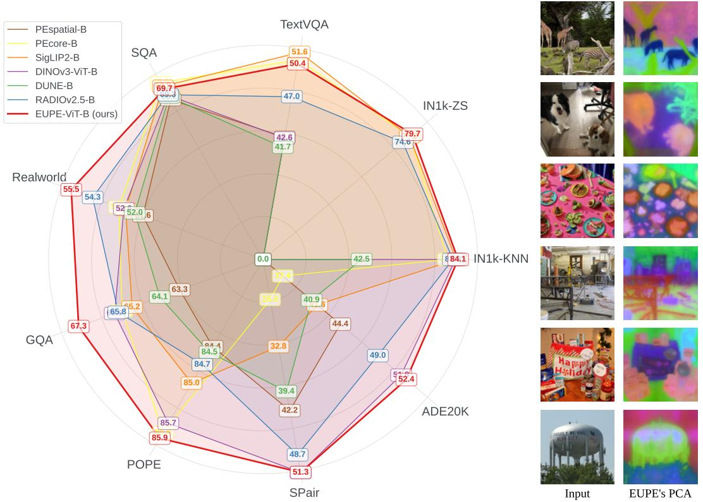

radar chart

| Method          | IN1k-ZS | IN1k-KNN | ADE20K | SPair | POPE | GQA  | Realworld |
| --------------- | ------- | -------- | ------ | ----- | ---- | ---- | --------- |
| PEspatial-B     | 79.7    | 84.1     | 52.4   | 42.2  | 63.3 | 65.8 | 67.3      |
| PEcore-B        | 51.6    | 42.6     | 37.4   | 25.9  | 85.0 | 52.0 | 52.0      |
| SigLIP2-B       | 74.6    | 40.9     | 40.9   | 32.8  | 85.0 | 64.1 | 64.1      |
| DINOv3-ViT-B    | 42.5    | 44.4     | 39.4   | 84.4  | 84.7 | 84.5 | 84.5      |
| DUNE-B          | 41.7    | 42.5     | 39.4   | 32.8  | 85.0 | 64.1 | 64.1      |
| RADIOv2.5-B     | 51.6    | 84.1     | 49.0   | 42.2  | 85.7 | 65.8 | 65.8      |
| EUPE-ViT-B (ours)| 50.4    | 84.1     | 51.3   | 51.3  | 85.9 | 85.7 | 85.9      |

Figure 1 Applying our distillation recipe (EUPE) to ViT-B gives a well-balanced universal encoder that excels at diverse task domains compared to both ViT-B domain experts and existing agglomerative ViT-Bs. Left: Performance on benchmarks across three task domains, higher the better. IN1k-ZS and IN1k-KNN are image understanding benchmarks on ImageNet1k. TextVQA, SQA, Realworld, GQA, POPE are vision-language modeling tasks. SPair and ADE20k are dense prediction tasks. We omit the IN1k-ZS score for models without text encoder (PEspatial-B, DINOv3-ViT-B, DUNE-B) and the IN1k-KNN score for models without class token output (PEspatial-B). Right: Visualization of EUPE-ViT-B’s feature by PCA projection into RGB space.

In this work, we study the pretraining recipe to produce efficient universal perception encoders. We discover that the principle to achieve universal capability on efficient encoders is first scaling up and then scaling down. Directly scaling down from multiple foundation teachers like in previous approaches cannot deliver satisfactory results because the efficient encoders do not have enough capacity to absorb various feature representations from foundation teachers into a universal representation directly. We propose the concept of proxy teacher which is a heavy model with enough capacity to unify the knowledge from multiple foundation teachers. This proxy teacher then transfers the learned universal knowledge to efficient students through distillation. To fully leverage the power of the proxy teacher, we distill the students from it with a longer fixed-resolution stage and shorter multi-resolution stage to accommodate the downstream tasks at various resolutions. Applying this recipe to efficient encoders leads to our Efficient Universal Perception Encoder (EUPE) family.

Experiments show that the proposed scaling-up and scaling-down distillation pipeline without additional bells and whistles can produce efficient universal encoders on-par or outperforming individual domain experts with the same size when zero-shot transferring to downstream tasks. For example, with the ViT-B architecture as shown in Fig. 1 left, our EUPE is on-par with image understanding experts like PEcore Bolya et al. (2025), SigLIP2 Tschannen et al. (2025), and DINOv3 Siméoni et al. (2025) on ImageNet-zeroshot and ImageNet-knn metrics, respectively. It is also on-par for even out-performing the dense prediction expert DINOv3 Siméoni et al. (2025) on SPair Min et al. (2019) and ADE20k Zhou et al. (2017). Compared to the vision-language modeling expert PEcore Bolya et al. (2025) and SigLIP2 Tschannen et al. (2025), it achieves significantly better performance on RealworldQA xAI (2024), GQA Hudson and Manning (2019) while maintaining at par performance on TextVQA Singh et al. (2019), SQA Lu et al. (2022), and POPE Li et al. (2023). Additionally, it outperforms existing agglomerative methods such as RADIO Heinrich et al. (2025) and DUNE Sarıyıldız et al. (2025) by large margins on most benchmarks. Fig. 1 right visualizes EUPE-ViT-B’s feature through PCA projection. Qualitatively, the feature can capture the semantic coherence (row 1&2), fine granularity (row 3), complex spatial structure (row 4), and text awareness (row 5&6) at the same time.

In summary, our main contributions include:

• A simple scaling-up and scaling-down distillation recipe that produces powerful efficient universal perception encoders, outperforming existing agglomerative methods.  
• A zoo of efficient model checkpoints with on-par or better performance than domain expert encoders on various downstream tasks for diverse on-device use cases under different computation budgets.  
• A comprehensive study of the distillation recipe to share insights on training stages, teachers, and other hyperparameter choices.

## 2 Related Work

Foundation Vision Encoders. Modern vision foundation models (VFMs) leverage diverse pretraining objectives to capture specific image properties. Self-supervised models such as MAE He et al. (2022), DINOv1 Caron et al. (2021), and DINOv2 Oquab et al. (2024) provide exceptional structural and geometric descriptors. The recently introduced 7B-parameter DINOv3 Siméoni et al. (2025) further utilizes Gram anchoring to preserve dense feature locality during large-scale training. In parallel, contrastive models like CLIP Radford et al. (2021) and SigLIP 2 Tschannen et al. (2025) align visual features with language, though often at the cost of spatial granularity. Other approaches, such as AIMv2 Fini et al. (2025), introduce multimodal autoregressive objectives to unify these capabilities, while SILC Naeem et al. (2024) combines contrastive learning with local self-distillation. The Segment Anything Model (SAM) Kirillov et al. (2023) on the other hand achieves unprecedented zero-shot segmentation through training on massive segmentation datasets. Recent breakthroughs, such as the Perception Encoder (PEcore) Bolya et al. (2025), challenge the notion that these objectives are mutually exclusive by demonstrating that high-quality general features exist within the intermediate layers of a single, contrastively-trained network. Further, PElang Bolya et al. (2025) extends this by language-aligning these internal features for multimodal LLMs. However, these encoders are typically experts in limited task domains, and their out-of-domain performance is below expectations. Our work EUPE addresses this by distilling knowledge from multiple expert teachers into a single, universal student encoder.

Knowledge Distillation for Vision Encoders. Knowledge distillation (KD), originally proposed by Hinton et al. Hinton et al. (2015), provides a general framework for training a compact student model to mimic a larger teacher. This foundational concept has been extended by numerous single-teacher distillation variants. Teacher Assistant Knowledge Distillation (TAKD) Mirzadeh et al. (2020) bridges a large capacity gap between teacher and student by introducing an intermediate-sized “teacher assistant” model. Other works focus on distilling specific capabilities from powerful foundation models: EfficientSAM Xiong et al. (2024) leverages masked image pretraining to distill the segmentation capabilities of SAM into a much smaller encoder, and PEspatial Bolya et al. (2025) distills the strong spatial features found in the intermediate layers of the Perception Encoder. Techniques have also been developed to preserve specific feature properties during distillation, such as the Gram anchoring method in DINOv3 Siméoni et al. (2025), which maintains the quality of dense, local features throughout training. Our work builds upon the simple yet effective principles but extends it to a multi-teacher setting. We intentionally keep the per-teacher distillation flow as simple as possible to focus on the challenges of combining knowledge from multiple, diverse experts into small and efficient student.

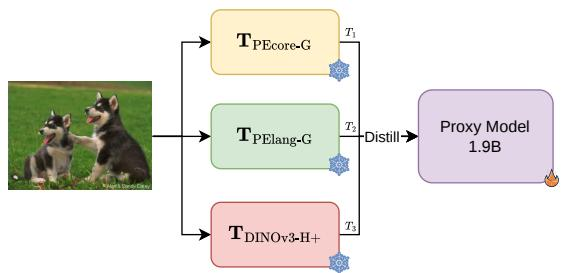

flowchart

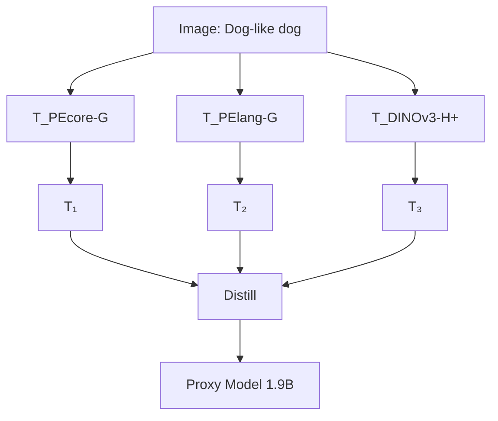

Stage 1: Multi-Teacher Distillation

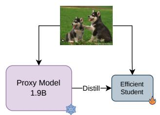

flowchart

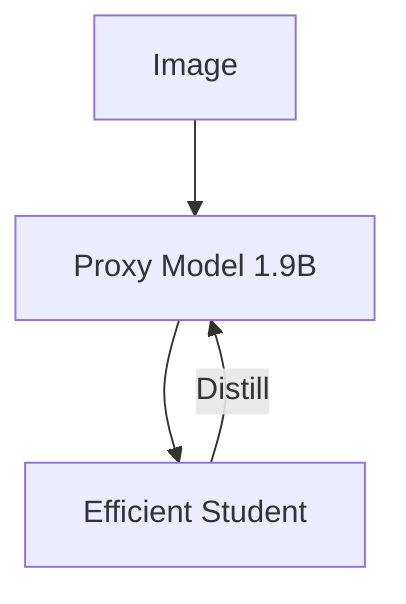

Stage 2: Single-Res Distillation

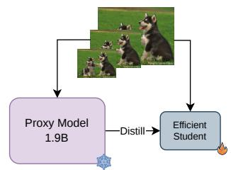

flowchart

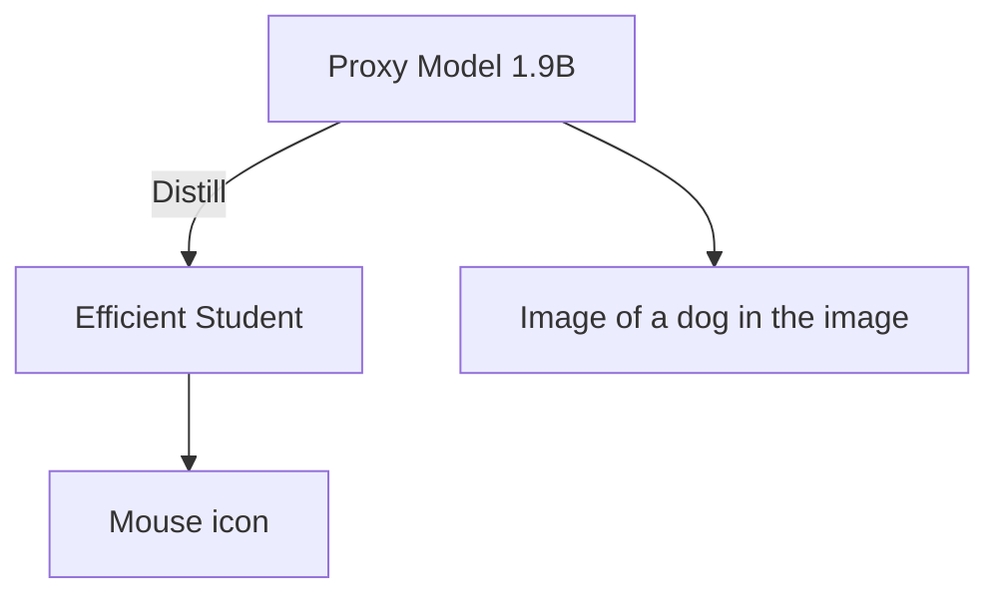

Stage 3: Multi-Res Distillation  
Figure 2 Multi-stage distillation pipeline (scaling up → scaling down). In Stage 1 we distill from multiple foundation models into a heavy proxy model. For Stage 2 the distillation happens from the proxy model into the target efficient encoder. In Stage 3 we finetune from Stage 2 models at multiple resolutions. The image pyramid indicates the multi-resolution inputs.

Agglomerative and Multi-Teacher Methods. To benefit from multiple strong encoders simultaneously, some work has explored the theoretical underpinnings of combining knowledge from multiple sources. Formont et al. Formont et al. (2025) proposed a task-agnostic, information-theoretic framework for multi-teacher distillation based on a majority-vote objective, while Ramtoula et al. Ramtoula et al. (2025) provides a systematic probing framework (“ComBo”) to identify and combine the most task-relevant features from disparate foundation models. Another direction is multi-teacher distillation. UNIC Sarıyıldız et al. (2024) introduced a “ladder of projectors” and “teacher dropping” to prevent any single teacher from dominating the gradient, while its successor DUNE Sarıyıldız et al. (2025) successfully merges 2D vision and 3D perception teachers through heterogeneous co-distillation. AM-RADIO Ranzinger et al. (2024) introduced an agglomerative framework for multi-teacher distillation that creates a unified student from CLIP, DINOv2, and SAM by progressively merging similar image tokens in the network’s deeper layers; its successor RADIOv2.5 Heinrich et al. (2025) further addressed resolution mode shifts and teacher imbalance. However, when it comes to an efficient computing scenario like on edge devices, these methods are not competitive to domain experts. Our work EUPE discovers the keep missing part is scaling-up to a proxy model before direct scaling down from multiple teachers.

## 3 Efficient Universal Perception Encoder

## 3.1 Pipeline Overview

We propose a multi-stage distillation pipeline with the principle: scaling up, then scaling, as shown in Fig. 2. We opt for simplicity in the design to demonstrate the importance of scaling up before scaling down.

Our pipeline has three stages. The first stage is multi-teacher distillation into a large proxy model, e.g. 1.9B parameters. We select a heavy model as the proxy because it has enough capacity to learn universally good representations from diverse foundational encoders of different domains. The input consists of label-free images which are passed to all teachers in parallel at their native resolution. Each teacher outputs a class token and a set of patch tokens. The same image also passes through the proxy model and outputs a class token and patch tokens. They are compared with each teacher’s tokens to compute the distillation loss. For teachers, we select representative foundation encoders from each task domain. PEcore Bolya et al. (2025) is selected as the domain expert for zero-shot image classification and retrieval, and DINOv3 Siméoni et al. (2025) is chosen as the domain expert for dense prediction. In addition, we find that PElang Bolya et al. (2025) is crucial for vision-language modeling.

The second stage is fixed-resolution distillation from the Stage 1 proxy model into the target efficient encoder. We hypothesize that it is much easier for efficient encoders to learn from a universal proxy teacher than directly learning from diverse domain experts, mainly because efficient encoders have lower capacity to effectively unify knowledge of multiple teachers into universal representations. In this stage, we keep the image resolution fixed at $2 5 6 \times 2 5 6$ so that the training step is computationally efficient and we can afford a longer learning schedule.

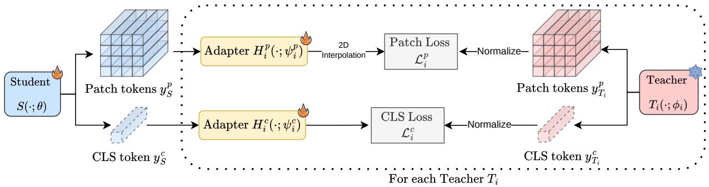

flowchart

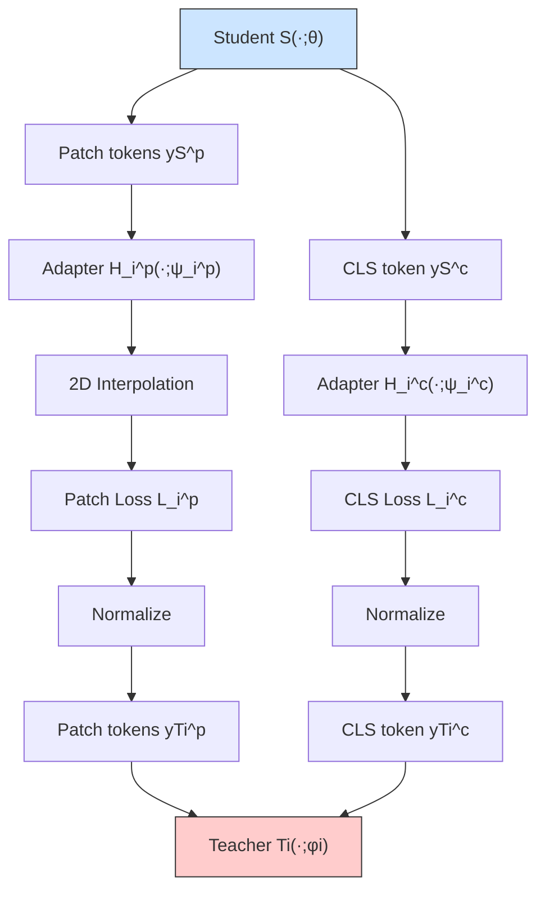

Figure 3 Per teacher distillation flow. Snowflake symbol indicates frozen parameters and flame symbol indicates trainable parameters. 2D interpolation is applied to the patch tokens in case the student’s output and the teacher’s output are of different spatial dimensions.

The third stage is multi-resolution finetuning from the Stage 1 proxy model to the target efficient encoder. The student encoder is initialized from the Stage 2 distilled checkpoint. Instead of passing the same image to the teacher and the student, we resize the image several times into a pyramid and let the teacher and the student randomly select one scale from the pyramid independently. As a result, the student can learn from the teacher’s representations at different granularity. This stage is designed to accommodate various resolutions of downstream tasks.

In all stages, the distillation from the teacher to the student follows the same flow as in Fig. 3. Let $S ( \cdot ; \theta )$ b e the student encoder parameterized by $\theta ,$ and $T _ { i } ( \cdot ; \phi _ { i } )$ be the $i ^ { \mathrm { t h } }$ teacher encoder parameterized by ϕi where i can be greater than 1 in Stage 1. Given the student’s input $x _ { S }$ and the teacher’s input $x _ { T _ { i } }$ , they each output a class token $y _ { * } ^ { c }$ and patch tokens $y _ { * } ^ { p }$ :

$$
\left(y _ {S} ^ {c}, y _ {S} ^ {p}\right) = S (x _ {S}; \theta), \quad y _ {S} ^ {c} \in \mathbb {R} ^ {d _ {S}}, y _ {S} ^ {p} \in \mathbb {R} ^ {N _ {S} \times d _ {S}}. \tag {1}
$$

$$
\left(y _ {T _ {i}} ^ {c}, y _ {T _ {i}} ^ {p}\right) = T _ {i} (x _ {T _ {i}}; \phi_ {i}), \quad y _ {T _ {i}} ^ {c} \in \mathbb {R} ^ {d _ {T _ {i}}}, y _ {T _ {i}} ^ {p} \in \mathbb {R} ^ {N _ {T _ {i}} \times d _ {T _ {i}}}. \tag {2}
$$

where $d _ { S } , N _ { S } , d _ { T _ { i } } , N _ { T _ { i } }$ are the feature dimension and number of patch tokens for the student and the teacher, respectively. To connect the outputs of the student and the $i ^ { \mathrm { t h } }$ teacher, we append adapter head modules to the student outputs to match the feature dimensions. Specifically, let $H _ { i } ^ { c } ( \cdot ; \psi _ { i } ^ { c } )$ and $H _ { i } ^ { p } ( \cdot ; \psi _ { i } ^ { p } )$ be the adapter heads for the class token and patch tokens for the ith teacher parameterized by $\psi _ { i } ^ { c }$ and $\psi _ { i } ^ { p }$ , respectively. Then the adapted class token and patch tokens for the $i ^ { \mathrm { t h } }$ teacher are:

$$
z _ {T _ {i}} ^ {c} = H _ {i} ^ {c} \left(y _ {S} ^ {c}; \psi_ {i} ^ {c}\right), \quad z _ {T _ {i}} ^ {c} \in \mathbb {R} ^ {d _ {T _ {i}}} \tag {3}
$$

$$
z _ {T _ {i}} ^ {p} = H _ {i} ^ {p} (y _ {S} ^ {p}; \psi_ {i} ^ {p}), \qquad z _ {T _ {i}} ^ {p} \in \mathbb {R} ^ {N _ {S} \times d _ {T _ {i}}}
$$

To match the spatial resolution between $z _ { T _ { i } } ^ { p }$ and $y _ { T _ { i } } ^ { p }$ , we 2D-interpolate the smaller one into the larger size so they will have the same shape max $\cdot ( N _ { S } , \bar { N _ { T _ { i } } } ) \times { d _ { T _ { i } } } ^ { - }$ . Finally, the distillation loss $L _ { i }$ between the student and the $i ^ { \mathrm { t h } }$ teacher is calculated from the student’s adapted tokens $z _ { T _ { i } } ^ { c } , z _ { T _ { i } } ^ { p }$ and the teacher’s normalized tokens $\bar { y } _ { T _ { i } } ^ { c } , \bar { y } _ { T _ { i } } ^ { p }$ :

$$
L _ {i} = L _ {i} ^ {c} (z _ {T _ {i}} ^ {c}, \bar {y} _ {T _ {i}} ^ {c}) + L _ {i} ^ {p} (z _ {T _ {i}} ^ {p}, \bar {y} _ {T _ {i}} ^ {p}) \tag {4}
$$

where $L _ { i } ^ { c } , L _ { i } ^ { p }$ are the class token loss and patch token loss, respectively, which we introduce below. During training, $\theta , \dot { \psi } _ { i } ^ { c } , \psi _ { i } ^ { p }$ are learnable parameters and $\phi _ { i }$ is frozen.

## 3.2 Loss

For simplicity, we use the same loss formulation for all stages. Following AM-RADIO Ranzinger et al. (2024), the class token loss is the cosine similarity loss and the patch token loss is a combination of the cosine similarity

loss and the smooth L1 loss:

$$
\begin{array}{l} L _ {i} ^ {c} (z _ {T _ {i}} ^ {c}, \bar {y} _ {T _ {i}} ^ {c}) = L _ {c o s} (z _ {T _ {i}} ^ {c}, \bar {y} _ {T _ {i}} ^ {c}) \\ \begin{array}{l} L _ {i} \left(z _ {T _ {i}}, y _ {T _ {i}}\right) = L _ {\cos} \left(z _ {T _ {i}}, y _ {T _ {i}}\right) \\ L _ {i} ^ {p} \left(z _ {T _ {i}} ^ {p}, \bar {y} _ {T _ {i}} ^ {p}\right) = \alpha L _ {\cos} \left(z _ {T _ {i}} ^ {p}, \bar {y} _ {T _ {i}} ^ {p}\right) + \beta L _ {\text { smooth } - L 1} \left(z _ {T _ {i}} ^ {p}, \bar {y} _ {T _ {i}} ^ {p}\right) \end{array} \tag {5} \\ \end{array}
$$

where $\alpha = 0 . 9 , \beta = 0 . 1$ are the loss weights. The total distillation loss L is the summation of the loss for all teachers:

$$
L = \sum_ {i} L _ {i} ^ {c} (z _ {T _ {i}} ^ {c}, \bar {y} _ {T _ {i}} ^ {c}) + L _ {i} ^ {p} (z _ {T _ {i}} ^ {p}, \bar {y} _ {T _ {i}} ^ {p}) \tag {6}
$$

For Stage 1, i ranges over the indices of all teachers. For Stage 2&3, there is only one teacher (proxy model).

## 3.3 Feature Normalization

We normalize the teacher output during distillation, i.e., $y _ { T _ { i } } ^ { c }  \bar { y } _ { T _ { i } } ^ { c } , y _ { T _ { i } } ^ { p }  \bar { y } _ { T _ { i } } ^ { p }$ . This helps stabilize the feature distillation Heo et al. (2019), especially in Stage 1. As pointed out by UNIC Sarıyıldız et al. (2024), the class token and patch tokens of a teacher’s outputs can have very different feature mean norm and standard deviation. And these statistics across teachers are also very diverse. Distillation without feature normalization will cause the domination of one type of token (the class token in most cases) from a single teacher. Unlike the complex PHI-S normalization used in RADIOv2.5 Heinrich et al. (2025), we opt for simplicity by simply subtracting the mean and dividing by the standard deviation (std), which proves effective. We compute the normalization statistics by running each teacher through a tiny batch of the training data and then fix the mean and std for the rest of the training. This is also different from UNIC Sarıyıldız et al. (2024) which computes statistics on-the-fly during distillation using an exponential moving average. On-the-fly computation requires gathering the features across all GPUs every step, which consumes more memory and makes it hard to scale up the batch size on multiple nodes.

## 3.4 Data

For all stages, we train on the same DINOv3 dataset Siméoni et al. (2025), which consists of LVD-1689M with balanced coverage of all visual concepts appearing on the Web and high quality public datasets such as ImageNet1k Deng et al. (2009). We also adopt the same data sampling strategy in DINOv3 to train with both homogeneous batches of data from ImageNet1k and heterogeneous batches from LVD-1689M. The probability of sampling from ImageNet1k is set to 10%.

## 4 Experiments

In this section, we benchmark EUPE by comparing it to existing efficient vision encoders on a variety of computer vision tasks. To compare their generalization capability on multiple tasks, we keep all encoders frozen and solely use their representations without adapter heads. Our test bed consists of three mainstream vision task domains. One is image understanding to test the encoder’s global representation, including zero-shot classification on ImageNet1k (IN1k-ZS) and KNN classification on ImageNet1k (IN1k-KNN). Another is dense prediction to measure their spatial understanding ability, including semantic segmentation (AKE20k Zhou et al. (2017)), monocular depth estimation (NYUv2 Silberman et al. (2012)), and semantic keypoint correspondence estimation (SPair Min et al. (2019)). Finally we also test on the vision-language modeling tasks. We train a Llava Liu et al. (2023) model with the encoder plugged in. We follow the definition proposed by Cambrian-1 Tong et al. (2024) of four types of VLM benchmarks. We choose one or two representative benchmarks from each type, namely OCR (TextVQA Singh et al. (2019)), knowledge (SQA Lu et al. (2022)), vision-centric (Realworld xAI (2024) and POPE Li et al. (2023)), and general (GQA Hudson and Manning (2019) and MME Fu et al. (2023)). We share more details on the setup in the supplementary material.

## 4.1 Implementation Details

In Stage 1, we choose the foundation teacher encoders to be PEcore-G (1.9B), PElang-G (1.7B), and DINOv3- H+ (840M). We follow the recipe described in the AM-Radio paper series. We run all teachers at their native resolutions (448 for PEcore/lang and 256 for DINOv3-H+) during training. We train a 1.9B parameter proxy model with 4 register tokens. We perform a crude centering of the teacher outputs by measuring their per-coordinate mean and variance during 500 iterations before training. We use the standard ImageNet constants for the mean-std normalization of inputs.

Table 1 Comparison with representative domain experts and agglomerative encoders across image understanding, VLM, and dense prediction benchmarks. Best results are indicated in bold. Numbers in brackets indicate the gap with the best domain expert. “no txt” means no text encoder. “no cls” means no class token output. ∗The discrepancy with results from Sarıyıldız et al. (2025) is due to benchmarking only the encoder part without adapter head.

<table><tr><td rowspan="2">Model</td><td colspan="2">Image under.</td><td>VLM OCR</td><td>VLM know.</td><td colspan="3">VLM vision</td><td>VLM general</td><td colspan="3">Dense prediction</td></tr><tr><td>IN1k-ZS</td><td>IN1k-KNN</td><td>TextVQA</td><td>SQA</td><td>Realworld</td><td>POPE</td><td>GQA</td><td>MMEp</td><td>SPair</td><td>NYUv2↓</td><td>ADE20k</td></tr><tr><td colspan="12">Domain Experts</td></tr><tr><td>PEcore-B Bolya et al. (2025)</td><td>78.4</td><td>79.7</td><td>50.8</td><td>70.0</td><td>52.9</td><td>85.8</td><td>65.6</td><td>1375.5</td><td>25.9</td><td>0.641</td><td>37.4</td></tr><tr><td>PEspatial-B Bolya et al. (2025)</td><td>no cls</td><td>no cls</td><td>42.8</td><td>69.0</td><td>51.6</td><td>84.4</td><td>63.3</td><td>1279.6</td><td>42.2</td><td>0.389</td><td>45.5</td></tr><tr><td>SigLIP2-B Tschannen et al. (2025)</td><td>78.2</td><td>83.2</td><td>51.6</td><td>69.8</td><td>52.5</td><td>85.0</td><td>65.2</td><td>1389.5</td><td>32.8</td><td>0.512</td><td>41.6</td></tr><tr><td>DINOv3-ViT-B Siméoni et al. (2025)</td><td>no txt</td><td>83.0</td><td>42.7</td><td>69.3</td><td>52.6</td><td>85.7</td><td>65.9</td><td>1368.0</td><td>51.3</td><td>0.373</td><td>51.8</td></tr><tr><td colspan="12">Agglomerative Methods</td></tr><tr><td>RADIOv2.5-B Heinrich et al. (2025)</td><td>74.6</td><td>81.9</td><td>47.0</td><td>69.3</td><td>54.3</td><td>84.7</td><td>65.8</td><td>1349.8</td><td>48.7</td><td>0.435</td><td>49.0</td></tr><tr><td>DUNE-B Sariyıldız et al. (2025)</td><td>no txt</td><td>42.5</td><td>41.7</td><td>69.2</td><td>52.0</td><td>84.5</td><td>64.1</td><td>1294.8</td><td>39.4</td><td>0.375</td><td>40.9*</td></tr><tr><td>EUPE-ViT-B (Ours)</td><td>79.7</td><td>84.1</td><td>50.4 (1.2)</td><td>69.7 (0.3)</td><td>55.5</td><td>85.9</td><td>67.3</td><td>1374.5 (15.0)</td><td>51.3</td><td>0.391 (0.018)</td><td>52.4</td></tr></table>

In Stage 2, we train with a 256 × 256 fixed resolution, a batch size of 8192, a cosine learning rate schedule, a base learning rate of 2e−5, and weight decay set to 1e−4 for 390k iterations. We augment the input images with random resized cropping, random horizontal flipping, color jittering, Gaussian blur, and random solarization. For efficient student encoders, we opt for backbones with less than 100M parameters. The ViT family includes ViT-B (86M), ViT-S (21M), and ViT-T (6M). The CNN family includes ConvNext-Base (89M), ConvNext-Small (50M), and ConvNext-Tiny (29M).

In Stage 3, we build the image pyramid with three scales, i.e. 256, 384, and 512. All other data augmentation steps are the same as in Stage 2. The student and the teacher randomly select one scale from the pyramid independently for each iteration. We opt for a shorter learning schedule in finetuning with batch size of 4096, base learning rate of 1e−5 for 100k iterations.

For all adapter heads, we adopt a simple 2-layer MLP design which starts with a linear projection without bias, followed by LayerNorm and GELU, and ends with another linear projection without bias. The hidden dimension is 1536 in Stage 1 and 3072 in Stage 2&3. Wherever spatial alignment is needed, we use PyTorch’s builtin interpolation with bicubic mode to resize the patch tokens.

## 4.2 Comparison with SOTA

We compare our model with both SOTA domain experts and previous agglomerative encoders on our test bed. We focus on efficient architectures and identify that the most common efficient backbone for all methods is ViT-B. We benchmark our EUPE-ViT-B and others, and report the performance in Table 1 and Fig. 1.

Overall, our EUPE-ViT-B is the most universally transferable encoder with on-par or even better performance on each benchmark across image understanding, dense prediction, and vision-language modeling when compared to the strongest model for that benchmark. Compared to agglomerative methods, it outperforms RADIOv2.5-B and DUNE-B on all VLM tasks and most dense prediction tasks by significant margins with only a small gap with DUNE-B on NYUv2. Compared to domain experts, it excels at image understanding on ImageNet1k, outperforms the dense prediction expert (DINOv3-ViT-B) on ADE20k, and outperforms the VLM experts (SigLIP2-B and PEcore-B) on Realworld, POPE, and GQA. On other benchmarks such as NYUv2, SQA, TextVQA, and MMEp, its gap with the corresponding domain expert is marginal.

Table 2 Ablation on the necessity of the three-stage pipeline. “Stage 2 only” means direct distillation from multiple teachers into the target efficient encoder. Best results are indicated in bold.

<table><tr><td>Task domain</td><td>Benchmark</td><td>Stage 2 only</td><td>Stage 1&amp;2</td><td>Stage 1&amp;3</td><td>Stage 1&amp;2&amp;3</td></tr><tr><td rowspan="2">Image</td><td>IN1k-ZS</td><td>79.6</td><td>79.5</td><td>80.0</td><td>79.7</td></tr><tr><td>IN1k-KNN</td><td>84.0</td><td>84.0</td><td>84.3</td><td>84.1</td></tr><tr><td rowspan="6">VLM</td><td>TextVQA</td><td>46.8</td><td>48.3</td><td>49.5</td><td>50.4</td></tr><tr><td>SQA</td><td>69.6</td><td>69.3</td><td>69.2</td><td>69.7</td></tr><tr><td>Realworld</td><td>53.5</td><td>55.1</td><td>55.1</td><td>55.5</td></tr><tr><td>POPE</td><td>85.3</td><td>85.3</td><td>84.6</td><td>85.9</td></tr><tr><td>GQA</td><td>66.6</td><td>66.4</td><td>67.3</td><td>67.3</td></tr><tr><td>MMEp</td><td>1337.9</td><td>1345.6</td><td>1399.7</td><td>1374.5</td></tr><tr><td rowspan="3">Dense</td><td>SPair</td><td>35.1</td><td>41.0</td><td>53.3</td><td>51.3</td></tr><tr><td>NYUv2↓</td><td>0.616</td><td>0.557</td><td>0.388</td><td>0.391</td></tr><tr><td>ADE20k</td><td>41.9</td><td>43.3</td><td>52.0</td><td>52.4</td></tr></table>

Table 3 Ablation on the choice of teacher foundation encoders in Stage 1. SOTA is the best per-benchmark performance among all existing vision encoders as a reference. PEc = PEcore-G. PEl = PElang-G. S2 = SigLIP2-G. Dv3 = DINOv3-H+. Best results are in bold.

<table><tr><td>Task domain</td><td>Benchmark</td><td>SOTA</td><td>PEc&amp;Dv3</td><td>PEc&amp;Dv3&amp;S2</td><td>PEc&amp;Dv3&amp;PEI</td></tr><tr><td rowspan="2">Image</td><td>IN1k-ZS</td><td>78.4</td><td>79.9</td><td>78.8</td><td>79.7</td></tr><tr><td>IN1k-KNN</td><td>83.2</td><td>84.3</td><td>84.2</td><td>84.1</td></tr><tr><td rowspan="6">VLM</td><td>TextVQA</td><td>51.6</td><td>48.6</td><td>44.8</td><td>50.4</td></tr><tr><td>SQA</td><td>70.0</td><td>69.7</td><td>70.2</td><td>69.7</td></tr><tr><td>Realworld</td><td>54.3</td><td>55.1</td><td>52.9</td><td>55.5</td></tr><tr><td>POPE</td><td>85.8</td><td>85.8</td><td>84.7</td><td>85.9</td></tr><tr><td>GQA</td><td>65.9</td><td>66.7</td><td>66.4</td><td>67.3</td></tr><tr><td>MMEp</td><td>1389.5</td><td>1375.2</td><td>1271.6</td><td>1374.5</td></tr><tr><td rowspan="3">Dense</td><td>SPair-71k</td><td>51.3</td><td>51.5</td><td>52.1</td><td>51.3</td></tr><tr><td>NYUv2↓</td><td>0.373</td><td>0.384</td><td>0.401</td><td>0.391</td></tr><tr><td>ADE20k</td><td>51.8</td><td>52.5</td><td>52.5</td><td>52.4</td></tr></table>

## 4.3 Ablation Studies

We detail our key ablation studies below. Further experiments regarding the data-mix, loss weights, and proxy model size are provided in the supplementary material. Unless otherwise specified, all ablations use the ViT-B architecture.

Necessity of stages. Table 2 validates that all three stages contribute complementary gains. Using only Stage 2 (direct multi-teacher distillation into efficient student) yields weaker VLM performance, especially on OCR, and also poor dense prediction performance. Adding Stage 1 significantly improves vision-language modeling tasks such as TextVQA and Realworld, but this setup still lags behind the full pipeline on dense tasks. The Stage 1+3 variant performs multi-resolution distillation after Stage 1. In this case, we adopt the same learning schedule as in Stage 2. This setting gives the strongest performance on dense prediction tasks, e.g. SPair (53.3) and NYUv2 (0.388), but the gaps behind the domain experts for VLM are significant. Also, training with multi-resolution is computationally costly, and we cannot afford a long schedule. The time to run one iteration in Stage 3 is twice as long as in Stage 2. Therefore, we opt for a long fixed-resolution training in Stage 2 followed by a short multi-resolution training in Stage 3. This setting improves the VLM metrics in general without sacrificing image and dense performance too much, resulting in the best overall balance.

Table 4 Proxy model performance with different teachers sets used to train the Stage-1 proxy. Also include teachers (PEcore-G, DINOv3-H+) performance as a reference. PEc = PEcore-G. PEl = PElang-G. S2 = SigLIP2-G. Dv3 = DINOv3-H+. Best results are in bold.

<table><tr><td>Task domain</td><td>Benchmark</td><td>Dv3</td><td>PEc</td><td>PEc&amp;Dv3</td><td>PEc&amp;Dv3&amp;S2</td><td>PEc&amp;Dv3&amp;PEI</td></tr><tr><td rowspan="2">Image</td><td>IN1k-ZS</td><td>no text</td><td>85.4</td><td>85.0</td><td>85.3</td><td>84.8</td></tr><tr><td>IN1k-KNN</td><td>85.4</td><td>87.2</td><td>87.0</td><td>87.2</td><td>87.0</td></tr><tr><td rowspan="6">VLM</td><td>TextVQA</td><td>49.8</td><td>54.7</td><td>56.2</td><td>53.2</td><td>58.6</td></tr><tr><td>SQA</td><td>69.0</td><td>72.2</td><td>70.9</td><td>70.2</td><td>70.6</td></tr><tr><td>Realworld</td><td>53.9</td><td>56.9</td><td>59.24</td><td>54.2</td><td>60.4</td></tr><tr><td>POPE</td><td>87.2</td><td>85.9</td><td>87.3</td><td>87.0</td><td>87.3</td></tr><tr><td>GQA</td><td>67.9</td><td>67.0</td><td>68.6</td><td>68.4</td><td>69.2</td></tr><tr><td>MMEp</td><td>1385.0</td><td>1456.6</td><td>1455.4</td><td>1366.2</td><td>1450.2</td></tr><tr><td rowspan="3">Dense</td><td>SPair-71k</td><td>49.7</td><td>20.3</td><td>52.9</td><td>54.4</td><td>53.8</td></tr><tr><td>NYUv2↓</td><td>0.352</td><td>0.590</td><td>0.332</td><td>0.321</td><td>0.390</td></tr><tr><td>ADE20k</td><td>54.8</td><td>38.7</td><td>56.0</td><td>55.4</td><td>55.9</td></tr></table>

The choice of teacher foundation models. Table 3 shows that selecting the right combination of teacher models in Stage 1 matters. The teacher set affects which capabilities are emphasized. We start with combining PEcore-G and DINOv3-H+, which shows promising signals on image understanding and dense prediction tasks. However, the gap with SOTA performance on the VLM OCR benchmark is huge. Then we explore adding another strong expert on VLM OCR tasks. SigLIP2-G itself achieves superior performance on all VLM benchmarks, but it substantially degrades the OCR metric when combined with PEcore-G and DINOv3-H+. This indicates that SigLIP2 features may not be compatible with the other teachers. Our hypothesis is that it is not helpful to have two CLIP-style models like PEcore-G and SigLIP2-G in the combination at the same time. PElang-G is a language-focused model derived from PEcore-G through alignment with language models. It turns out to be a good complement to the combinations. Adding PElang-G provides the strongest OCR and general VLM performance among the compared sets, without sacrificing the image and dense performance too much. We therefore use PEcore-G, PElang-G, and DINOv3-H+ as the default set to maximize multi-task robustness.

Performance of proxy models. We also report the performance of different proxy models as a reference. Table 4 shows that PEcore-G and DINOv3-H+ are experts in VLM and dense prediction, respectively. Combining them together provides a good foundation for all three task domains. The PElang-G is crucial for VLM tasks especially OCR-related. SigLIP2-G, on the other hand, does not work well with PEcore-G and DINOv3-H+, causing major degradations in VLM performance. These observations align with the final results of targeted efficient encoder in Table 3, indicating that the student learns well from the teacher.

## 4.4 Feature Visualization

To qualitatively compare the model’s feature representations, we project dense patch tokens into a threedimensional space using Principal Component Analysis (PCA) and map these dimensions to RGB. We apply this visualization technique to both domain expert and agglomerative ViT-Bs, as illustrated in Fig. 4.

For models trained with image-text pairs like PEcore and SigLIP2, their patch tokens contain semantic information but are not spatially consistent, leading to noisy representations. DINOv3, on the other hand, has highly sharp features with semantic coherence, but lacks discrimination ability for fine-grained details (e.g. food and plates having similar representations) as shown in the last row. For the agglomerative DUNE model, the features are similar to DINOv3 due to distilling from multiple dense prediction experts. Our EUPE model can combine the best of both worlds, i.e. achieving both semantically sharp features and sensitivity to fine-grained details. For the other agglomerative model, RADIO, its features are overly sensitive, which breaks the semantic coherence (e.g., in row 2, the black fur of the dogs merges with the background).

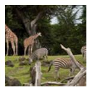

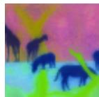

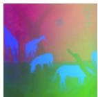

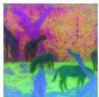

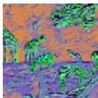

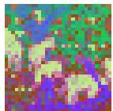

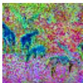

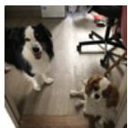

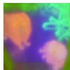

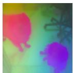

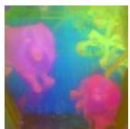

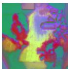

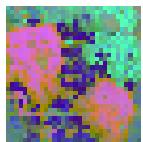

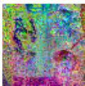

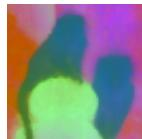

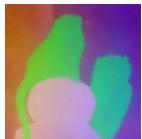

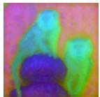

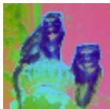

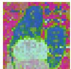

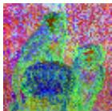

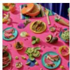

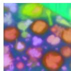

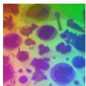

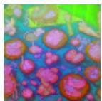

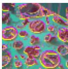

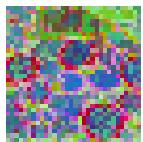

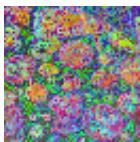  
RADIO  
SigLIP2  
PEcore  
Figure 4 Comparison of dense features by projecting the patch tokens using PCA into RGB space. From left to right: EUPE-ViT-B16 (Ours), DINOv3-ViT-B16, DUNE-B14, RADIOv2.5-B16, SigLIP2-B16, PEcore-B16. Best viewed in color.

Input  
EUPE  
DINOv3  
DUNE  
Table 5 ViT family evaluation across image understanding, VLM, and dense prediction tasks. “no cls” means no class token output. “no txt” means no text encoder.

<table><tr><td rowspan="2">Model</td><td colspan="2">Image Under.</td><td>VLM OCR</td><td>VLM Know.</td><td colspan="2">VLM Vision</td><td colspan="2">VLM General</td><td colspan="3">Dense Prediction</td></tr><tr><td>IN1k-ZS</td><td>IN1k-KNN</td><td>TextVQA</td><td>SQA</td><td>Realworld</td><td>POPE</td><td>GQA</td><td>MMEp</td><td>SPair</td><td>NYUv2↓</td><td>ADE20k</td></tr><tr><td>PEcore-T</td><td>52.9</td><td>61.7</td><td>44.3</td><td>68.6</td><td>47.4</td><td>82.2</td><td>60.9</td><td>1221.1</td><td>20.2</td><td>0.756</td><td>22.0</td></tr><tr><td>PEspatial-T</td><td>no cls</td><td>no cls</td><td>40.7</td><td>68.0</td><td>48.7</td><td>80.7</td><td>59.0</td><td>1128.0</td><td>18.4</td><td>0.589</td><td>28.5</td></tr><tr><td>EUPE-ViT-T</td><td>50.5</td><td>66.3</td><td>42.0</td><td>69.5</td><td>50.0</td><td>82.4</td><td>61.4</td><td>1258.0</td><td>37.2</td><td>0.571</td><td>36.7</td></tr><tr><td>PEcore-S</td><td>62.8</td><td>71.9</td><td>47.0</td><td>69.4</td><td>48.4</td><td>83.2</td><td>63.5</td><td>1339.2</td><td>28.6</td><td>0.599</td><td>33.7</td></tr><tr><td>PEspatial-S</td><td>no cls</td><td>no cls</td><td>42.5</td><td>67.6</td><td>49.0</td><td>82.8</td><td>62.9</td><td>1245.4</td><td>30.8</td><td>0.464</td><td>38.6</td></tr><tr><td>DINOv3-ViT-S</td><td>no txt</td><td>78.6</td><td>41.7</td><td>68.5</td><td>50.3</td><td>84.5</td><td>64.2</td><td>1263.1</td><td>47.9</td><td>0.404</td><td>46.9</td></tr><tr><td>EUPE-ViT-S</td><td>69.8</td><td>78.2</td><td>44.1</td><td>69.3</td><td>51.7</td><td>84.5</td><td>65.0</td><td>1304.9</td><td>46.5</td><td>0.455</td><td>46.6</td></tr></table>

We further analyze the features of encoders trained with different stage settings. Fig. 5 helps us to understand their difference through visualization of the first few principal components. The encoder trained with Stage 2 only shows noisy feature maps and it is hard to identify semantic coherence. This can be effectively addressed by scaling up in Stage 1 and then scaling down as shown in the second row, indicating that learning from a single universal large teacher is an easier path compared to directly learning from multiple domain experts for efficient encoders. However, without Stage 3 multi-resolution training, the semantic coherence can be broken by spatial awareness. As shown in components 1&4 of row 2, the visualization is divided into local regions due to resolution mismatch during training and inference. Stage 3 training can address this issue and makes the feature representations even sharper.

## 4.5 Full Family of EUPE

The full family includes variants based on the Vision Transformer (ViT) and ConvNeXt architectures. These models cover a wide range of parameter sizes and inference costs to accommodate diverse on-device use cases under different computation budgets. In addition to the results in Table 1, Table 5 and 6 reports the comparison of the remaining EUPE family versus other model collections of the corresponding size.

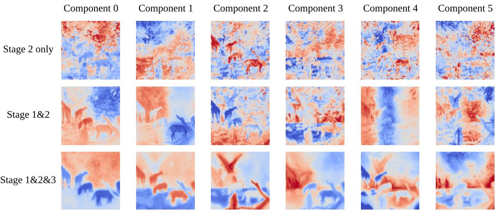  
Figure 5 Comparison of dense features PCA components for encoders trained with stage variants. Input is the same as the image in Fig. 4 row 1. “Stage 2 only” means direct distillation from multiple teachers into the target efficient encoder. Best viewed in color.

Table 6 ConvNext family evaluation across VLM and dense prediction tasks. We omit results on image understanding tasks as the models do not have class token output.

<table><tr><td rowspan="2">Model</td><td>VLM OCR</td><td>VLM Know.</td><td colspan="2">VLM Vision</td><td colspan="2">VLM General</td><td colspan="3">Dense Prediction</td></tr><tr><td>TextVQA</td><td>SQA</td><td>Realworld</td><td>POPE</td><td>GQA</td><td>MMEp</td><td>SPair</td><td>NYUv2↓</td><td>ADE20k</td></tr><tr><td>DINOv3-ConvNext-T</td><td>41.6</td><td>69.8</td><td>44.7</td><td>81.9</td><td>60.3</td><td>1226.0</td><td>35.7</td><td>0.448</td><td>42.7</td></tr><tr><td>EUPE-ConvNext-T</td><td>43.7</td><td>68.8</td><td>47.9</td><td>83.4</td><td>63.0</td><td>1278.1</td><td>41.3</td><td>0.430</td><td>43.5</td></tr><tr><td>DINOv3-ConvNext-S</td><td>42.6</td><td>68.8</td><td>49.3</td><td>83.7</td><td>63.1</td><td>1321.5</td><td>34.7</td><td>0.432</td><td>44.8</td></tr><tr><td>EUPE-ConvNext-S</td><td>45.0</td><td>68.9</td><td>50.5</td><td>84.0</td><td>64.7</td><td>1284.2</td><td>40.1</td><td>0.388</td><td>46.8</td></tr><tr><td>DINOv3-ConvNext-B</td><td>42.7</td><td>69.1</td><td>46.6</td><td>84.4</td><td>63.7</td><td>1278.8</td><td>35.0</td><td>0.420</td><td>46.3</td></tr><tr><td>EUPE-ConvNext-B</td><td>46.4</td><td>70.1</td><td>53.3</td><td>84.7</td><td>65.8</td><td>1348.9</td><td>37.7</td><td>0.365</td><td>48.9</td></tr></table>

For the ViT-S/T family in Table 5, our EUPE models offer balanced performance across three task domains. At Tiny scale, EUPE achieves large margins on dense prediction tasks. At Small scale, EUPE approaches DINOv3-level performance on SPair and ADE20k, while preserving or even improving vision-language modeling capability over PEcore.

For the ConvNext family in Table 6, our EUPE family consistently performs better compared to the domain expert DINOv3 family across Tiny, Small and Base sizes on dense prediction tasks. Additionally, EUPE unlocks better vision-language modeling capability, especially for the OCR and vision-centric cases.

## 5 Conclusion

We introduced EUPE, a simple yet effective recipe to obtain efficient universal perception encoders by first scaling up knowledge aggregation and then scaling down to compact student models. Across diverse benchmarks spanning image understanding, vision-language modeling, and dense prediction, EUPE yields balanced zero-shot transfer and consistently strong performance with little to no task-specific finetuning. We hope EUPE serves as a practical foundation for deploying versatile vision systems under tight computational budgets, and as a baseline for future work on scaling proxy teachers and improving universal representations for edge and multi-task settings.

## Acknowledgements

We thank Bilge Soran for leadership support. Thank Daniel Bolya, Christoph Feichtenhofer, and the broader Perception Team for making the PE model available. Thank Hu Xu and Daniel Li for sharing the MetaCLIP data.

## Appendix

## A Additional Ablation Studies

In this section, we provide further experiments regarding the proxy model size, datamix, and loss weights.

Table 7 Proxy model performance with different teachers sets used to train the Stage-1 proxy. PEc = PEcore-G. PEl = PElang-G. S2 = SigLIP2-G. Dv3 = DINOv3-H+. Dv3-7B = DINOv3-7B. The number in brackets is the parameter size of the proxy model. Best results are in bold.

<table><tr><td>Task domain</td><td>Benchmark</td><td>PEc&amp;Dv3(1.9B)</td><td>PEc&amp;Dv3&amp;S2(1.9B)</td><td>PEc&amp;Dv3&amp;PEI(1.9B)</td><td>PEc&amp;Dv3-7B&amp;PEI(7B)</td></tr><tr><td rowspan="2">Image</td><td>IN1k-ZS</td><td>85.0</td><td>85.3</td><td>84.8</td><td>85.1</td></tr><tr><td>IN1k-KNN</td><td>87.0</td><td>87.2</td><td>87.0</td><td>87.2</td></tr><tr><td rowspan="6">VLM</td><td>TextVQA</td><td>56.2</td><td>53.2</td><td>58.6</td><td>59.7</td></tr><tr><td>SQA</td><td>70.9</td><td>70.2</td><td>70.6</td><td>71.6</td></tr><tr><td>Realworld</td><td>59.24</td><td>54.2</td><td>60.4</td><td>60.2</td></tr><tr><td>POPE</td><td>87.3</td><td>87.0</td><td>87.3</td><td>86.6</td></tr><tr><td>GQA</td><td>68.6</td><td>68.4</td><td>69.2</td><td>69.4</td></tr><tr><td>MMEp</td><td>1455.4</td><td>1366.2</td><td>1450.2</td><td>1484.9</td></tr><tr><td rowspan="3">Dense</td><td>SPair</td><td>52.9</td><td>54.4</td><td>53.8</td><td>56.2</td></tr><tr><td>NYUv2↓</td><td>0.332</td><td>0.321</td><td>0.390</td><td>0.305</td></tr><tr><td>ADE20k</td><td>56.0</td><td>55.4</td><td>55.9</td><td>56.9</td></tr></table>

Impact of scaling up the teachers. We explore whether further scaling up the teachers can keep increasing performance. In the main paper setting, we used DINOv3-H+ (840M) in Stage 1 and the proxy model is ViT-G (1.8B) in Stage 2&3. Here we simultaneously scale up the DINOv3 teacher in Stage 1 and the proxy model in Stage 2&3 to ViT-7B scale.

Table 7 verifies that scaling both the DINOv3 teacher and the proxy model to 7B can set new records on most benchmarks compared to the existing 1.9B proxy models. And on IN1k-ZS, Realworld, and POPE, the performance gap to the best proxy model is marginal. This is promising, but when distilling this 7B proxy model into the ViT-B student, we observe mixed signals as shown in Table 8. Although image understanding and dense prediction have been slightly improved, the VLM quality is generally worse than before. Almost all benchmarks in VLM are dropped and major degradations are observed on TextVQA, Realworld, and MMEp. This indicates that the proxy’s knowledge is not fully distilled to the student. The main reason could be the huge size difference between the 7B proxy and the 86M ViT-B. A possible solution may be progressive distillation through the Teaching Assistant proposed in Mirzadeh et al. (2020), which we leave as future work.

Impact of datamix. We also compare the effect of training with LVD-1689M Siméoni et al. (2025) and MetaCLIP Xu et al. (2023). We keep the probability of sampling from ImageNet1k the same as 10% and vary the heterogeneous batches between LVD and MetaCLIP. The teachers in Stage 1 are PEcore-G and DINOv3-H+. The proxy model in Stage 2&3 is 1.9B. Table 9 shows that despite the fact that MetaCLIP has 2.5B images, about 0.8B more than LVD, training on LVD yields better performance on almost all benchmarks, indicating the higher quality of LVD.

Table 8 Impact of scaling up the DINOv3 teacher in Stage 1 and the proxy model in Stage 2&3. Reported performance is from the final ViT-B student after Stage 3.

<table><tr><td rowspan="2">DINOv3 size</td><td rowspan="2">Proxy size</td><td colspan="2">Image under.</td><td>VLM OCR</td><td>VLM know.</td><td colspan="2">VLM vision</td><td colspan="2">VLM general</td><td colspan="3">Dense prediction</td></tr><tr><td>IN1k-ZS</td><td>IN1k-KNN</td><td>Text VQA</td><td>SQA</td><td>Realworld</td><td>POPE</td><td>GQA</td><td>MMEp</td><td>SPair</td><td>NYUv2↓</td><td>ADE20k</td></tr><tr><td>ViT-H+</td><td>ViT-G</td><td>79.7</td><td>84.1</td><td>50.4</td><td>69.7</td><td>55.5</td><td>85.9</td><td>67.3</td><td>1374.5</td><td>51.3</td><td>0.391</td><td>52.4</td></tr><tr><td>ViT-7B</td><td>ViT-7B</td><td>80.2</td><td>83.9</td><td>48.5</td><td>69.8</td><td>53.9</td><td>85.3</td><td>66.6</td><td>1345.2</td><td>52.0</td><td>0.390</td><td>52.5</td></tr></table>

Table 9 Impact of training on LVD-1689M with 1689M images versus MetaCLIP with 2.5B images

<table><tr><td rowspan="2">Training data</td><td colspan="2">Image under.</td><td>VLM OCR</td><td>VLM know.</td><td colspan="2">VLM vision</td><td colspan="2">VLM general</td><td colspan="3">Dense prediction</td></tr><tr><td>IN1k-ZS</td><td>IN1k-KNN</td><td>TextVQA</td><td>SQA</td><td>Realworld</td><td>POPE</td><td>GQA</td><td>MMEp</td><td>SPair</td><td>NYUv2↓</td><td>ADE20k</td></tr><tr><td>90% MetaCLIP + 10% IN1k</td><td>79.3</td><td>83.7</td><td>48.5</td><td>69.7</td><td>54.2</td><td>83.9</td><td>66.8</td><td>1327.8</td><td>49.0</td><td>0.393</td><td>52.6</td></tr><tr><td>90% LVD + 10% IN1k</td><td>79.9</td><td>84.3</td><td>48.6</td><td>69.7</td><td>55.1</td><td>85.8</td><td>66.7</td><td>1375.2</td><td>51.5</td><td>0.384</td><td>52.5</td></tr></table>

Impact of varying patch loss weight In the early exploration of this work, we observed that the patch loss of DINOv3 teacher behaves differently from other teachers during distillation, therefore ablating it with different weights. We introduce a hyperparameter γ in the distillation loss of DINOv3 teacher $\begin{array} { r } { L _ { D v 3 } \mathrm { : } } \end{array}$ :

$$
L _ {D v 3} = L ^ {c} (z _ {D v 3} ^ {c}, \bar {y} _ {D v 3} ^ {c}) + \gamma L ^ {p} (z _ {D v 3} ^ {p}, \bar {y} _ {D v 3} ^ {p}) \tag {7}
$$

And it contributes to the total loss in the same way as other teachers shown in Eq. (6) in the main paper. We adopt the “Stage 2 only” setting by directly distilling multiple teachers into a ViT-B student, with teachers including PEcore-G, PElang-G and DINOv3-H+. Table 10 reports the results. In general, a higher patch loss weight $( \gamma = 2 . 0 )$ gives better image understanding and dense prediction results, but leads to worse vision-language modeling on TextVQA, SQA, and Realworld. On the other hand, ignoring DINOv3’s patch tokens $( \gamma = 0 . 0 )$ leads to poor dense prediction performance despite a superior result on TextVQA. This means that DINOv3’s patch tokens play an important role in dense prediction tasks but can hurt several VLM benchmarks if putting too much weight on them. To achieve a balanced performance, we keep the weight the same as the other teachers and transfer this setting to the training of the large proxy model in Stage 1.

## B Inference Cost Comparison

To power AI use cases on real edge devices, model inference cost is an important factor to take into consideration when down-selecting the most suitable architecture for the best user experience. Therefore, we provide both inference FLOPs and on-device latency for all models in our EUPE family in Table 11. The inference latency measurement is done by exporting the encoders as ExecuTorch models and profiling the models on mobile devices. We also report the cost of larger architectures not included in our EUPE family as a reference to show their limitation to be deployed on edge devices.

When the model size is less than 100M parameters, we observe acceptable inference latency even with a resolution as high as 512. It is recommended to select ConvNext architectures at higher resolutions and ViT architectures for the low resolution scenario. Also note that small FLOPs of ConvNext do not necessarily lead to lower latency compared to ViT. This is because convolutional operations are often less efficient on CPU architecture compared to the highly optimized Matrix Multiplication (GEMM) operations used in ViTs.

Table 10 Impact of varying the patch loss weight for DINOv3 in Eq. 7. SPair@224 means the benchmark is done at 224 × 224 resolution.

<table><tr><td></td><td>Image</td><td>VLM OCR</td><td>VLM know.</td><td colspan="2">VLM vision</td><td colspan="2">VLM general</td><td colspan="2">Dense</td></tr><tr><td> $\gamma$ </td><td>IN1k-KNN</td><td>TextVQA</td><td>SQA</td><td>Realworld</td><td>POPE</td><td>GQA</td><td>MMEp</td><td>SPair@224</td><td>ADE20k</td></tr><tr><td>0.0</td><td>79.7</td><td>51.8</td><td>71.4</td><td>54.3</td><td>84.9</td><td>66.4</td><td>1362.8</td><td>23.4</td><td>28.7</td></tr><tr><td>1.0</td><td>80.2</td><td>50.9</td><td>69.9</td><td>55.2</td><td>84.9</td><td>66.4</td><td>1375.4</td><td>29.0</td><td>31.9</td></tr><tr><td>2.0</td><td>80.3</td><td>50.1</td><td>68.8</td><td>54.0</td><td>86.2</td><td>66.6</td><td>1380.9</td><td>31.3</td><td>32.9</td></tr></table>

Table 11 Model size and inference cost comparison. We present per model the number of parameters and the cost measured by FLOPs and latency on images of size 256 × 256 and $5 1 2 \times 5 1 2$ . Latency is measured on iPhone 15 Pro CPU. ∗models not included in our EUPE family but to show their incompatibility for running on edge devices.

<table><tr><td rowspan="2">Model</td><td rowspan="2">#Params</td><td colspan="2">Inference GFLOPs</td><td colspan="2">Inference latency (ms)</td></tr><tr><td>Res. 256</td><td>Res. 512</td><td>Res. 256</td><td>Res. 512</td></tr><tr><td>ConvNext-Tiny</td><td>29M</td><td>5</td><td>20</td><td>22.4</td><td>82.4</td></tr><tr><td>ConvNext-Small</td><td>50M</td><td>11</td><td>46</td><td>38.5</td><td>141.9</td></tr><tr><td>ConvNext-Base</td><td>89M</td><td>20</td><td>81</td><td>59.3</td><td>222.7</td></tr><tr><td>ConvNext-Large*</td><td>198M</td><td>38</td><td>152</td><td>112.5</td><td>447.2</td></tr><tr><td>ViT-T</td><td>6M</td><td>4</td><td>17</td><td>6.8</td><td>38.3</td></tr><tr><td>ViT-S</td><td>21M</td><td>12</td><td>63</td><td>17.1</td><td>97.9</td></tr><tr><td>ViT-B</td><td>86M</td><td>47</td><td>216</td><td>55.2</td><td>305.2</td></tr><tr><td>ViT-L*</td><td>300M</td><td>163</td><td>721</td><td>192.6</td><td>990.4</td></tr></table>

## C Detailed Benchmark Settings

In this section, we provide details about the settings across all benchmarks in this paper, including the datasets, the additional training recipe if any, and the evaluation protocols.

## C.1 Image Understanding

We evaluate the global quality of vision encoders through image classification on the ImageNet1k Deng et al. (2009) validation set and report the top-1 accuracy. For each image, we input at 224 × 224 resolution and take the class token of the vision encoder as the feature representation of that image. The class token is then used to predict the category label of the image using two protocols: 1) KNN; 2) zero-shot. In the KNN protocol, we pre-generate the class tokens on the images from the training set. Given the class token of a test image, we select k images from the training set with the closest L2 distances between their class tokens and the test class token. Then the majority of their categories is chosen as the predicted label. We set k = 10 in the KNN protocol. In the zero-shot protocol, we use the text tower of the vision encoder to build the zero-shot classifier weights with the text input being the 1000 category names of ImageNet1k. Given the class token of a test image, we compute the dot product of it and the classifier weights followed by softmax to output a probability distribution. The class name with the highest probability is the final prediction. Note that for our EUPE ViT family, we use the teacher’s text tower to build the classifier weights and project the class token into the teacher’s space using the adapter head.

## C.2 Vision-Language Modeling

In this task domain, we evaluate the quality of patch tokens from the vision encoders by connecting them to a language model with an MLP projector following the LlaVA-1.5 Liu et al. (2023) paradigm. We keep everything in LlaVA unchanged except swapping its vision encoder with the ones to be tested. We first train only the projector on 558K image-text pairs for vision-language alignment. Then we finetune both the projector and the language model on 665K language-image instruction-following data. For both stages, we train with consine learning rate schedule, 0.03 learing rate warmup ratio, 0 weight decay, AdamW as the optimizer for 1 epoch. The learning rate for the first stage and the second stage is $1 e - 3$ and $2 e - 5$ , respectively. We use input resolution $3 3 6 \times 3 3 6$ for vision encoders with patch size 14 and 384 × 384 for vision encoders with patch size 16 to keep the number of visual tokens fixed. After the 2-stage training, we evaluate the model on 6 benchmarks from 4 types of tasks defined by Cambrian-1 Tong et al. (2024), i.e. TextVQA Singh et al. (2019) for OCR, SQA Lu et al. (2022) for knowledge, Realworld xAI (2024) and POPE Li et al. (2023) for vision-centric, and GQA Hudson and Manning (2019) and MME Fu et al. (2023) for general. For POPE we report the F1 score. For MME we report its perception score. For all others, we report the accuracy.

## C.3 Dense Prediction: Semantic Segmentation

We evaluate the performance of vision encoders in semantic segmentation using linear probing on the ADE20k dataset Zhou et al. (2017). The evaluation metric is the standard mean Intersection-over-Union (mIoU). Specifically, we attach a linear classification layer to the patch tokens (after layer normalization) of the frozen encoder and train it on the ADE20k training set. We train with batch size as 16, learning rate as $1 e - 3$ , weight decay as $1 e - 3 , 5 1 2 \times 5 1 2$ resolution, AdamW as the optimizer for 40k iterations.

## C.4 Dense Prediction: Depth Estimation

We evaluate the performance of vision encoders in depth estimation using linear probing on the NYUv2 dataset Silberman et al. (2012). Results are reported using the Root Mean Squared Error (RMSE) metric (lower the better). We train a linear classifier on the training set. This linear layer is applied on top of the patch output features (after layer normalization) of the frozen encoder, with the features further normalized using a trained batch normalization layer. We train with batch size as 16, learning rate as $3 e - 4$ , weight decay as 1e − 3, AdamW as the optimizer for 38k iterations.

## C.5 Dense Prediction: 3D Keypoint Matching

We evaluate the performance of vision encoders in semantic correspondence on the SPair-71k dataset Min et al. (2019) in a training-free setting using a similar protocol as previous works Walmer et al. (2023); Suri et al. (2024). We use images resized to a side length of 448/512 pixels for models with patch size 14/16 respectively. Given an image pair with annotated source keypoints, we first extract dense feature maps from the frozen encoder for both images. For each source keypoint, its corresponding feature vector is obtained by bilinearly upsampling the feature maps to the image resolution and extracting the feature at the rounded keypoint pixel location. We then compute cosine similarity between this source feature and all spatial features in the target image to produce a similarity map, and predict the correspondence as the location with maximum similarity. The predicted location is mapped back to image coordinates and compared with the ground-truth target keypoint. Performance is measured using Percentage of Correct Keypoints (PCK), where a prediction is considered correct if the distance to the ground truth is within a specific pixel threshold of the object bounding box in the target image. We choose 0.1 as the threshold (PCK@0.1), where the predicted point must be within 10% of the maximum object bounding box dimension. We also set the number of image pairs per-category to 100 for our evaluation.

## References

Hangbo Bao, Li Dong, Songhao Piao, and Furu Wei. Beit: Bert pre-training of image transformers. arXiv preprint arXiv:2106.08254, 2021.  
Andrei Barbu, David Mayo, Julian Alverio, William Luo, Christopher Wang, Dan Gutfreund, Josh Tenenbaum, and Boris Katz. Objectnet: A large-scale bias-controlled dataset for pushing the limits of object recognition models. Advances in neural information processing systems, 32, 2019.  
Daniel Bolya, Po-Yao Huang, Peize Sun, Jang Hyun Cho, Andrea Madotto, Chen Wei, Tengyu Ma, Jiale Zhi, Jathushan Rajasegaran, Hanoona Rasheed, et al. Perception encoder: The best visual embeddings are not at the output of the network. arXiv preprint arXiv:2504.13181, 2025.  
Nicolas Carion, Laura Gustafson, Yuan-Ting Hu, Shoubhik Debnath, Ronghang Hu, Didac Suris, Chaitanya Ryali, Kalyan Vasudev Alwala, Haitham Khedr, Andrew Huang, et al. Sam 3: Segment anything with concepts. arXiv preprint arXiv:2511.16719, 2025.  
Mathilde Caron, Hugo Touvron, Ishan Misra, Hervé Jégou, Julien Mairal, Piotr Bojanowski, and Armand Joulin. Emerging properties in self-supervised vision transformers. In Proceedings of the IEEE/CVF international conference on computer vision, pages 9650–9660, 2021.  
Xinlei Chen, Saining Xie, and Kaiming He. An empirical study of training self-supervised vision transformers. In Proceedings of the IEEE/CVF international conference on computer vision, pages 9640–9649, 2021.  
Jia Deng, Wei Dong, Richard Socher, Li-Jia Li, Kai Li, and Li Fei-Fei. Imagenet: A large-scale hierarchical image database. In Proceedings of the IEEE Conference on Computer Vision and Pattern Recognition (CVPR), 2009.  
Alexey Dosovitskiy, Lucas Beyer, Alexander Kolesnikov, Dirk Weissenborn, Xiaohua Zhai, Thomas Unterthiner, Mostafa Dehghani, Matthias Minderer, Georg Heigold, Sylvain Gelly, Jakob Uszkoreit, and Neil Houlsby. An image is worth 16x16 words: Transformers for image recognition at scale. In International Conference on Learning Representations (ICLR), 2021.  
Mark Everingham, Luc Van Gool, Christopher KI Williams, John Winn, and Andrew Zisserman. The pascal visual object classes (voc) challenge. International journal of computer vision, 88(2):303–338, 2010.  
Enrico Fini, Mustafa Shukor, Xiujun Li, Philipp Dufter, Michal Klein, David Haldimann, Sai Aitharaju, Victor G Turrisi da Costa, Louis Béthune, Zhe Gan, et al. Multimodal autoregressive pre-training of large vision encoders. In Proceedings of the Computer Vision and Pattern Recognition Conference, pages 9641–9654, 2025.  
Philippe Formont, Maxime Darrin, Banafsheh Karimian, Jackie CK Cheung, Eric Granger, Ismail Ben Ayed, Mohammadhadi Shateri, and Pablo Piantanida. Learning task-agnostic representations through multi-teacher distillation. arXiv preprint arXiv:2510.18680, 2025.  
Chaoyou Fu, Peixian Chen, Yunhang Shen, Yulei Qin, Mengdan Zhang, Xu Lin, Jinrui Yang, Xiawu Zheng, Ke Li, Xing Sun, et al. Mme: A comprehensive evaluation benchmark for multimodal large language models. arXiv preprint arXiv:2306.13394, 2023.  
Andreas Geiger, Philip Lenz, Christoph Stiller, and Raquel Urtasun. Vision meets robotics: The kitti dataset. The international journal of robotics research, 32(11):1231–1237, 2013.  
Kaiming He, Xiangyu Zhang, Shaoqing Ren, and Jian Sun. Deep residual learning for image recognition. In Proceedings of the IEEE Conference on Computer Vision and Pattern Recognition (CVPR), 2016.  
Kaiming He, Xinlei Chen, Saining Xie, Yanghao Li, Piotr Dollár, and Ross Girshick. Masked autoencoders are scalable vision learners. In Proceedings of the IEEE/CVF conference on computer vision and pattern recognition, pages 16000–16009, 2022.  
Greg Heinrich, Mike Ranzinger, Hongxu Yin, Yao Lu, Jan Kautz, Andrew Tao, Bryan Catanzaro, and Pavlo Molchanov. Radiov2. 5: Improved baselines for agglomerative vision foundation models. In Proceedings of the Computer Vision and Pattern Recognition Conference, pages 22487–22497, 2025.  
Byeongho Heo, Jeesoo Kim, Sangdoo Yun, Hyojin Park, Nojun Kwak, and Jin Young Choi. A comprehensive overhaul of feature distillation. In Proceedings of the IEEE/CVF international conference on computer vision, pages 1921–1930, 2019.  
Geoffrey Hinton, Oriol Vinyals, and Jeff Dean. Distilling the knowledge in a neural network. arXiv preprint arXiv:1503.02531, 2015.  
Gao Huang, Zhuang Liu, Laurens Van Der Maaten, and Kilian Q Weinberger. Densely connected convolutional networks. In Proceedings of the IEEE conference on computer vision and pattern recognition, pages 4700–4708, 2017.  
Drew A Hudson and Christopher D Manning. Gqa: A new dataset for real-world visual reasoning and compositional question answering. In Proceedings of the IEEE/CVF conference on computer vision and pattern recognition, pages 6700–6709, 2019.  
Varun Jampani, Kevis-Kokitsi Maninis, Andreas Engelhardt, Arjun Karpur, Karen Truong, Kyle Sargent, Stefan Popov, André Araujo, Ricardo Martin Brualla, Kaushal Patel, et al. Navi: Category-agnostic image collections with high-quality 3d shape and pose annotations. Advances in Neural Information Processing Systems, 36:76061–76084, 2023.  
Alexander Kirillov, Eric Mintun, Nikhila Ravi, Hanzi Mao, Chloe Rolland, Laura Gustafson, Tete Xiao, Spencer Whitehead, Alexander C. Berg, Wan-Yen Lo, Piotr Dollár, and Ross Girshick. Segment anything. In Proceedings of the IEEE/CVF International Conference on Computer Vision (ICCV), 2023.  
Yifan Li, Yifan Du, Kun Zhou, Jinpeng Wang, Wayne Xin Zhao, and Ji-Rong Wen. Evaluating object hallucination in large vision-language models. In Proceedings of the 2023 conference on empirical methods in natural language processing, pages 292–305, 2023.  
Tsung-Yi Lin, Michael Maire, Serge Belongie, James Hays, Pietro Perona, Deva Ramanan, Piotr Dollár, and C Lawrence Zitnick. Microsoft coco: Common objects in context. In European conference on computer vision, pages 740–755. Springer, 2014.  
Haotian Liu, Chunyuan Li, Qingyang Wu, and Yong Jae Lee. Visual instruction tuning. Advances in neural information processing systems, 36:34892–34916, 2023.  
Ze Liu, Yutong Lin, Yue Cao, Han Hu, Yixuan Wei, Zheng Zhang, Stephen Lin, and Baining Guo. Swin transformer: Hierarchical vision transformer using shifted windows. In Proceedings of the IEEE/CVF international conference on computer vision, pages 10012–10022, 2021.  
Zhuang Liu, Hanzi Mao, Chao-Yuan Wu, Christoph Feichtenhofer, Trevor Darrell, and Saining Xie. A convnet for the 2020s. In Proceedings of the IEEE/CVF Conference on Computer Vision and Pattern Recognition (CVPR), 2022.  
Pan Lu, Swaroop Mishra, Tony Xia, Liang Qiu, Kai-Wei Chang, Song-Chun Zhu, Oyvind Tafjord, Peter Clark, and Ashwin Kalyan. Learn to explain: Multimodal reasoning via thought chains for science question answering. In The 36th Conference on Neural Information Processing Systems (NeurIPS), 2022.  
Juhong Min, Jongmin Lee, Jean Ponce, and Minsu Cho. Spair-71k: A large-scale benchmark for semantic correspondence. arXiv prepreint arXiv:1908.10543, 2019.  
Seyed Iman Mirzadeh, Mehrdad Farajtabar, Ang Li, Nir Levine, Akihiro Matsukawa, and Hassan Ghasemzadeh. Improved knowledge distillation via teacher assistant. In Proceedings of the AAAI conference on artificial intelligence, volume 34, pages 5191–5198, 2020.  
Muhammad Ferjad Naeem, Yongqin Xian, Xiaohua Zhai, Lukas Hoyer, Luc Van Gool, and Federico Tombari. Silc: Improving vision language pretraining with self-distillation. In European Conference on Computer Vision, pages 38–55. Springer, 2024.  
Maxime Oquab, Timothée Darcet, Théo Moutakanni, Huy Vo, Marc Szafraniec, Vasil Khalidov, Pierre Fernandez, Daniel Haziza, Francisco Massa, Alaaeldin El-Nouby, et al. Dinov2: Learning robust visual features without supervision. Transactions on Machine Learning Research Journal, 2024.  
Alec Radford, Jong Wook Kim, Chris Hallacy, Aditya Ramesh, Gabriel Goh, Sandhini Agarwal, Girish Sastry, Amanda Askell, Pamela Mishkin, Jack Clark, et al. Learning transferable visual models from natural language supervision. In International conference on machine learning, pages 8748–8763. PmLR, 2021.  
Benjamin Ramtoula, Pierre-Yves Lajoie, Paul Newman, and Daniele De Martini. Fantastic features and where to find them: A probing method to combine features from multiple foundation models. arXiv preprint arXiv:2512.01405, 2025.  
Mike Ranzinger, Greg Heinrich, Jan Kautz, and Pavlo Molchanov. Am-radio: Agglomerative vision foundation model reduce all domains into one. In Proceedings of the IEEE/CVF conference on computer vision and pattern recognition, pages 12490–12500, 2024.  
Nikhila Ravi, Valentin Gabeur, Yuan-Ting Hu, Ronghang Hu, Chaitanya Ryali, Tengyu Ma, Haitham Khedr, Roman Rädle, Chloe Rolland, Laura Gustafson, et al. Sam 2: Segment anything in images and videos. arXiv preprint arXiv:2408.00714, 2024.  
Mert Bülent Sarıyıldız, Philippe Weinzaepfel, Thomas Lucas, Diane Larlus, and Yannis Kalantidis. Unic: Universal classification models via multi-teacher distillation. In European Conference on Computer Vision, pages 353–371. Springer, 2024.  
Mert Bülent Sarıyıldız, Philippe Weinzaepfel, Thomas Lucas, Pau de Jorge, Diane Larlus, and Yannis Kalantidis. Dune: Distilling a universal encoder from heterogeneous 2d and 3d teachers. In Proceedings of the Computer Vision and Pattern Recognition Conference, pages 30084–30094, 2025.  
Nathan Silberman, Derek Hoiem, Pushmeet Kohli, and Rob Fergus. Indoor segmentation and support inference from rgbd images. In European conference on computer vision, pages 746–760. Springer, 2012.  
Oriane Siméoni, Huy V Vo, Maximilian Seitzer, Federico Baldassarre, Maxime Oquab, Cijo Jose, Vasil Khalidov, Marc Szafraniec, Seungeun Yi, Michaël Ramamonjisoa, et al. Dinov3. arXiv preprint arXiv:2508.10104, 2025.  
Amanpreet Singh, Vivek Natarjan, Meet Shah, Yu Jiang, Xinlei Chen, Devi Parikh, and Marcus Rohrbach. Towards vqa models that can read. In Proceedings of the IEEE Conference on Computer Vision and Pattern Recognition, pages 8317–8326, 2019.  
Saksham Suri, Matthew Walmer, Kamal Gupta, and Abhinav Shrivastava. Lift: A surprisingly simple lightweight feature transform for dense vit descriptors. In European Conference on Computer Vision, pages 110–128. Springer, 2024.  
Peter Tong, Ellis Brown, Penghao Wu, Sanghyun Woo, Adithya Jairam Vedagiri IYER, Sai Charitha Akula, Shusheng Yang, Jihan Yang, Manoj Middepogu, Ziteng Wang, et al. Cambrian-1: A fully open, vision-centric exploration of multimodal llms. Advances in Neural Information Processing Systems, 37:87310–87356, 2024.  
Hugo Touvron, Matthieu Cord, Matthijs Douze, Francisco Massa, Alexandre Sablayrolles, and Hervé Jégou. Training data-efficient image transformers & distillation through attention. In International conference on machine learning, pages 10347–10357. PMLR, 2021.  
Michael Tschannen, Alexey Gritsenko, Xiao Wang, Muhammad Ferjad Naeem, Ibrahim Alabdulmohsin, Nikhil Parthasarathy, Talfan Evans, Lucas Beyer, Ye Xia, Basil Mustafa, et al. Siglip 2: Multilingual vision-language encoders with improved semantic understanding, localization, and dense features. arXiv preprint arXiv:2502.14786, 2025.  
Grant Van Horn, Oisin Mac Aodha, Yang Song, Yin Cui, Chen Sun, Alex Shepard, Hartwig Adam, Pietro Perona, and Serge Belongie. The inaturalist species classification and detection dataset. In Proceedings of the IEEE conference on computer vision and pattern recognition, pages 8769–8778, 2018.  
Matthew Walmer, Saksham Suri, Kamal Gupta, and Abhinav Shrivastava. Teaching matters: Investigating the role of supervision in vision transformers. In Proceedings of the IEEE/CVF Conference on Computer Vision and Pattern Recognition, pages 7486–7496, 2023.  
xAI. Realworldqa, 2024. https://huggingface.co/datasets/xai-org/RealworldQA. Accessed: 2024-04-25.  
Jianxiong Xiao, Krista A Ehinger, James Hays, Antonio Torralba, and Aude Oliva. Sun database: Exploring a large collection of scene categories. International Journal of Computer Vision, 119(1):3–22, 2016.  
Saining Xie, Ross Girshick, Piotr Dollár, Zhuowen Tu, and Kaiming He. Aggregated residual transformations for deep neural networks. In Proceedings of the IEEE conference on computer vision and pattern recognition, pages 1492–1500, 2017.  
Yunyang Xiong, Bala Varadarajan, Lemeng Wu, Xiaoyu Xiang, Fanyi Xiao, Chenchen Zhu, Xiaoliang Dai, Dilin Wang, Fei Sun, Forrest Iandola, et al. Efficientsam: Leveraged masked image pretraining for efficient segment anything. In Proceedings of the IEEE/CVF conference on computer vision and pattern recognition, pages 16111–16121, 2024.  
Hu Xu, Saining Xie, Xiaoqing Ellen Tan, Po-Yao Huang, Russell Howes, Vasu Sharma, Shang-Wen Li, Gargi Ghosh, Luke Zettlemoyer, and Christoph Feichtenhofer. Demystifying clip data. arXiv preprint arXiv:2309.16671, 2023.  
Peter Young, Alice Lai, Micah Hodosh, and Julia Hockenmaier. From image descriptions to visual denotations: New similarity metrics for semantic inference over event descriptions. Transactions of the association for computational linguistics, 2:67–78, 2014.  
Xiaohua Zhai, Basil Mustafa, Alexander Kolesnikov, and Lucas Beyer. Sigmoid loss for language image pre-training. In Proceedings of the IEEE/CVF international conference on computer vision, pages 11975–11986, 2023.  
Bolei Zhou, Hang Zhao, Xavier Puig, Sanja Fidler, Adela Barriuso, and Antonio Torralba. Scene parsing through ade20k dataset. In Proceedings of the IEEE conference on computer vision and pattern recognition, pages 633–641, 2017.